# Remote Tournament Connection Persistence Implementation Plan

## Overview

This implementation plan addresses the architectural limitation in the TournaFence application where disconnection from a tournament server causes an immediate and disruptive switch to local database mode. The solution employs a zustand-based state management approach with a multi-tier caching strategy to provide a seamless user experience during network disruptions.

## Core Requirements

1. Maintain access to remote tournament data during temporary disconnections
2. Provide clear visual indicators of connection state to users
3. Implement intelligent reconnection strategies with exponential backoff
4. Enable graceful degradation of functionality based on connection state
5. Preserve user context and state across reconnection attempts

## System Architecture

### 1. Connection State Model

The application will implement a connection state machine with the following states:

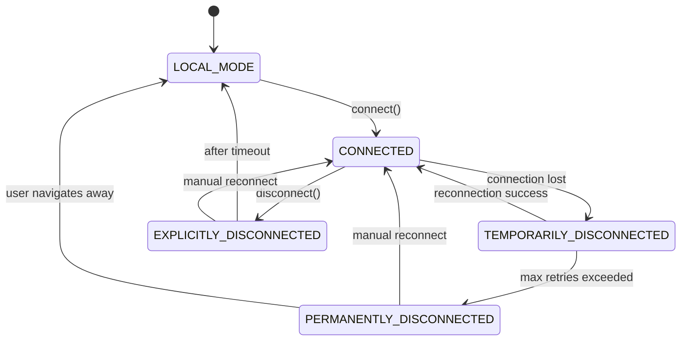

These states represent:

- **CONNECTED**: Active connection to tournament server
- **TEMPORARILY_DISCONNECTED**: Connection lost, automatic reconnection in progress
- **EXPLICITLY_DISCONNECTED**: User-initiated disconnection
- **PERMANENTLY_DISCONNECTED**: Failed to reconnect after maximum attempts
- **LOCAL_MODE**: Operating with local tournaments only

### 2. Multi-Tier Caching Architecture

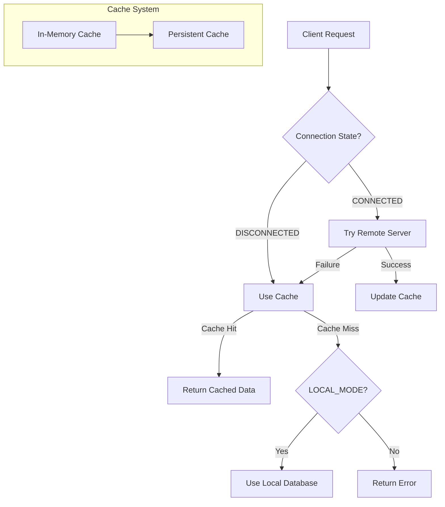

We'll implement a multi-tiered caching approach:

1. **In-Memory Cache (Primary)**: Fast access tier using zustand
2. **Persistent Cache (Secondary)**: Durable storage using AsyncStorage

The local database will never be used for remote tournament data, as it would serve incorrect data. It will only be used in LOCAL_MODE, when the user is working with tournaments stored locally on the device.

### 3. Data Source Prioritization

The system will implement a clear hierarchy for data source selection:

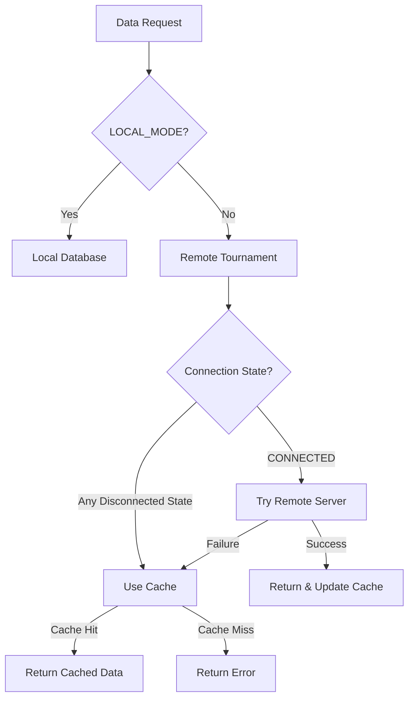

For remote tournaments:
1. **Remote Server**: Primary source when connected
2. **Memory Cache**: First fallback when disconnected or server errors occur
3. **Persistent Cache**: Second fallback when memory cache is unavailable

For local tournaments:
1. **Local Database**: Only source for LOCAL_MODE

The local database should never be used as a fallback for remote tournament data, as it would serve incorrect data. Each data fetching operation should follow this strict separation between remote and local data sources.

## Implementation Details

### 1. Initialization Sequence

The initialization sequence is critical to ensure proper system state on application launch:

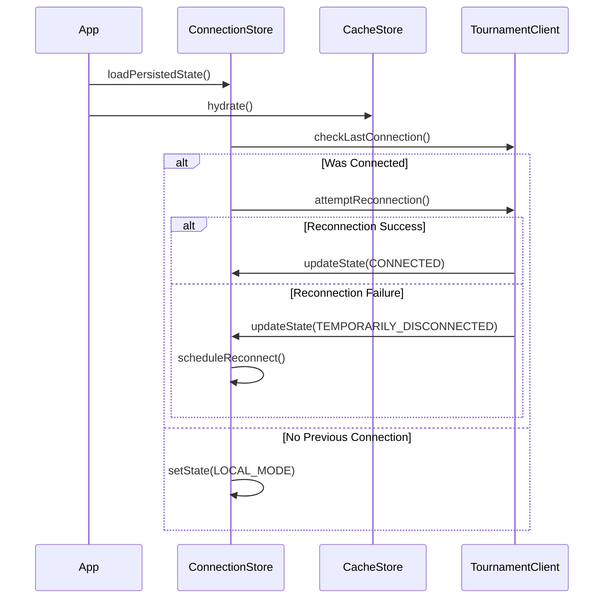

The initialization process should:

1. Load persisted connection state and cache data
2. Check if the app was previously connected to a tournament
3. If previously connected, attempt reconnection
4. Transition to appropriate state based on reconnection result
5. Initialize UI components with loaded state

### 2. Query Deduplication Strategy

To prevent cache thrashing during reconnection attempts:

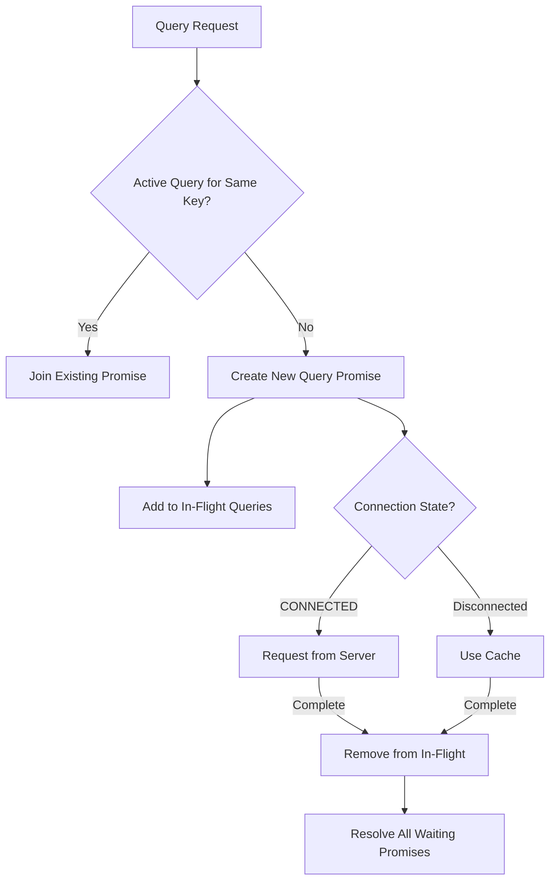

The implementation should:

1. Maintain a map of in-flight query promises by query key
2. When a duplicate query is requested, return the existing promise
3. Resolve all waiting promises with the same result when complete
4. Clear from the in-flight map after completion
5. Implement timeout handling for stuck queries

### 3. Cache Versioning Mechanism

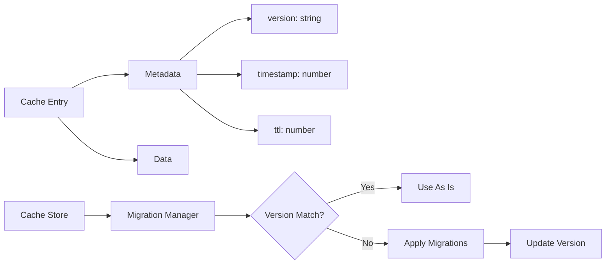

The cache versioning system should:

1. Store schema version with each cache entry
2. Include a migration framework for handling schema changes
3. Version each entity type independently to allow partial migrations
4. Provide a mechanism to force refresh when versions are incompatible
5. Log migration operations for debugging purposes

### 4. Memory Pressure Handling

The cache system should respond appropriately to memory constraints:

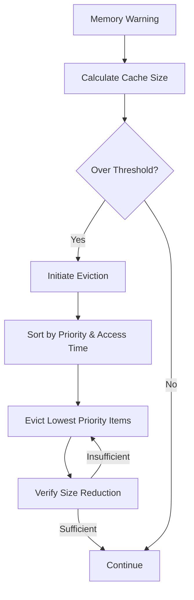

Implementation should:

1. Monitor memory warnings from the device
2. Implement size estimation for cached objects
3. Define eviction policies based on priority and access patterns
4. Preserve critical navigation and UI state data during eviction
5. Provide hooks for components to mark entries as essential

## Offline UX Patterns

The user experience during connection state transitions should follow these patterns:

### 1. Connection Status Indicators

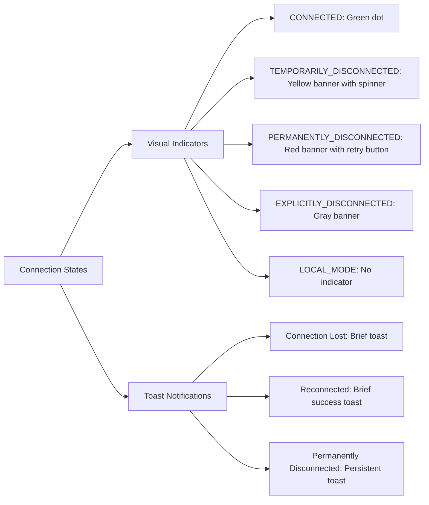

Implementation guidelines:

1. Use consistent color coding across the application
2. Position indicators in non-intrusive but visible locations
3. Animate transitions between states
4. Provide appropriate action buttons based on state
5. Ensure color choices consider accessibility requirements

### 2. Component Degradation Patterns

Components should follow consistent degradation patterns based on connection state:

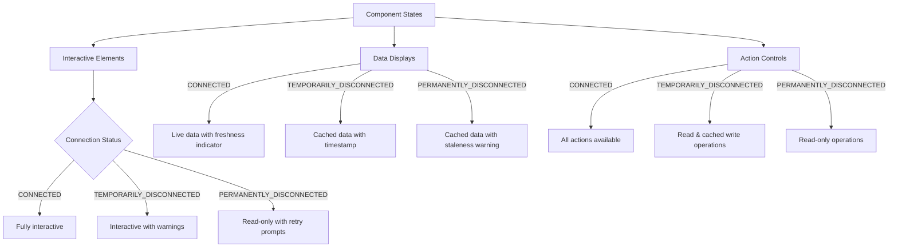

Guidelines for component behavior:

1. Display clear data freshness indicators (timestamp, "cached" badge)
2. Use subtle visual treatments to indicate degraded functionality
3. Disable or modify interactive elements based on connection state
4. Provide appropriate feedback for actions that require connection
5. Maintain consistent layout between states to prevent jarring transitions

### 3. Offline Action Handling

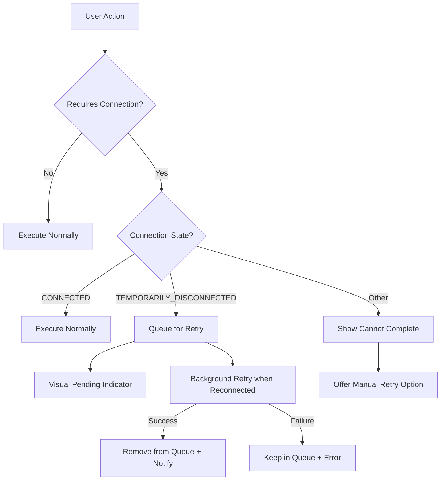

Implementation requirements:

1. Queue critical user actions during TEMPORARILY_DISCONNECTED state
2. Provide visual feedback for queued actions
3. Automatically retry when connection is restored
4. Allow manual retry for failed actions
5. Preserve action context during disconnections

## Data Synchronization Strategy

### 1. Write Operation Handling

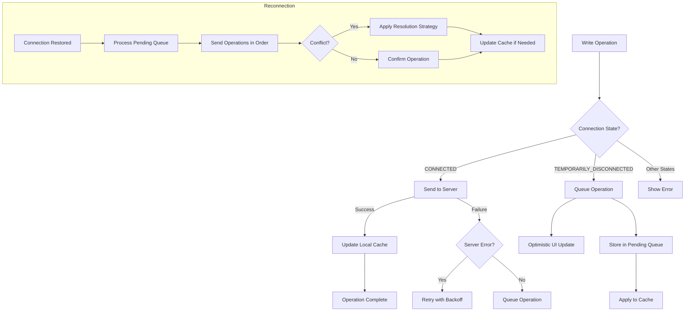

This strategy requires:

1. A persistent queue for operations during disconnection
2. Vector clock or other conflict detection mechanism
3. Optimistic UI updates with visual pending indicators
4. Conflict resolution strategies for concurrent modifications
5. Ordered replay of operations upon reconnection

### 2. Conflict Resolution Approaches

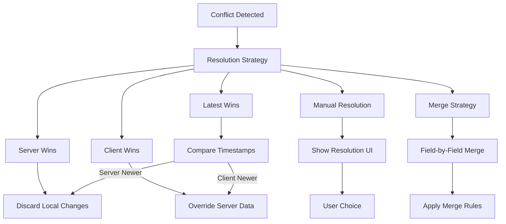

Implementation requirements:

1. Default to Server Wins for most entities
2. Use Latest Wins for certain entity types (e.g., scores)
3. Implement field-level merge for complex entities when possible
4. Provide manual resolution UI for critical conflicts
5. Track resolution decisions for future conflict handling

### 3. Synchronization Process

The synchronization process during reconnection follows this sequence:

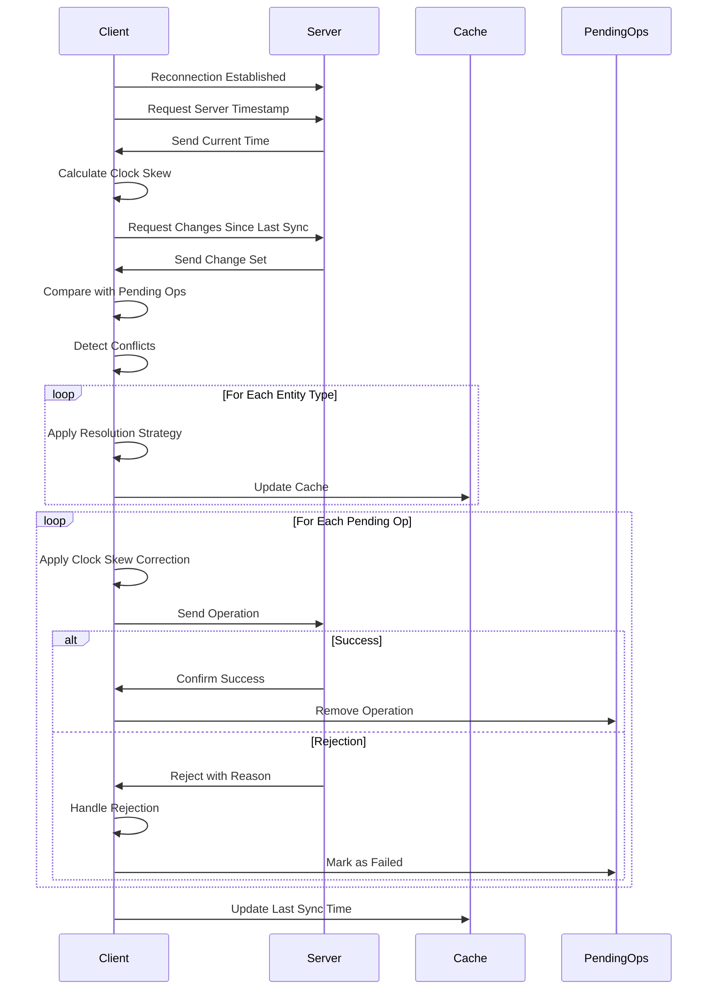

This process ensures:

1. Time synchronization between client and server
2. Efficient delta updates rather than full data refresh
3. Proper handling of conflicts during reconnection
4. Ordered application of pending operations
5. Resilience to partial synchronization failures

## Implementation Approach

The implementation will proceed in phases:

1. **Phase 1**: Connection state management and basic caching
2. **Phase 2**: Advanced caching and offline UX patterns
3. **Phase 3**: Synchronization and conflict resolution

By implementing the system incrementally, we can validate each layer before building the next, ensuring a robust and maintainable solution.

## Conclusion

This implementation plan addresses the connection persistence limitations while maintaining compatibility with the existing codebase. By utilizing zustand for state management and implementing a multi-tier caching strategy, we provide a seamless user experience during network disruptions while ensuring data integrity and consistency.