# Software Design Document
# TournaFence Tournament Management Application

## Table of Contents

1. [Document History](#1-document-history)
2. [Introduction](#2-introduction)
   1. [Purpose](#21-purpose)
   2. [Scope](#22-scope)
   3. [Design Goals](#23-design-goals)
   4. [Definitions](#24-definitions)
   5. [References](#25-references)
3. [System Overview](#3-system-overview)
   1. [Technologies Used](#31-technologies-used)
   2. [Architecture Diagram](#32-architecture-diagram)
   3. [Sequence Diagrams](#33-sequence-diagrams)
4. [Detailed Architecture](#4-detailed-architecture)
   1. [Key Components and Interactions](#41-key-components-and-interactions)
      1. [Application Initialization](#411-application-initialization)
      2. [Tournament Creation Flow](#412-tournament-creation-flow)
      3. [Event Management](#413-event-management)
      4. [Event Settings Configuration](#414-event-settings-configuration)
      5. [Pool Management](#415-pool-management)
      6. [Direct Elimination Management](#416-direct-elimination-management)
      7. [Double Elimination Flow](#417-double-elimination-flow)
      8. [Compass Draw Flow](#418-compass-draw-flow)
      9. [Referee Module Flow](#419-referee-module-flow)
   2. [Component Architecture](#42-component-architecture)
      1. [Home Screen](#421-home-screen)
      2. [Event Management](#422-event-management)
      3. [Event Settings](#423-event-settings)
      4. [Pools Page](#424-pools-page)
      5. [Bout Order Page](#425-bout-order-page)
      6. [Referee Module](#426-referee-module)
      7. [Bracket Pages](#427-bracket-pages)
5. [Data Model](#5-data-model)
   1. [Database Schema](#51-database-schema)
6. [Traceability Matrix](#6-traceability-matrix)

## 1. Document History

| Version | Date       | Description                      | Author     |
|---------|------------|----------------------------------|------------|
| 0.1     | 2025-03-08 | Initial Draft                    | Claude     |
| 1.0     | 2025-03-08 | First Complete Version           | Claude     |
| 2.0     | 2025-03-10 | Reorganized Structure with Updated Diagrams | Claude |

## 2. Introduction

### 2.1 Purpose

This Software Design Document (SDD) describes the architectural and detailed design for TournaFence, a React Native application for managing fencing tournaments. It provides a comprehensive view of the system's architecture, component interactions, data flow, and behavior to guide implementation and maintenance activities.

### 2.2 Scope

TournaFence is designed to handle all aspects of fencing tournament management, including:
- Tournament creation and configuration
- Event management within tournaments
- Fencer and referee registration
- Pool formation and round-robin bout scheduling
- Direct elimination bracket generation (single elimination, double elimination, compass draw)
- Bout scoring and timing
- Results calculation and tournament progression

### 2.3 Design Goals

The primary design goals for the TournaFence application are:

1. **Reliability**: The system must maintain data integrity throughout tournament operations
2. **Usability**: The interface must be intuitive for tournament organizers, referees, and participants
3. **Flexibility**: The system must support various tournament formats and configurations
4. **Performance**: The application must handle concurrent operations efficiently
5. **Modularity**: Components must be designed for reuse and independent testing
6. **Maintainability**: The codebase must follow consistent patterns and best practices

### 2.4 Definitions

| Term | Definition |
|------|------------|
| DE   | Direct Elimination |
| UI   | User Interface |
| API  | Application Programming Interface |
| SRS  | Software Requirements Specification |
| DB   | Database |
| SQLite | Self-contained, serverless, zero-configuration, transactional SQL database engine |
| JSX  | JavaScript XML (syntax extension for JavaScript) |
| Props | Properties passed to React components |
| State | Object representing component data that can change over time |
| Hook | Functions that let you use React state and features |
| Pool | Group of fencers who fence round-robin bouts against each other |
| Bout | Individual fencing match between two fencers |
| Seeding | The ranking of fencers for placement in tournament brackets |
| Tableau | Bracket structure for direct elimination rounds |

### 2.5 References

- Software Requirements Specification (SRS)
- React Native Documentation (https://reactnative.dev/docs/getting-started)
- Expo Documentation (https://docs.expo.dev)
- SQLite Documentation (https://www.sqlite.org/docs.html)
- USA Fencing Rule Book (https://www.usafencing.org/rules)

## 3. System Overview

### 3.1 Technologies Used

The TournaFence application is built using modern cross-platform mobile development technologies:

| Technology | Version | Purpose |
|------------|---------|---------|
| React | 18.3.1 | JavaScript library for building user interfaces |
| React Native | 0.76.7 | Framework for building native mobile apps using React |
| TypeScript | 5.7.2 | Typed JavaScript that compiles to plain JavaScript |
| Expo | 52.0.33 | Framework and platform for universal React applications |
| Expo SQLite | 15.1.2 | SQLite database for local data storage |
| React Navigation | 7.0.12 | Routing and navigation for React Native apps |
| Async Storage | 1.23.1 | AsyncStorage implementation for React Native |
| React Native Gesture Handler | 2.20.2 | Declarative API for gesture handling in React Native |
| React Native Reanimated | 3.16.1 | React Native's Animated library reimplementation |
| React Native Draggable FlatList | 4.0.1 | FlatList with draggable and sortable items |

### 3.2 Architecture Diagram

The TournaFence application follows a three-tier architecture with clear separation between the presentation layer, business logic layer, and data persistence layer.

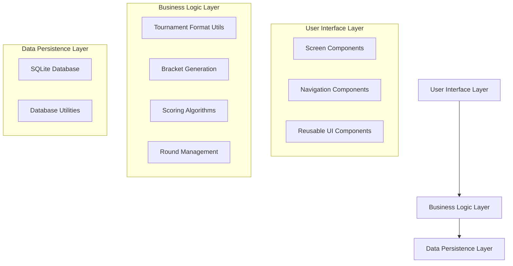
```mermaid
graph TD
    A[User Interface Layer] --> B[Business Logic Layer]
    B --> C[Data Persistence Layer]
    
    subgraph "User Interface Layer"
        A1[Screen Components]
        A2[Navigation Components]
        A3[Reusable UI Components]
    end
    
    subgraph "Business Logic Layer"
        B1[Tournament Format Utils]
        B2[Bracket Generation]
        B3[Scoring Algorithms]
        B4[Round Management]
    end
    
    subgraph "Data Persistence Layer"
        C1[SQLite Database]
        C2[Database Utilities]
    end
```

The application employs several design principles and patterns:

1. **Component-Based Architecture**: UI is composed of reusable React components
2. **Container/Presenter Pattern**: Separation of data management from presentation
3. **Single Responsibility Principle**: Each component has a focused responsibility
4. **Repository Pattern**: Database access is abstracted through utilities
5. **Factory Pattern**: Creation of tournament formats and brackets
6. **Hooks Pattern**: Functional components with state and effects

### 3.3 Sequence Diagrams

The system's key interactions are illustrated in the sequence diagrams presented in section 4.1, which show the dynamic behavior of the system during critical operations such as tournament creation, event configuration, and bout scoring.

## 4. Detailed Architecture

### 4.1 Key Components and Interactions

This section describes the key interactions between components during system operations, illustrating the dynamic behavior of the application.

#### 4.1.1 Application Initialization

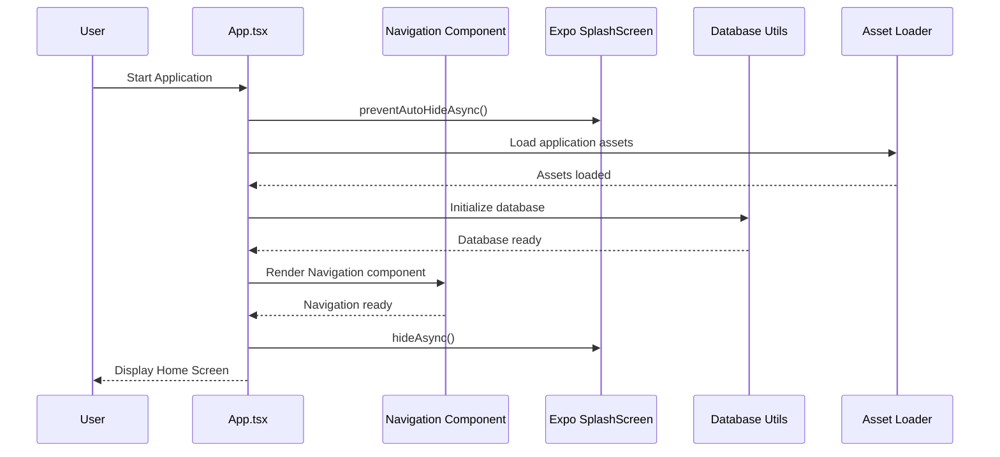
```mermaid
sequenceDiagram
    participant User
    participant App as App.tsx
    participant Navigation as Navigation Component
    participant SplashScreen as Expo SplashScreen
    participant DB as Database Utils
    participant Assets as Asset Loader

    User->>App: Start Application
    App->>SplashScreen: preventAutoHideAsync()
    App->>Assets: Load application assets
    Assets-->>App: Assets loaded
    App->>DB: Initialize database
    DB-->>App: Database ready
    App->>Navigation: Render Navigation component
    Navigation-->>App: Navigation ready
    App->>SplashScreen: hideAsync()
    App-->>User: Display Home Screen
```

The application initialization process begins when the user starts the application. The App component first prevents the splash screen from auto-hiding, then loads assets and initializes the database in parallel. Once both assets are loaded and the database is initialized, the Navigation component is rendered. Finally, the splash screen is hidden, and the Home Screen is displayed to the user.

#### 4.1.2 Tournament Creation Flow

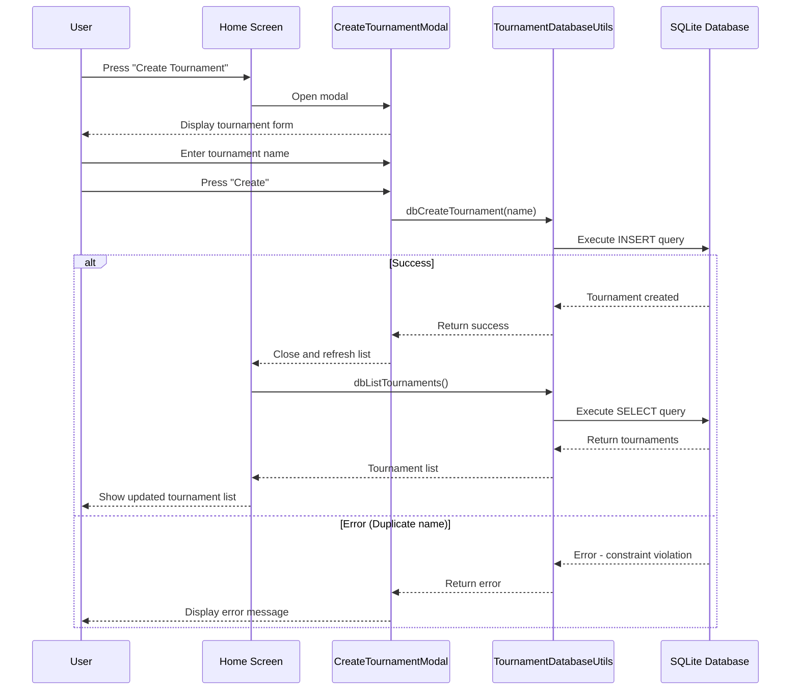
```mermaid
sequenceDiagram
    participant User
    participant Home as Home Screen
    participant Modal as CreateTournamentModal
    participant DB as TournamentDatabaseUtils
    participant SQLite as SQLite Database
    
    User->>Home: Press "Create Tournament"
    Home->>Modal: Open modal
    Modal-->>User: Display tournament form
    User->>Modal: Enter tournament name
    User->>Modal: Press "Create"
    Modal->>DB: dbCreateTournament(name)
    DB->>SQLite: Execute INSERT query
    alt Success
        SQLite-->>DB: Tournament created
        DB-->>Modal: Return success
        Modal-->>Home: Close and refresh list
        Home->>DB: dbListTournaments()
        DB->>SQLite: Execute SELECT query
        SQLite-->>DB: Return tournaments
        DB-->>Home: Tournament list
        Home-->>User: Show updated tournament list
    else Error (Duplicate name)
        SQLite-->>DB: Error - constraint violation
        DB-->>Modal: Return error
        Modal-->>User: Display error message
    end
```

The tournament creation flow begins when the user presses the "Create Tournament" button on the Home screen. This opens a modal dialog where the user can enter a tournament name. When the user submits the form, the application calls the database utility to create a new tournament. If successful, the modal closes and the tournament list is refreshed to include the new tournament. If there's an error (such as a duplicate name), an error message is displayed to the user.

#### 4.1.3 Event Management

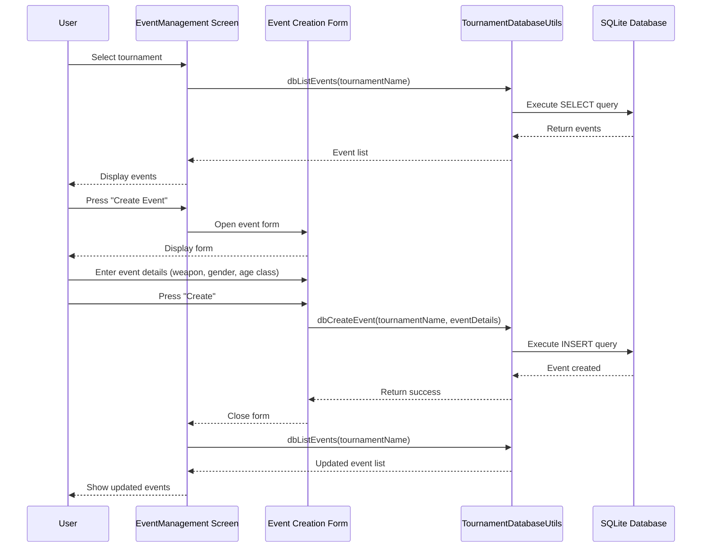
```mermaid
sequenceDiagram
    participant User
    participant EventMgmt as EventManagement Screen
    participant EventForm as Event Creation Form
    participant DB as TournamentDatabaseUtils
    participant SQLite as SQLite Database
    
    User->>EventMgmt: Select tournament
    EventMgmt->>DB: dbListEvents(tournamentName)
    DB->>SQLite: Execute SELECT query
    SQLite-->>DB: Return events
    DB-->>EventMgmt: Event list
    EventMgmt-->>User: Display events
    
    User->>EventMgmt: Press "Create Event"
    EventMgmt->>EventForm: Open event form
    EventForm-->>User: Display form
    User->>EventForm: Enter event details (weapon, gender, age class)
    User->>EventForm: Press "Create"
    EventForm->>DB: dbCreateEvent(tournamentName, eventDetails)
    DB->>SQLite: Execute INSERT query
    SQLite-->>DB: Event created
    DB-->>EventForm: Return success
    EventForm-->>EventMgmt: Close form
    EventMgmt->>DB: dbListEvents(tournamentName)
    DB-->>EventMgmt: Updated event list
    EventMgmt-->>User: Show updated events
```

The event management flow begins when a user selects a tournament from the Home screen, which navigates to the Event Management screen. The application loads and displays the events for the selected tournament. The user can create a new event by pressing the "Create Event" button, which opens a form to enter event details such as weapon type, gender, and age class. Upon submission, the application creates the event in the database and refreshes the event list to show the newly created event.

#### 4.1.4 Event Settings Configuration

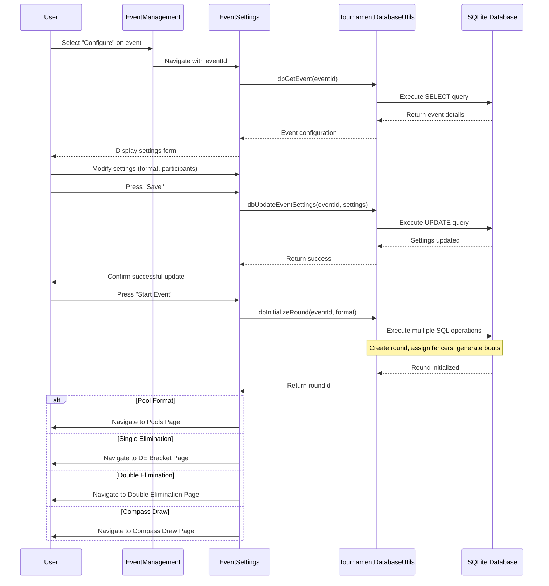
```mermaid
sequenceDiagram
    participant User
    participant Events as EventManagement
    participant Settings as EventSettings
    participant DB as TournamentDatabaseUtils
    participant SQLite as SQLite Database
    
    User->>Events: Select "Configure" on event
    Events->>Settings: Navigate with eventId
    Settings->>DB: dbGetEvent(eventId)
    DB->>SQLite: Execute SELECT query
    SQLite-->>DB: Return event details
    DB-->>Settings: Event configuration
    Settings-->>User: Display settings form
    
    User->>Settings: Modify settings (format, participants)
    User->>Settings: Press "Save"
    Settings->>DB: dbUpdateEventSettings(eventId, settings)
    DB->>SQLite: Execute UPDATE query
    SQLite-->>DB: Settings updated
    DB-->>Settings: Return success
    Settings-->>User: Confirm successful update
    
    User->>Settings: Press "Start Event"
    Settings->>DB: dbInitializeRound(eventId, format)
    DB->>SQLite: Execute multiple SQL operations
    Note over DB,SQLite: Create round, assign fencers, generate bouts
    SQLite-->>DB: Round initialized
    DB-->>Settings: Return roundId
    
    alt Pool Format
        Settings->>User: Navigate to Pools Page
    else Single Elimination
        Settings->>User: Navigate to DE Bracket Page
    else Double Elimination
        Settings->>User: Navigate to Double Elimination Page
    else Compass Draw
        Settings->>User: Navigate to Compass Draw Page
    end
```

The event settings configuration begins when the user selects "Configure" on an event in the Event Management screen. The application navigates to the Event Settings screen, loading the event details. The user can modify settings such as tournament format and participants, then save these changes. When the user is ready to start the event, pressing the "Start Event" button initializes the round in the database, creating the necessary structures based on the selected format. The application then navigates to the appropriate screen based on the tournament format.

#### 4.1.5 Pool Management

The pool management process is divided into three key phases: initial setup and display, bout management, and pool completion.

##### 4.1.5.1 Pool Setup and Display

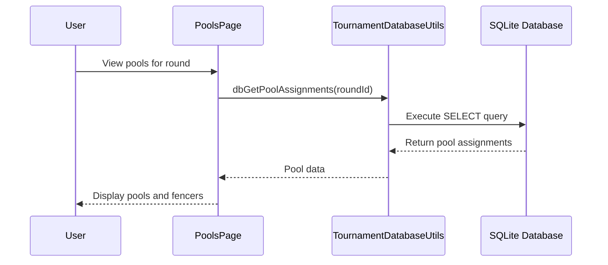
```mermaid
sequenceDiagram
    participant User
    participant Pools as PoolsPage
    participant DB as TournamentDatabaseUtils
    participant SQLite as SQLite Database
    
    User->>Pools: View pools for round
    Pools->>DB: dbGetPoolAssignments(roundId)
    DB->>SQLite: Execute SELECT query
    SQLite-->>DB: Return pool assignments
    DB-->>Pools: Pool data
    Pools-->>User: Display pools and fencers
```

The pool setup begins when the user navigates to the Pools Page after starting an event with a pool format. The application loads the pool assignments from the database and displays the pools with their assigned fencers to the user.

##### 4.1.5.2 Bout Selection and Scoring

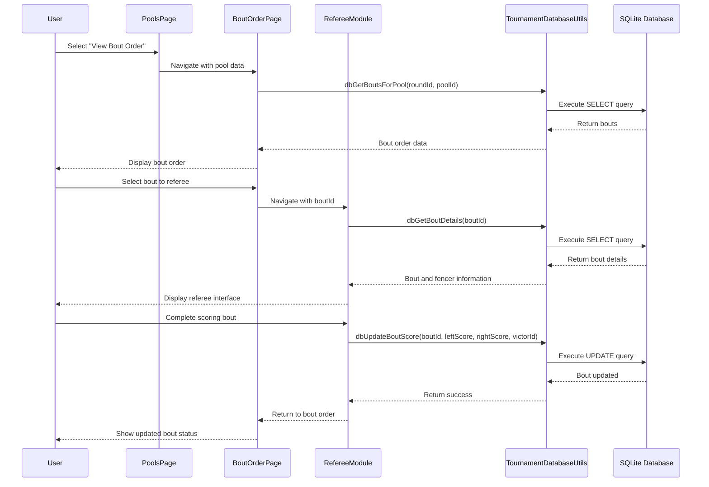
```mermaid
sequenceDiagram
    participant User
    participant Pools as PoolsPage
    participant BoutOrder as BoutOrderPage
    participant Referee as RefereeModule
    participant DB as TournamentDatabaseUtils
    participant SQLite as SQLite Database
    
    User->>Pools: Select "View Bout Order"
    Pools->>BoutOrder: Navigate with pool data
    BoutOrder->>DB: dbGetBoutsForPool(roundId, poolId)
    DB->>SQLite: Execute SELECT query
    SQLite-->>DB: Return bouts
    DB-->>BoutOrder: Bout order data
    BoutOrder-->>User: Display bout order
    
    User->>BoutOrder: Select bout to referee
    BoutOrder->>Referee: Navigate with boutId
    Referee->>DB: dbGetBoutDetails(boutId)
    DB->>SQLite: Execute SELECT query
    SQLite-->>DB: Return bout details
    DB-->>Referee: Bout and fencer information
    Referee-->>User: Display referee interface
    
    User->>Referee: Complete scoring bout
    Referee->>DB: dbUpdateBoutScore(boutId, leftScore, rightScore, victorId)
    DB->>SQLite: Execute UPDATE query
    SQLite-->>DB: Bout updated
    DB-->>Referee: Return success
    Referee-->>BoutOrder: Return to bout order
    BoutOrder-->>User: Show updated bout status
```

Once pools are displayed, the user can select "View Bout Order" to see the sequence of bouts for a pool. The application loads the bouts for the selected pool and displays them in the recommended order. The user can select a bout to referee, which opens the Referee Module with the details of the selected bout. After scoring the bout, the results are saved to the database, and the user returns to the bout order view with updated status.

##### 4.1.5.3 Pool Completion and Results

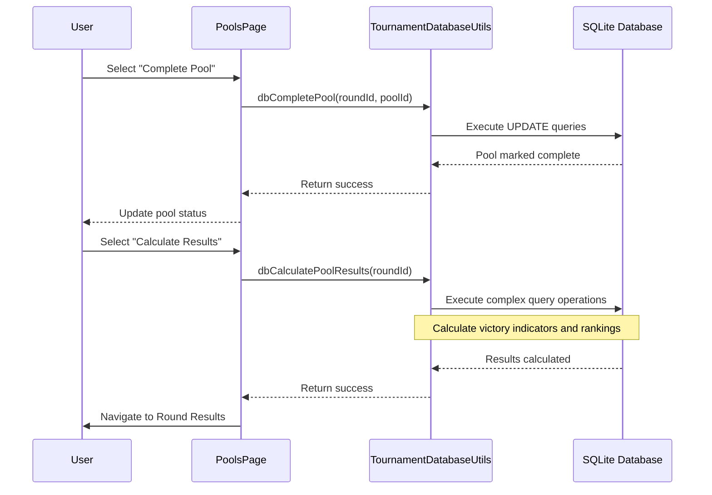
```mermaid
sequenceDiagram
    participant User
    participant Pools as PoolsPage
    participant DB as TournamentDatabaseUtils
    participant SQLite as SQLite Database
    
    User->>Pools: Select "Complete Pool"
    Pools->>DB: dbCompletePool(roundId, poolId)
    DB->>SQLite: Execute UPDATE queries
    SQLite-->>DB: Pool marked complete
    DB-->>Pools: Return success
    Pools-->>User: Update pool status
    
    User->>Pools: Select "Calculate Results"
    Pools->>DB: dbCalculatePoolResults(roundId)
    DB->>SQLite: Execute complex query operations
    Note over DB,SQLite: Calculate victory indicators and rankings
    SQLite-->>DB: Results calculated
    DB-->>Pools: Return success
    Pools->>User: Navigate to Round Results
```

After all bouts in a pool have been scored, the user can mark the pool as complete. When all pools in the round are complete, the user can calculate the round results. This triggers complex database operations to calculate victory indicators, rankings, and other statistics. The application then navigates to the Round Results screen to display the final standings and prepare for the next stage of the tournament.

#### 4.1.6 Direct Elimination Management

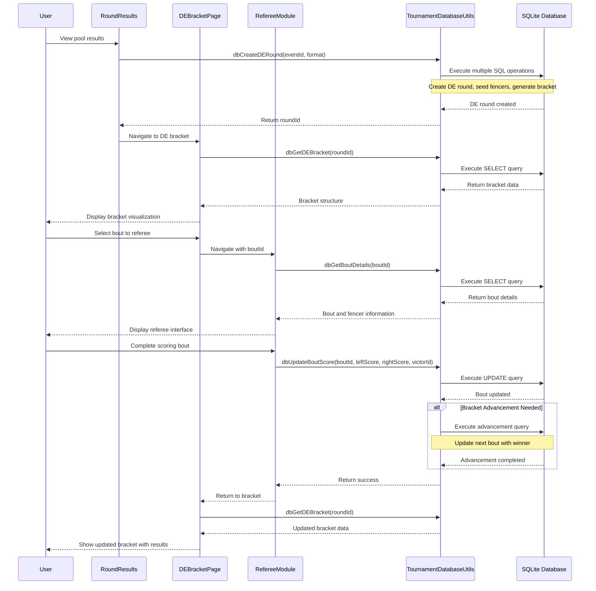
```mermaid
sequenceDiagram
    participant User
    participant Results as RoundResults
    participant DEPage as DEBracketPage
    participant Referee as RefereeModule
    participant DB as TournamentDatabaseUtils
    participant SQLite as SQLite Database
    
    User->>Results: View pool results
    Results->>DB: dbCreateDERound(eventId, format)
    DB->>SQLite: Execute multiple SQL operations
    Note over DB,SQLite: Create DE round, seed fencers, generate bracket
    SQLite-->>DB: DE round created
    DB-->>Results: Return roundId
    Results->>DEPage: Navigate to DE bracket
    
    DEPage->>DB: dbGetDEBracket(roundId)
    DB->>SQLite: Execute SELECT query
    SQLite-->>DB: Return bracket data
    DB-->>DEPage: Bracket structure
    DEPage-->>User: Display bracket visualization
    
    User->>DEPage: Select bout to referee
    DEPage->>Referee: Navigate with boutId
    Referee->>DB: dbGetBoutDetails(boutId)
    DB->>SQLite: Execute SELECT query
    SQLite-->>DB: Return bout details
    DB-->>Referee: Bout and fencer information
    Referee-->>User: Display referee interface
    
    User->>Referee: Complete scoring bout
    Referee->>DB: dbUpdateBoutScore(boutId, leftScore, rightScore, victorId)
    DB->>SQLite: Execute UPDATE query
    SQLite-->>DB: Bout updated
    
    alt Bracket Advancement Needed
        DB->>SQLite: Execute advancement query
        Note over DB,SQLite: Update next bout with winner
        SQLite-->>DB: Advancement completed
    end
    
    DB-->>Referee: Return success
    Referee-->>DEPage: Return to bracket
    DEPage->>DB: dbGetDEBracket(roundId)
    DB-->>DEPage: Updated bracket data
    DEPage-->>User: Show updated bracket with results
```

The direct elimination management begins when pool results are finalized and a DE round is created. The application seeds fencers based on pool results and generates the bracket structure. The user can view the bracket visualization, which shows all scheduled bouts. When selecting a bout to referee, the application opens the Referee Module with the bout details. After scoring the bout, the result is saved, and the winner is automatically advanced to the next round in the bracket. The bracket visualization is then updated to reflect the new state.

#### 4.1.7 Double Elimination Flow

The double elimination process is divided into three phases: bracket structure generation, bout management, and advancement logic.

##### 4.1.7.1 Double Elimination Structure Generation

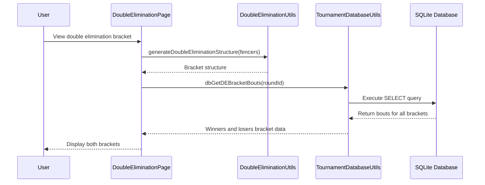
```mermaid
sequenceDiagram
    participant User
    participant DEPage as DoubleEliminationPage
    participant Utils as DoubleEliminationUtils
    participant DB as TournamentDatabaseUtils
    participant SQLite as SQLite Database
    
    User->>DEPage: View double elimination bracket
    DEPage->>Utils: generateDoubleEliminationStructure(fencers)
    Utils-->>DEPage: Bracket structure
    DEPage->>DB: dbGetDEBracketBouts(roundId)
    DB->>SQLite: Execute SELECT query
    SQLite-->>DB: Return bouts for all brackets
    DB-->>DEPage: Winners and losers bracket data
    DEPage-->>User: Display both brackets
```

The double elimination structure generation begins when a round with double elimination format is initialized. The application uses specialized utilities to generate the structure for both winners and losers brackets. The bouts for both brackets are created in the database, and when the user navigates to the Double Elimination Page, they can view both brackets simultaneously.

##### 4.1.7.2 Bout Management in Double Elimination

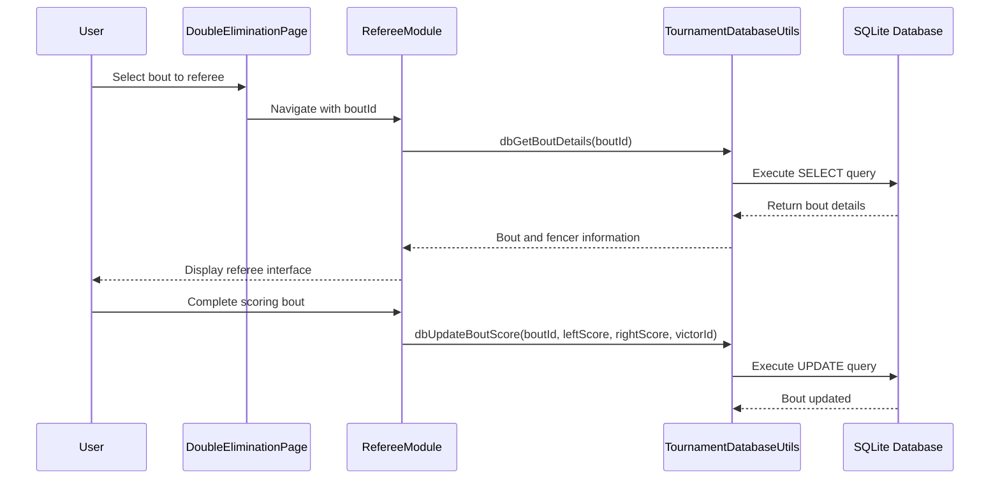
```mermaid
sequenceDiagram
    participant User
    participant DEPage as DoubleEliminationPage
    participant Referee as RefereeModule
    participant DB as TournamentDatabaseUtils
    participant SQLite as SQLite Database
    
    User->>DEPage: Select bout to referee
    DEPage->>Referee: Navigate with boutId
    Referee->>DB: dbGetBoutDetails(boutId)
    DB->>SQLite: Execute SELECT query
    SQLite-->>DB: Return bout details
    DB-->>Referee: Bout and fencer information
    Referee-->>User: Display referee interface
    
    User->>Referee: Complete scoring bout
    Referee->>DB: dbUpdateBoutScore(boutId, leftScore, rightScore, victorId)
    DB->>SQLite: Execute UPDATE query
    SQLite-->>DB: Bout updated
```

The bout management process in double elimination is similar to single elimination, where the user selects a bout to referee from either bracket. The application loads the bout details and presents the referee interface. After scoring, the result is saved to the database.

##### 4.1.7.3 Double Elimination Advancement Logic

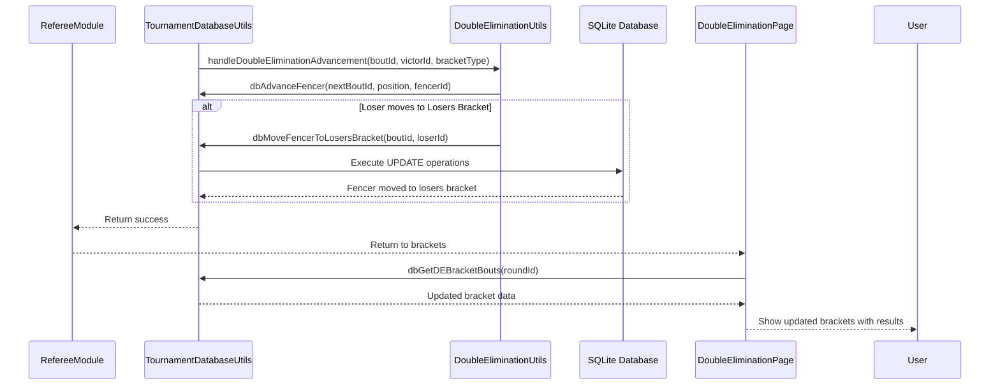
```mermaid
sequenceDiagram
    participant Referee as RefereeModule
    participant DB as TournamentDatabaseUtils
    participant Utils as DoubleEliminationUtils
    participant SQLite as SQLite Database
    participant DEPage as DoubleEliminationPage
    participant User
    
    DB->>Utils: handleDoubleEliminationAdvancement(boutId, victorId, bracketType)
    Utils->>DB: dbAdvanceFencer(nextBoutId, position, fencerId)
    
    alt Loser moves to Losers Bracket
        Utils->>DB: dbMoveFencerToLosersBracket(boutId, loserId)
        DB->>SQLite: Execute UPDATE operations
        SQLite-->>DB: Fencer moved to losers bracket
    end
    
    DB-->>Referee: Return success
    Referee-->>DEPage: Return to brackets
    DEPage->>DB: dbGetDEBracketBouts(roundId)
    DB-->>DEPage: Updated bracket data
    DEPage-->>User: Show updated brackets with results
```

The advancement logic for double elimination is more complex than single elimination. After a bout is scored, the winner advances within the current bracket, and if the bout was in the winners bracket, the loser moves to the corresponding position in the losers bracket. This logic is handled by specialized utilities that determine the correct advancement paths based on the bout's position and bracket type.

#### 4.1.8 Compass Draw Flow

The compass draw process is divided into three phases: initialization and structure generation, bout management, and cross-direction advancement logic.

##### 4.1.8.1 Compass Draw Initialization

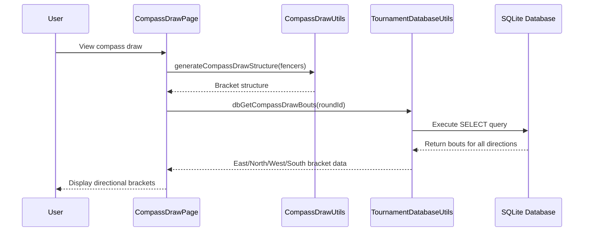
```mermaid
sequenceDiagram
    participant User
    participant CDPage as CompassDrawPage
    participant Utils as CompassDrawUtils
    participant DB as TournamentDatabaseUtils
    participant SQLite as SQLite Database
    
    User->>CDPage: View compass draw
    CDPage->>Utils: generateCompassDrawStructure(fencers)
    Utils-->>CDPage: Bracket structure
    CDPage->>DB: dbGetCompassDrawBouts(roundId)
    DB->>SQLite: Execute SELECT query
    SQLite-->>DB: Return bouts for all directions
    DB-->>CDPage: East/North/West/South bracket data
    CDPage-->>User: Display directional brackets
```

The compass draw initialization creates a complex structure with multiple directional brackets (East, North, West, South). When the user views the compass draw, the application loads all the directional brackets and displays them in an organized layout.

##### 4.1.8.2 Directional Bracket Management

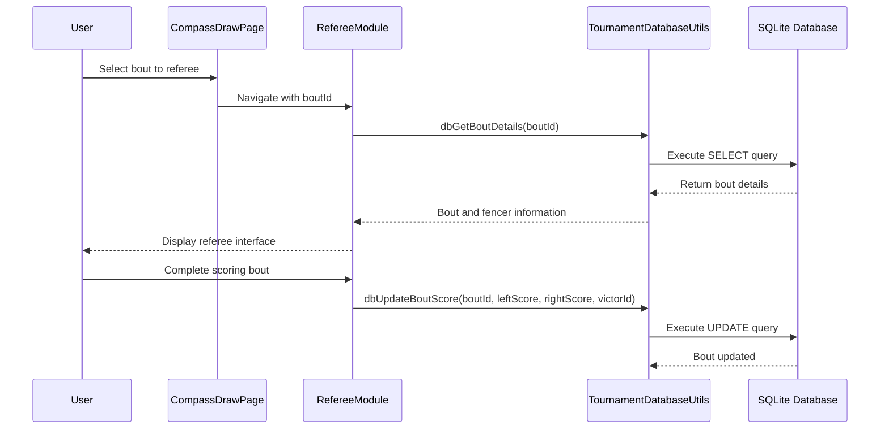
```mermaid
sequenceDiagram
    participant User
    participant CDPage as CompassDrawPage
    participant Referee as RefereeModule
    participant DB as TournamentDatabaseUtils
    participant SQLite as SQLite Database
    
    User->>CDPage: Select bout to referee
    CDPage->>Referee: Navigate with boutId
    Referee->>DB: dbGetBoutDetails(boutId)
    DB->>SQLite: Execute SELECT query
    SQLite-->>DB: Return bout details
    DB-->>Referee: Bout and fencer information
    Referee-->>User: Display referee interface
    
    User->>Referee: Complete scoring bout
    Referee->>DB: dbUpdateBoutScore(boutId, leftScore, rightScore, victorId)
    DB->>SQLite: Execute UPDATE query
    SQLite-->>DB: Bout updated
```

Bout management in the compass draw is similar to other bracket formats, where the user selects a bout from any direction to referee. The application loads the bout details and presents the referee interface for scoring.

##### 4.1.8.3 Cross-Direction Advancement

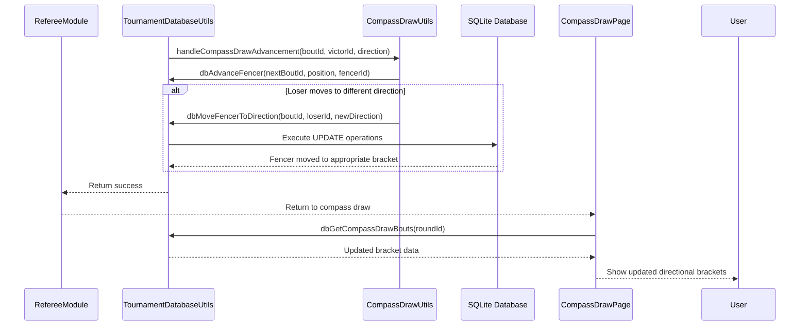
```mermaid
sequenceDiagram
    participant Referee as RefereeModule
    participant DB as TournamentDatabaseUtils
    participant Utils as CompassDrawUtils
    participant SQLite as SQLite Database
    participant CDPage as CompassDrawPage
    participant User
    
    DB->>Utils: handleCompassDrawAdvancement(boutId, victorId, direction)
    Utils->>DB: dbAdvanceFencer(nextBoutId, position, fencerId)
    
    alt Loser moves to different direction
        Utils->>DB: dbMoveFencerToDirection(boutId, loserId, newDirection)
        DB->>SQLite: Execute UPDATE operations
        SQLite-->>DB: Fencer moved to appropriate bracket
    end
    
    DB-->>Referee: Return success
    Referee-->>CDPage: Return to compass draw
    CDPage->>DB: dbGetCompassDrawBouts(roundId)
    DB-->>CDPage: Updated bracket data
    CDPage-->>User: Show updated directional brackets
```

The cross-direction advancement in a compass draw is the most complex of all bracket formats. Winners typically continue in the same direction, while losers move to a different direction based on where and when they lost. Specialized utilities handle these complex advancement rules to ensure fencers progress correctly through the tournament structure.

#### 4.1.9 Referee Module Flow

The referee module process is divided into three key phases: session initialization, scoring and timing control, and bout completion.

##### 4.1.9.1 Referee Session Initialization

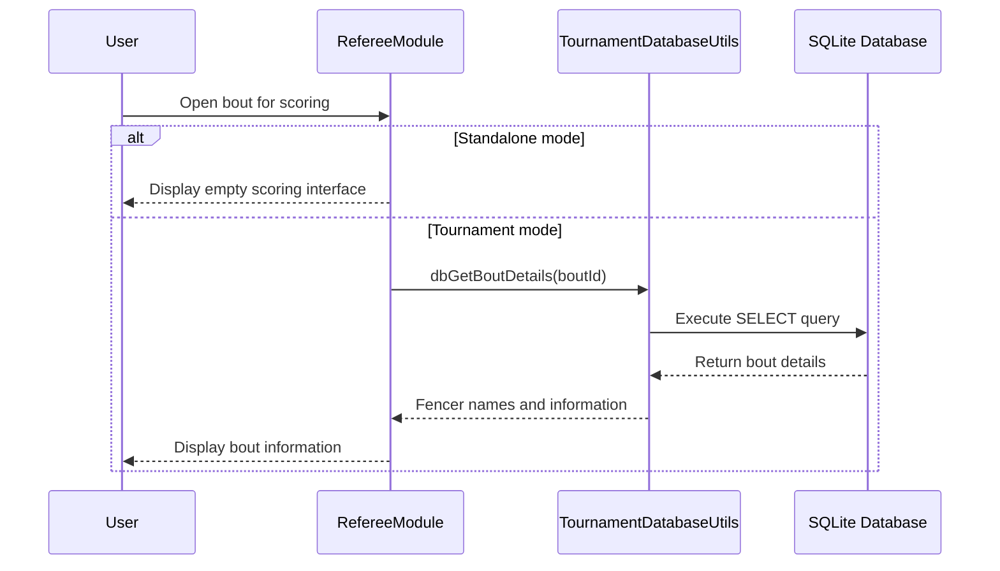
```mermaid
sequenceDiagram
    participant User
    participant Referee as RefereeModule
    participant DB as TournamentDatabaseUtils
    participant SQLite as SQLite Database
    
    User->>Referee: Open bout for scoring
    alt Standalone mode
        Referee-->>User: Display empty scoring interface
    else Tournament mode
        Referee->>DB: dbGetBoutDetails(boutId)
        DB->>SQLite: Execute SELECT query
        SQLite-->>DB: Return bout details
        DB-->>Referee: Fencer names and information
        Referee-->>User: Display bout information
    end
```

The Referee Module can be initialized in two modes: standalone for practice or informal bouts, or tournament mode for official bouts. In tournament mode, the application loads the bout details including fencer information from the database.

##### 4.1.9.2 Timer and Scoring Controls

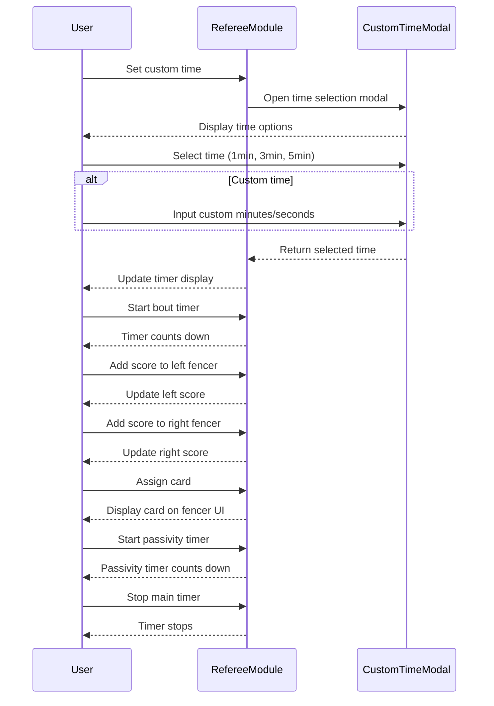
```mermaid
sequenceDiagram
    participant User
    participant Referee as RefereeModule
    participant TimeModal as CustomTimeModal
    
    User->>Referee: Set custom time
    Referee->>TimeModal: Open time selection modal
    TimeModal-->>User: Display time options
    User->>TimeModal: Select time (1min, 3min, 5min)
    alt Custom time
        User->>TimeModal: Input custom minutes/seconds
    end
    TimeModal-->>Referee: Return selected time
    Referee-->>User: Update timer display
    
    User->>Referee: Start bout timer
    Referee-->>User: Timer counts down
    
    User->>Referee: Add score to left fencer
    Referee-->>User: Update left score
    
    User->>Referee: Add score to right fencer
    Referee-->>User: Update right score
    
    User->>Referee: Assign card
    Referee-->>User: Display card on fencer UI
    
    User->>Referee: Start passivity timer
    Referee-->>User: Passivity timer counts down
    
    User->>Referee: Stop main timer
    Referee-->>User: Timer stops
```

The Referee Module provides comprehensive controls for managing a bout, including timer functions, scoring, and card assignments. The user can set custom time periods, start and stop timers, increment scores for each fencer, and assign cards as penalties.

##### 4.1.9.3 Bout Completion and Results

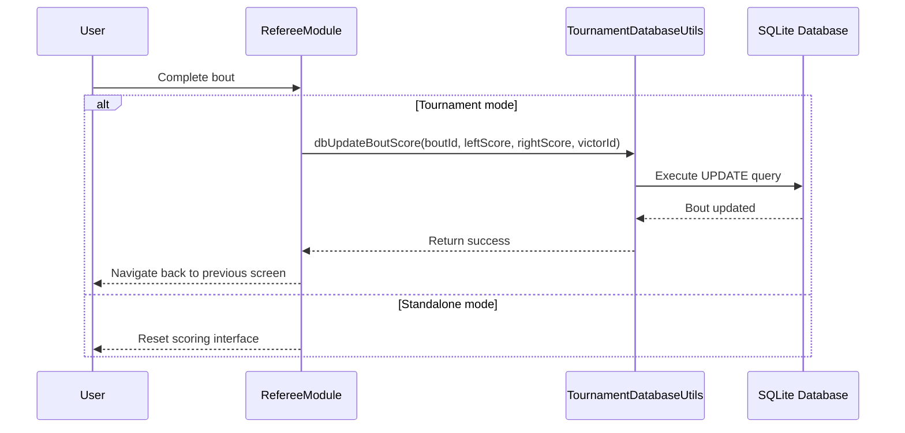
```mermaid
sequenceDiagram
    participant User
    participant Referee as RefereeModule
    participant DB as TournamentDatabaseUtils
    participant SQLite as SQLite Database
    
    User->>Referee: Complete bout
    
    alt Tournament mode
        Referee->>DB: dbUpdateBoutScore(boutId, leftScore, rightScore, victorId)
        DB->>SQLite: Execute UPDATE query
        SQLite-->>DB: Bout updated
        DB-->>Referee: Return success
        Referee-->>User: Navigate back to previous screen
    else Standalone mode
        Referee-->>User: Reset scoring interface
    end
```

When a bout is completed, the Referee Module saves the results to the database in tournament mode and returns to the previous screen. In standalone mode, the interface is reset for a new bout. The saved results trigger the appropriate advancement logic based on the tournament format.

### 4.2 Component Architecture

This section describes the static architecture of the application's major components, detailing their structure, properties, methods, and relationships.

#### 4.2.1 Home Screen

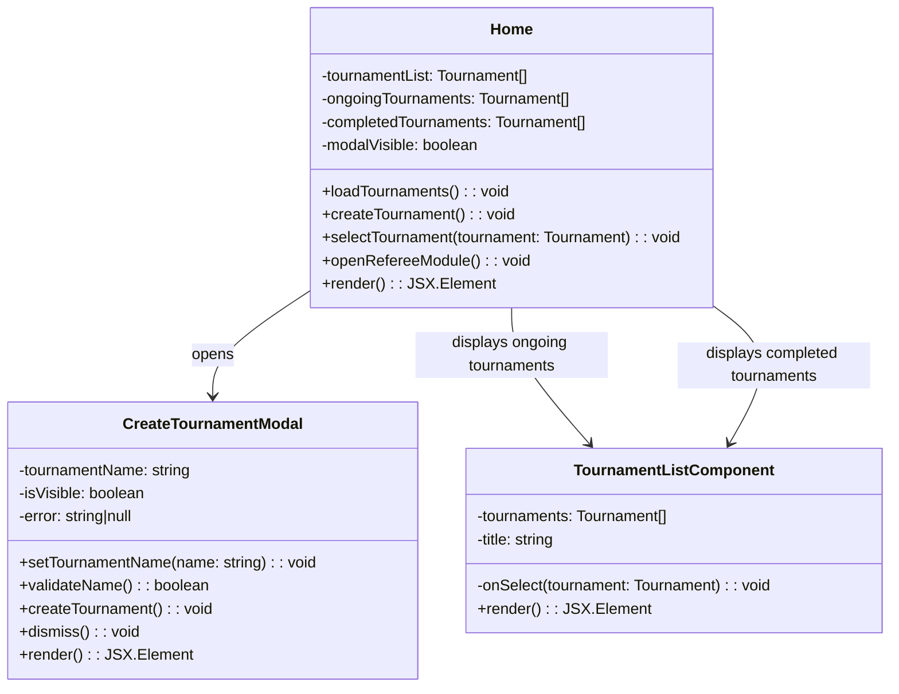
```mermaid
classDiagram
    class Home {
        -tournamentList: Tournament[]
        -ongoingTournaments: Tournament[]
        -completedTournaments: Tournament[]
        -modalVisible: boolean
        +loadTournaments(): void
        +createTournament(): void
        +selectTournament(tournament: Tournament): void
        +openRefereeModule(): void
        +render(): JSX.Element
    }
    
    class CreateTournamentModal {
        -tournamentName: string
        -isVisible: boolean
        -error: string|null
        +setTournamentName(name: string): void
        +validateName(): boolean
        +createTournament(): void
        +dismiss(): void
        +render(): JSX.Element
    }
    
    class TournamentListComponent {
        -tournaments: Tournament[]
        -title: string
        -onSelect(tournament: Tournament): void
        +render(): JSX.Element
    }
    
    Home --> CreateTournamentModal: opens
    Home --> TournamentListComponent: displays ongoing tournaments
    Home --> TournamentListComponent: displays completed tournaments
```

The Home screen is the entry point of the application, providing access to tournament management features. It maintains lists of ongoing and completed tournaments, and allows the user to create new tournaments or select existing ones.

##### 4.2.1.1 Home
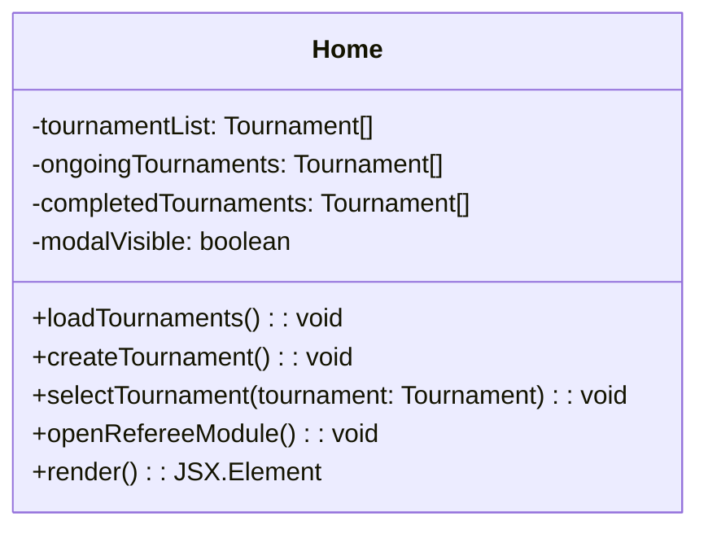
```mermaid
classDiagram
    class Home {
        -tournamentList: Tournament[]
        -ongoingTournaments: Tournament[]
        -completedTournaments: Tournament[]
        -modalVisible: boolean
        +loadTournaments(): void
        +createTournament(): void
        +selectTournament(tournament: Tournament): void
        +openRefereeModule(): void
        +render(): JSX.Element
    }
```

###### 4.2.1.1.1 Attributes

| Name | Access | Type | Description |
|------|--------|------|-------------|
| tournamentList | private | Tournament[] | Complete list of all tournaments in the system |
| ongoingTournaments | private | Tournament[] | List of tournaments that are currently in progress |
| completedTournaments | private | Tournament[] | List of tournaments that have been completed |
| modalVisible | private | boolean | Flag controlling visibility of the create tournament modal |

###### 4.2.1.1.2 Methods

| Name: | loadTournaments |
|-----------|--------------------------------------------------|
| **Input:** | None |
| **Output:** | void |
| **Description:** | Retrieves tournament data from the database and populates the tournament lists. |

| Name: | createTournament |
|-----------|--------------------------------------------------|
| **Input:** | None |
| **Output:** | void |
| **Description:** | Shows the create tournament modal dialog for user input. |

| Name: | selectTournament |
|-----------|--------------------------------------------------|
| **Input:** | Tournament tournament : The tournament to be selected |
| **Output:** | void |
| **Description:** | Navigates to the Event Management screen for the selected tournament. |

| Name: | openRefereeModule |
|-----------|--------------------------------------------------|
| **Input:** | None |
| **Output:** | void |
| **Description:** | Opens the referee module in standalone mode for practice or unofficial bouts. |

| Name: | render |
|-----------|--------------------------------------------------|
| **Input:** | None |
| **Output:** | JSX.Element |
| **Description:** | Renders the home screen UI with tournament lists and action buttons. |

##### 4.2.1.2 CreateTournamentModal
```mermaid
classDiagram
    class CreateTournamentModal {
        -tournamentName: string
        -isVisible: boolean
        -error: string|null
        +setTournamentName(name: string): void
        +validateName(): boolean
        +createTournament(): void
        +dismiss(): void
        +render(): JSX.Element
    }
```

###### 4.2.1.2.1 Attributes

| Name | Access | Type | Description |
|------|--------|------|-------------|
| tournamentName | private | string | Name input for the new tournament |
| isVisible | private | boolean | Controls modal visibility |
| error | private | string\|null | Holds validation or persistence error messages |

###### 4.2.1.2.2 Methods

| Name: | setTournamentName |
|-----------|--------------------------------------------------|
| **Input:** | string name : The name to set for the tournament |
| **Output:** | void |
| **Description:** | Updates the tournament name state with user input. |

| Name: | validateName |
|-----------|--------------------------------------------------|
| **Input:** | None |
| **Output:** | boolean |
| **Description:** | Validates the tournament name for uniqueness and formatting requirements. |

| Name: | createTournament |
|-----------|--------------------------------------------------|
| **Input:** | None |
| **Output:** | void |
| **Description:** | Creates a new tournament with the specified name in the database. |

| Name: | dismiss |
|-----------|--------------------------------------------------|
| **Input:** | None |
| **Output:** | void |
| **Description:** | Closes the modal without saving changes. |

| Name: | render |
|-----------|--------------------------------------------------|
| **Input:** | None |
| **Output:** | JSX.Element |
| **Description:** | Renders the modal dialog with name input field and action buttons. |

##### 4.2.1.3 TournamentListComponent
```mermaid
classDiagram
    class TournamentListComponent {
        -tournaments: Tournament[]
        -title: string
        -onSelect(tournament: Tournament): void
        +render(): JSX.Element
    }
```

###### 4.2.1.3.1 Attributes

| Name | Access | Type | Description |
|------|--------|------|-------------|
| tournaments | private | Tournament[] | List of tournaments to display |
| title | private | string | Section title for the tournament list |
| onSelect | private | function | Callback function when a tournament is selected |

###### 4.2.1.3.2 Methods

| Name: | render |
|-----------|--------------------------------------------------|
| **Input:** | None |
| **Output:** | JSX.Element |
| **Description:** | Renders the tournament list with headers and selection capability. |

#### 4.2.2 Event Management

```mermaid
classDiagram
    class EventManagement {
        -tournamentName: string
        -events: Event[]
        -loading: boolean
        -modalVisible: boolean
        +loadEvents(): void
        +createEvent(eventData: EventData): void
        +deleteEvent(eventId: number): void
        +startEvent(event: Event): void
        +render(): JSX.Element
    }
    
    class EventItem {
        -event: Event
        -onStart(event: Event): void
        -onDelete(eventId: number): void
        -onEdit(event: Event): void
        +render(): JSX.Element
    }
    
    class CreateEventModal {
        -eventName: string
        -weapon: string
        -gender: string
        -ageClass: string
        -isVisible: boolean
        -error: string|null
        +setEventName(name: string): void
        +setWeapon(weapon: string): void
        +setGender(gender: string): void
        +setAgeClass(ageClass: string): void
        +validateEvent(): boolean
        +createEvent(): void
        +dismiss(): void
        +render(): JSX.Element
    }
    
    EventManagement --> EventItem: displays
    EventManagement --> CreateEventModal: opens
    EventManagement --> TournamentDatabaseUtils: uses
```

The Event Management screen displays and manages events within a selected tournament. It allows users to create, delete, and start events.

##### 4.2.2.1 EventManagement
```mermaid
classDiagram
    class EventManagement {
        -tournamentName: string
        -events: Event[]
        -loading: boolean
        -modalVisible: boolean
        +loadEvents(): void
        +createEvent(eventData: EventData): void
        +deleteEvent(eventId: number): void
        +startEvent(event: Event): void
        +render(): JSX.Element
    }
```

###### 4.2.2.1.1 Attributes

| Name | Access | Type | Description |
|------|--------|------|-------------|
| tournamentName | private | string | Name of the selected tournament |
| events | private | Event[] | List of events within the tournament |
| loading | private | boolean | Indicates if data is being loaded |
| modalVisible | private | boolean | Controls visibility of the create event modal |

###### 4.2.2.1.2 Methods

| Name: | loadEvents |
|-----------|--------------------------------------------------|
| **Input:** | None |
| **Output:** | void |
| **Description:** | Fetches event data for the current tournament from the database. |

| Name: | createEvent |
|-----------|--------------------------------------------------|
| **Input:** | EventData eventData : The data for the new event |
| **Output:** | void |
| **Description:** | Creates a new event with the specified parameters in the database. |

| Name: | deleteEvent |
|-----------|--------------------------------------------------|
| **Input:** | number eventId : The identifier of the event to delete |
| **Output:** | void |
| **Description:** | Deletes an event from the database after confirmation. |

| Name: | startEvent |
|-----------|--------------------------------------------------|
| **Input:** | Event event : The event to start or configure |
| **Output:** | void |
| **Description:** | Navigates to the event settings screen to configure and start the event. |

| Name: | render |
|-----------|--------------------------------------------------|
| **Input:** | None |
| **Output:** | JSX.Element |
| **Description:** | Renders the event management screen with event list and control buttons. |

##### 4.2.2.2 EventItem
```mermaid
classDiagram
    class EventItem {
        -event: Event
        -onStart(event: Event): void
        -onDelete(eventId: number): void
        -onEdit(event: Event): void
        +render(): JSX.Element
    }
```

###### 4.2.2.2.1 Attributes

| Name | Access | Type | Description |
|------|--------|------|-------------|
| event | private | Event | The event data to display |
| onStart | private | function | Callback when user starts the event |
| onDelete | private | function | Callback when user deletes the event |
| onEdit | private | function | Callback when user edits the event |

###### 4.2.2.2.2 Methods

| Name: | render |
|-----------|--------------------------------------------------|
| **Input:** | None |
| **Output:** | JSX.Element |
| **Description:** | Renders an individual event item with event details and action buttons. |

##### 4.2.2.3 CreateEventModal
```mermaid
classDiagram
    class CreateEventModal {
        -eventName: string
        -weapon: string
        -gender: string
        -ageClass: string
        -isVisible: boolean
        -error: string|null
        +setEventName(name: string): void
        +setWeapon(weapon: string): void
        +setGender(gender: string): void
        +setAgeClass(ageClass: string): void
        +validateEvent(): boolean
        +createEvent(): void
        +dismiss(): void
        +render(): JSX.Element
    }
```

###### 4.2.2.3.1 Attributes

| Name | Access | Type | Description |
|------|--------|------|-------------|
| eventName | private | string | Name input for the new event |
| weapon | private | string | Selected weapon type (foil, epee, saber) |
| gender | private | string | Selected gender category (mixed, men, women) |
| ageClass | private | string | Selected age classification (senior, junior, etc.) |
| isVisible | private | boolean | Controls modal visibility |
| error | private | string\|null | Holds validation or persistence error messages |

###### 4.2.2.3.2 Methods

| Name: | setEventName |
|-----------|--------------------------------------------------|
| **Input:** | string name : The name to set for the event |
| **Output:** | void |
| **Description:** | Updates the event name state with user input. |

| Name: | setWeapon |
|-----------|--------------------------------------------------|
| **Input:** | string weapon : The weapon type to set |
| **Output:** | void |
| **Description:** | Updates the weapon type selection. |

| Name: | setGender |
|-----------|--------------------------------------------------|
| **Input:** | string gender : The gender category to set |
| **Output:** | void |
| **Description:** | Updates the gender category selection. |

| Name: | setAgeClass |
|-----------|--------------------------------------------------|
| **Input:** | string ageClass : The age classification to set |
| **Output:** | void |
| **Description:** | Updates the age classification selection. |

| Name: | validateEvent |
|-----------|--------------------------------------------------|
| **Input:** | None |
| **Output:** | boolean |
| **Description:** | Validates event data to ensure all required fields are properly filled. |

| Name: | createEvent |
|-----------|--------------------------------------------------|
| **Input:** | None |
| **Output:** | void |
| **Description:** | Creates a new event with the specified parameters in the database. |

| Name: | dismiss |
|-----------|--------------------------------------------------|
| **Input:** | None |
| **Output:** | void |
| **Description:** | Closes the modal without saving changes. |

| Name: | render |
|-----------|--------------------------------------------------|
| **Input:** | None |
| **Output:** | JSX.Element |
| **Description:** | Renders the modal dialog with event input fields and action buttons. |

#### 4.2.3 Event Settings

```mermaid
classDiagram
    class EventSettings {
        -eventId: number
        -event: Event
        -tournamentName: string
        -fencers: Fencer[]
        -referees: Referee[]
        -loading: boolean
        +loadEventDetails(): void
        +loadFencers(): void
        +loadReferees(): void
        +addFencer(fencer: Fencer): void
        +removeFencer(fencerId: number): void
        +addReferee(referee: Referee): void
        +removeReferee(refereeId: number): void
        +updateEventSettings(settings: EventSettings): void
        +startEvent(): void
        +render(): JSX.Element
    }
    
    class FencerList {
        -fencers: Fencer[]
        -onRemove(fencerId: number): void
        +render(): JSX.Element
    }
    
    class RefereeList {
        -referees: Referee[]
        -onRemove(refereeId: number): void
        +render(): JSX.Element
    }
    
    class FormatSelection {
        -selectedFormat: string
        -onFormatChange(format: string): void
        +render(): JSX.Element
    }
    
    EventSettings --> FencerList: displays
    EventSettings --> RefereeList: displays
    EventSettings --> FormatSelection: displays
    EventSettings --> TournamentDatabaseUtils: uses
```

The Event Settings screen configures all aspects of an event before it begins, including format selection, participant management, and referee assignment.

##### 4.2.3.1 EventSettings
```mermaid
classDiagram
    class EventSettings {
        -eventId: number
        -event: Event
        -tournamentName: string
        -fencers: Fencer[]
        -referees: Referee[]
        -loading: boolean
        +loadEventDetails(): void
        +loadFencers(): void
        +loadReferees(): void
        +addFencer(fencer: Fencer): void
        +removeFencer(fencerId: number): void
        +addReferee(referee: Referee): void
        +removeReferee(refereeId: number): void
        +updateEventSettings(settings: EventSettings): void
        +startEvent(): void
        +render(): JSX.Element
    }
```

###### 4.2.3.1.1 Attributes

| Name | Access | Type | Description |
|------|--------|------|-------------|
| eventId | private | number | Identifier of the event being configured |
| event | private | Event | Complete event data object |
| tournamentName | private | string | Name of the parent tournament |
| fencers | private | Fencer[] | List of fencers assigned to the event |
| referees | private | Referee[] | List of referees assigned to the event |
| loading | private | boolean | Indicates if data is being loaded |

###### 4.2.3.1.2 Methods

| Name: | loadEventDetails |
|-----------|--------------------------------------------------|
| **Input:** | None |
| **Output:** | void |
| **Description:** | Fetches event details from the database including basic information and format settings. |

| Name: | loadFencers |
|-----------|--------------------------------------------------|
| **Input:** | None |
| **Output:** | void |
| **Description:** | Fetches the list of fencers registered for this event. |

| Name: | loadReferees |
|-----------|--------------------------------------------------|
| **Input:** | None |
| **Output:** | void |
| **Description:** | Fetches the list of referees assigned to this event. |

| Name: | addFencer |
|-----------|--------------------------------------------------|
| **Input:** | Fencer fencer : The fencer to add to the event |
| **Output:** | void |
| **Description:** | Adds a fencer to the event and persists the change in the database. |

| Name: | removeFencer |
|-----------|--------------------------------------------------|
| **Input:** | number fencerId : The identifier of the fencer to remove |
| **Output:** | void |
| **Description:** | Removes a fencer from the event and updates the database. |

| Name: | addReferee |
|-----------|--------------------------------------------------|
| **Input:** | Referee referee : The referee to add to the event |
| **Output:** | void |
| **Description:** | Adds a referee to the event and persists the change in the database. |

| Name: | removeReferee |
|-----------|--------------------------------------------------|
| **Input:** | number refereeId : The identifier of the referee to remove |
| **Output:** | void |
| **Description:** | Removes a referee from the event and updates the database. |

| Name: | updateEventSettings |
|-----------|--------------------------------------------------|
| **Input:** | EventSettings settings : The updated event settings |
| **Output:** | void |
| **Description:** | Updates the event configuration including format and parameters. |

| Name: | startEvent |
|-----------|--------------------------------------------------|
| **Input:** | None |
| **Output:** | void |
| **Description:** | Initializes the event with current settings and navigates to the appropriate screen based on format. |

| Name: | render |
|-----------|--------------------------------------------------|
| **Input:** | None |
| **Output:** | JSX.Element |
| **Description:** | Renders the event settings screen with all configuration options and participant lists. |

##### 4.2.3.2 FencerList
```mermaid
classDiagram
    class FencerList {
        -fencers: Fencer[]
        -onRemove(fencerId: number): void
        +render(): JSX.Element
    }
```

###### 4.2.3.2.1 Attributes

| Name | Access | Type | Description |
|------|--------|------|-------------|
| fencers | private | Fencer[] | List of fencers to display |
| onRemove | private | function | Callback function when a fencer is removed |

###### 4.2.3.2.2 Methods

| Name: | render |
|-----------|--------------------------------------------------|
| **Input:** | None |
| **Output:** | JSX.Element |
| **Description:** | Renders the list of fencers with their information and remove buttons. |

##### 4.2.3.3 RefereeList
```mermaid
classDiagram
    class RefereeList {
        -referees: Referee[]
        -onRemove(refereeId: number): void
        +render(): JSX.Element
    }
```

###### 4.2.3.3.1 Attributes

| Name | Access | Type | Description |
|------|--------|------|-------------|
| referees | private | Referee[] | List of referees to display |
| onRemove | private | function | Callback function when a referee is removed |

###### 4.2.3.3.2 Methods

| Name: | render |
|-----------|--------------------------------------------------|
| **Input:** | None |
| **Output:** | JSX.Element |
| **Description:** | Renders the list of referees with their information and remove buttons. |

##### 4.2.3.4 FormatSelection
```mermaid
classDiagram
    class FormatSelection {
        -selectedFormat: string
        -onFormatChange(format: string): void
        +render(): JSX.Element
    }
```

###### 4.2.3.4.1 Attributes

| Name | Access | Type | Description |
|------|--------|------|-------------|
| selectedFormat | private | string | Currently selected tournament format |
| onFormatChange | private | function | Callback function when format is changed |

###### 4.2.3.4.2 Methods

| Name: | render |
|-----------|--------------------------------------------------|
| **Input:** | None |
| **Output:** | JSX.Element |
| **Description:** | Renders the format selection controls with options for pools, single elimination, double elimination, and compass draw. |

#### 4.2.4 Pools Page

```mermaid
classDiagram
    class PoolsPage {
        -eventId: number
        -roundId: number
        -pools: Pool[]
        -loading: boolean
        +loadPools(): void
        +viewBoutOrder(poolId: number): void
        +completePool(poolId: number): void
        +calculateResults(): void
        +render(): JSX.Element
    }
    
    class PoolDisplay {
        -pool: Pool
        -fencers: PoolFencer[]
        -isComplete: boolean
        -onViewBoutOrder(): void
        -onComplete(): void
        +render(): JSX.Element
    }
    
    class PoolTable {
        -fencers: PoolFencer[]
        -boutResults: BoutResult[]
        +render(): JSX.Element
    }
    
    PoolsPage --> PoolDisplay: contains
    PoolDisplay --> PoolTable: contains
    PoolsPage --> TournamentDatabaseUtils: uses
    PoolsPage --> RoundAlgorithms: uses
```

The Pools Page manages pool assignments, bout scheduling, and pool completion in a tournament round.

##### 4.2.4.1 PoolsPage
```mermaid
classDiagram
    class PoolsPage {
        -eventId: number
        -roundId: number
        -pools: Pool[]
        -loading: boolean
        +loadPools(): void
        +viewBoutOrder(poolId: number): void
        +completePool(poolId: number): void
        +calculateResults(): void
        +render(): JSX.Element
    }
```

###### 4.2.4.1.1 Attributes

| Name | Access | Type | Description |
|------|--------|------|-------------|
| eventId | private | number | Identifier of the event containing the pools |
| roundId | private | number | Identifier of the current round |
| pools | private | Pool[] | List of pools in the current round |
| loading | private | boolean | Indicates if data is being loaded |

###### 4.2.4.1.2 Methods

| Name: | loadPools |
|-----------|--------------------------------------------------|
| **Input:** | None |
| **Output:** | void |
| **Description:** | Fetches pool assignments and fencer data from the database. |

| Name: | viewBoutOrder |
|-----------|--------------------------------------------------|
| **Input:** | number poolId : The identifier of the pool to view |
| **Output:** | void |
| **Description:** | Navigates to the Bout Order page for the selected pool. |

| Name: | completePool |
|-----------|--------------------------------------------------|
| **Input:** | number poolId : The identifier of the pool to mark as complete |
| **Output:** | void |
| **Description:** | Marks a pool as complete in the database after all bouts are finished. |

| Name: | calculateResults |
|-----------|--------------------------------------------------|
| **Input:** | None |
| **Output:** | void |
| **Description:** | Calculates rankings, victory indicators, and seeding for the next round based on pool results. |

| Name: | render |
|-----------|--------------------------------------------------|
| **Input:** | None |
| **Output:** | JSX.Element |
| **Description:** | Renders the pools page with all pool displays and control buttons. |

##### 4.2.4.2 PoolDisplay
```mermaid
classDiagram
    class PoolDisplay {
        -pool: Pool
        -fencers: PoolFencer[]
        -isComplete: boolean
        -onViewBoutOrder(): void
        -onComplete(): void
        +render(): JSX.Element
    }
```

###### 4.2.4.2.1 Attributes

| Name | Access | Type | Description |
|------|--------|------|-------------|
| pool | private | Pool | The pool data to display |
| fencers | private | PoolFencer[] | List of fencers assigned to this pool |
| isComplete | private | boolean | Indicates if the pool has been marked as complete |
| onViewBoutOrder | private | function | Callback when user views bout order |
| onComplete | private | function | Callback when user marks pool as complete |

###### 4.2.4.2.2 Methods

| Name: | render |
|-----------|--------------------------------------------------|
| **Input:** | None |
| **Output:** | JSX.Element |
| **Description:** | Renders a single pool component with header, table, and action buttons. |

##### 4.2.4.3 PoolTable
```mermaid
classDiagram
    class PoolTable {
        -fencers: PoolFencer[]
        -boutResults: BoutResult[]
        +render(): JSX.Element
    }
```

###### 4.2.4.3.1 Attributes

| Name | Access | Type | Description |
|------|--------|------|-------------|
| fencers | private | PoolFencer[] | List of fencers in the pool |
| boutResults | private | BoutResult[] | Results of bouts that have been completed |

###### 4.2.4.3.2 Methods

| Name: | render |
|-----------|--------------------------------------------------|
| **Input:** | None |
| **Output:** | JSX.Element |
| **Description:** | Renders the pool table grid showing fencer matchups and bout results. |

#### 4.2.5 Bout Order Page

```mermaid
classDiagram
    class BoutOrderPage {
        -roundId: number
        -poolId: number
        -bouts: Bout[]
        -loading: boolean
        +loadBouts(): void
        +selectBout(boutId: number): void
        +render(): JSX.Element
    }
    
    class BoutItem {
        -bout: Bout
        -leftFencer: Fencer
        -rightFencer: Fencer
        -status: string
        -onSelect(): void
        +render(): JSX.Element
    }
    
    BoutOrderPage --> BoutItem: displays
    BoutOrderPage --> TournamentDatabaseUtils: uses
```

The Bout Order Page displays the sequence of bouts in a pool and allows referees to select bouts for scoring.

##### 4.2.5.1 BoutOrderPage
```mermaid
classDiagram
    class BoutOrderPage {
        -roundId: number
        -poolId: number
        -bouts: Bout[]
        -loading: boolean
        +loadBouts(): void
        +selectBout(boutId: number): void
        +render(): JSX.Element
    }
```

###### 4.2.5.1.1 Attributes

| Name | Access | Type | Description |
|------|--------|------|-------------|
| roundId | private | number | Identifier of the current round |
| poolId | private | number | Identifier of the selected pool |
| bouts | private | Bout[] | List of bouts in the selected pool |
| loading | private | boolean | Indicates if data is being loaded |

###### 4.2.5.1.2 Methods

| Name: | loadBouts |
|-----------|--------------------------------------------------|
| **Input:** | None |
| **Output:** | void |
| **Description:** | Fetches bout data for the selected pool from the database. |

| Name: | selectBout |
|-----------|--------------------------------------------------|
| **Input:** | number boutId : The identifier of the bout to referee |
| **Output:** | void |
| **Description:** | Navigates to the Referee Module with the selected bout. |

| Name: | render |
|-----------|--------------------------------------------------|
| **Input:** | None |
| **Output:** | JSX.Element |
| **Description:** | Renders the bout order page with all bouts in recommended sequence. |

##### 4.2.5.2 BoutItem
```mermaid
classDiagram
    class BoutItem {
        -bout: Bout
        -leftFencer: Fencer
        -rightFencer: Fencer
        -status: string
        -onSelect(): void
        +render(): JSX.Element
    }
```

###### 4.2.5.2.1 Attributes

| Name | Access | Type | Description |
|------|--------|------|-------------|
| bout | private | Bout | The bout data to display |
| leftFencer | private | Fencer | Left side fencer information |
| rightFencer | private | Fencer | Right side fencer information |
| status | private | string | Current status of the bout (pending, complete) |
| onSelect | private | function | Callback when the bout is selected for refereeing |

###### 4.2.5.2.2 Methods

| Name: | render |
|-----------|--------------------------------------------------|
| **Input:** | None |
| **Output:** | JSX.Element |
| **Description:** | Renders a single bout item with fencer names and status indicators. |

#### 4.2.6 Referee Module

```mermaid
classDiagram
    class RefereeModule {
        -boutId: number|null
        -boutTime: number
        -leftScore: number
        -rightScore: number
        -leftFencer: Fencer|null
        -rightFencer: Fencer|null
        -passivityTime: number
        -isTimerActive: boolean
        -isPassivityActive: boolean
        -cards: Card[]
        -loading: boolean
        +loadBoutDetails(): void
        +startTimer(): void
        +stopTimer(): void
        +resetTimer(): void
        +updateScore(fencer: 'left'|'right', change: number): void
        +addCard(fencer: 'left'|'right', type: CardType): void
        +startPassivityTimer(): void
        +stopPassivityTimer(): void
        +resetPassivityTimer(): void
        +saveBoutResult(): void
        +render(): JSX.Element
    }
    
    class CustomTimeModal {
        -isVisible: boolean
        -minutes: number
        -seconds: number
        -presets: TimePreset[]
        -onSelectPreset(preset: TimePreset): void
        -onSetCustomTime(minutes: number, seconds: number): void
        -onConfirm(): void
        -onCancel(): void
        +render(): JSX.Element
    }
    
    class ScoreDisplay {
        -leftScore: number
        -rightScore: number
        -leftFencer: Fencer|null
        -rightFencer: Fencer|null
        -leftCards: Card[]
        -rightCards: Card[]
        -onScoreChange(fencer: 'left'|'right', change: number): void
        +render(): JSX.Element
    }
    
    class TimerDisplay {
        -time: number
        -isActive: boolean
        -isPaused: boolean
        -warningThreshold: number
        -criticalThreshold: number
        +render(): JSX.Element
    }
    
    RefereeModule --> CustomTimeModal: opens
    RefereeModule --> ScoreDisplay: contains
    RefereeModule --> TimerDisplay: contains
    RefereeModule --> TournamentDatabaseUtils: uses
```

The Referee Module provides comprehensive bout management tools for scoring, timing, and recording fencing bouts.

##### 4.2.6.1 RefereeModule
```mermaid
classDiagram
    class RefereeModule {
        -boutId: number|null
        -boutTime: number
        -leftScore: number
        -rightScore: number
        -leftFencer: Fencer|null
        -rightFencer: Fencer|null
        -passivityTime: number
        -isTimerActive: boolean
        -isPassivityActive: boolean
        -cards: Card[]
        -loading: boolean
        +loadBoutDetails(): void
        +startTimer(): void
        +stopTimer(): void
        +resetTimer(): void
        +updateScore(fencer: 'left'|'right', change: number): void
        +addCard(fencer: 'left'|'right', type: CardType): void
        +startPassivityTimer(): void
        +stopPassivityTimer(): void
        +resetPassivityTimer(): void
        +saveBoutResult(): void
        +render(): JSX.Element
    }
```

###### 4.2.6.1.1 Attributes

| Name | Access | Type | Description |
|------|--------|------|-------------|
| boutId | private | number\|null | Identifier of the bout being refereed (null in standalone mode) |
| boutTime | private | number | Current bout time in seconds |
| leftScore | private | number | Score of the left fencer |
| rightScore | private | number | Score of the right fencer |
| leftFencer | private | Fencer\|null | Left fencer information |
| rightFencer | private | Fencer\|null | Right fencer information |
| passivityTime | private | number | Current passivity timer value in seconds |
| isTimerActive | private | boolean | Indicates if the main timer is running |
| isPassivityActive | private | boolean | Indicates if the passivity timer is running |
| cards | private | Card[] | List of cards assigned to fencers |
| loading | private | boolean | Indicates if data is being loaded |

###### 4.2.6.1.2 Methods

| Name: | loadBoutDetails |
|-----------|--------------------------------------------------|
| **Input:** | None |
| **Output:** | void |
| **Description:** | Fetches bout and fencer details from the database in tournament mode. |

| Name: | startTimer |
|-----------|--------------------------------------------------|
| **Input:** | None |
| **Output:** | void |
| **Description:** | Starts the main bout timer. |

| Name: | stopTimer |
|-----------|--------------------------------------------------|
| **Input:** | None |
| **Output:** | void |
| **Description:** | Stops the main bout timer. |

| Name: | resetTimer |
|-----------|--------------------------------------------------|
| **Input:** | None |
| **Output:** | void |
| **Description:** | Resets the main bout timer to the configured time. |

| Name: | updateScore |
|-----------|--------------------------------------------------|
| **Input:** | string fencer : Which fencer to update ('left' or 'right') number change : Value to add to the score (can be negative) |
| **Output:** | void |
| **Description:** | Updates the score for the specified fencer. |

| Name: | addCard |
|-----------|--------------------------------------------------|
| **Input:** | string fencer : Which fencer receives the card ('left' or 'right') CardType type : Type of card (yellow, red, black) |
| **Output:** | void |
| **Description:** | Assigns a card to the specified fencer and applies any score penalties. |

| Name: | startPassivityTimer |
|-----------|--------------------------------------------------|
| **Input:** | None |
| **Output:** | void |
| **Description:** | Starts the passivity timer. |

| Name: | stopPassivityTimer |
|-----------|--------------------------------------------------|
| **Input:** | None |
| **Output:** | void |
| **Description:** | Stops the passivity timer. |

| Name: | resetPassivityTimer |
|-----------|--------------------------------------------------|
| **Input:** | None |
| **Output:** | void |
| **Description:** | Resets the passivity timer to the configured time. |

| Name: | saveBoutResult |
|-----------|--------------------------------------------------|
| **Input:** | None |
| **Output:** | void |
| **Description:** | Persists bout results to the database and handles advancement logic in tournament mode. |

| Name: | render |
|-----------|--------------------------------------------------|
| **Input:** | None |
| **Output:** | JSX.Element |
| **Description:** | Renders the referee module with all scoring, timing, and control elements. |

##### 4.2.6.2 CustomTimeModal
```mermaid
classDiagram
    class CustomTimeModal {
        -isVisible: boolean
        -minutes: number
        -seconds: number
        -presets: TimePreset[]
        -onSelectPreset(preset: TimePreset): void
        -onSetCustomTime(minutes: number, seconds: number): void
        -onConfirm(): void
        -onCancel(): void
        +render(): JSX.Element
    }
```

###### 4.2.6.2.1 Attributes

| Name | Access | Type | Description |
|------|--------|------|-------------|
| isVisible | private | boolean | Controls modal visibility |
| minutes | private | number | Minutes value for custom time |
| seconds | private | number | Seconds value for custom time |
| presets | private | TimePreset[] | List of predefined time presets |
| onSelectPreset | private | function | Callback when a preset is selected |
| onSetCustomTime | private | function | Callback when custom time is set |
| onConfirm | private | function | Callback when time selection is confirmed |
| onCancel | private | function | Callback when time selection is canceled |

###### 4.2.6.2.2 Methods

| Name: | render |
|-----------|--------------------------------------------------|
| **Input:** | None |
| **Output:** | JSX.Element |
| **Description:** | Renders the time selection modal with presets and custom input options. |

##### 4.2.6.3 ScoreDisplay
```mermaid
classDiagram
    class ScoreDisplay {
        -leftScore: number
        -rightScore: number
        -leftFencer: Fencer|null
        -rightFencer: Fencer|null
        -leftCards: Card[]
        -rightCards: Card[]
        -onScoreChange(fencer: 'left'|'right', change: number): void
        +render(): JSX.Element
    }
```

###### 4.2.6.3.1 Attributes

| Name | Access | Type | Description |
|------|--------|------|-------------|
| leftScore | private | number | Score of the left fencer |
| rightScore | private | number | Score of the right fencer |
| leftFencer | private | Fencer\|null | Left fencer information |
| rightFencer | private | Fencer\|null | Right fencer information |
| leftCards | private | Card[] | Cards assigned to left fencer |
| rightCards | private | Card[] | Cards assigned to right fencer |
| onScoreChange | private | function | Callback when a score is changed |

###### 4.2.6.3.2 Methods

| Name: | render |
|-----------|--------------------------------------------------|
| **Input:** | None |
| **Output:** | JSX.Element |
| **Description:** | Renders the score display with fencer names, scores, and card indicators. |

##### 4.2.6.4 TimerDisplay
```mermaid
classDiagram
    class TimerDisplay {
        -time: number
        -isActive: boolean
        -isPaused: boolean
        -warningThreshold: number
        -criticalThreshold: number
        +render(): JSX.Element
    }
```

###### 4.2.6.4.1 Attributes

| Name | Access | Type | Description |
|------|--------|------|-------------|
| time | private | number | Current time value in seconds |
| isActive | private | boolean | Indicates if the timer is running |
| isPaused | private | boolean | Indicates if the timer is paused |
| warningThreshold | private | number | Threshold in seconds for warning display |
| criticalThreshold | private | number | Threshold in seconds for critical display |

###### 4.2.6.4.2 Methods

| Name: | render |
|-----------|--------------------------------------------------|
| **Input:** | None |
| **Output:** | JSX.Element |
| **Description:** | Renders the timer display with minutes and seconds in appropriate format and color. |

#### 4.2.7 Bracket Pages

```mermaid
classDiagram
    class DEBracketPage {
        -eventId: number
        -roundId: number
        -bouts: Bout[]
        -bracketSize: number
        -loading: boolean
        +loadBracket(): void
        +selectBout(boutId: number): void
        +render(): JSX.Element
    }
    
    class DoubleEliminationPage {
        -eventId: number
        -roundId: number
        -winnersBracket: Bout[]
        -losersBracket: Bout[]
        -finalsBracket: Bout[]
        -loading: boolean
        +loadBrackets(): void
        +selectBout(boutId: number): void
        +render(): JSX.Element
    }
    
    class CompassDrawPage {
        -eventId: number
        -roundId: number
        -eastBracket: Bout[]
        -northBracket: Bout[]
        -westBracket: Bout[]
        -southBracket: Bout[]
        -loading: boolean
        +loadBrackets(): void
        +selectBout(boutId: number): void
        +render(): JSX.Element
    }
    
    class BracketDisplay {
        -bouts: Bout[]
        -bracketType: string
        -round: number
        -onSelectBout(boutId: number): void
        +render(): JSX.Element
    }
    
    class BoutNode {
        -bout: Bout
        -leftFencer: Fencer|null
        -rightFencer: Fencer|null
        -winner: Fencer|null
        -state: string
        -onSelect(): void
        +render(): JSX.Element
    }
    
    DEBracketPage --> BracketDisplay: contains
    DoubleEliminationPage --> BracketDisplay: contains multiple
    CompassDrawPage --> BracketDisplay: contains multiple
    BracketDisplay --> BoutNode: contains
    DEBracketPage --> TournamentDatabaseUtils: uses
    DoubleEliminationPage --> DoubleEliminationUtils: uses
    CompassDrawPage --> CompassDrawUtils: uses
```

The Bracket Pages provide visualization and management for different types of elimination formats, including single elimination, double elimination, and compass draw.

##### 4.2.7.1 DEBracketPage
```mermaid
classDiagram
    class DEBracketPage {
        -eventId: number
        -roundId: number
        -bouts: Bout[]
        -bracketSize: number
        -loading: boolean
        +loadBracket(): void
        +selectBout(boutId: number): void
        +render(): JSX.Element
    }
```

###### 4.2.7.1.1 Attributes

| Name | Access | Type | Description |
|------|--------|------|-------------|
| eventId | private | number | Identifier of the event |
| roundId | private | number | Identifier of the current round |
| bouts | private | Bout[] | List of bouts in the bracket |
| bracketSize | private | number | Size of the bracket (8, 16, 32, 64, etc.) |
| loading | private | boolean | Indicates if data is being loaded |

###### 4.2.7.1.2 Methods

| Name: | loadBracket |
|-----------|--------------------------------------------------|
| **Input:** | None |
| **Output:** | void |
| **Description:** | Fetches single elimination bracket data from the database. |

| Name: | selectBout |
|-----------|--------------------------------------------------|
| **Input:** | number boutId : The identifier of the bout to referee |
| **Output:** | void |
| **Description:** | Navigates to the Referee Module with the selected bout. |

| Name: | render |
|-----------|--------------------------------------------------|
| **Input:** | None |
| **Output:** | JSX.Element |
| **Description:** | Renders the bracket visualization with all bouts in tournament structure. |

##### 4.2.7.2 DoubleEliminationPage
```mermaid
classDiagram
    class DoubleEliminationPage {
        -eventId: number
        -roundId: number
        -winnersBracket: Bout[]
        -losersBracket: Bout[]
        -finalsBracket: Bout[]
        -loading: boolean
        +loadBrackets(): void
        +selectBout(boutId: number): void
        +render(): JSX.Element
    }
```

###### 4.2.7.2.1 Attributes

| Name | Access | Type | Description |
|------|--------|------|-------------|
| eventId | private | number | Identifier of the event |
| roundId | private | number | Identifier of the current round |
| winnersBracket | private | Bout[] | List of bouts in the winners bracket |
| losersBracket | private | Bout[] | List of bouts in the losers bracket |
| finalsBracket | private | Bout[] | List of bouts in the finals bracket |
| loading | private | boolean | Indicates if data is being loaded |

###### 4.2.7.2.2 Methods

| Name: | loadBrackets |
|-----------|--------------------------------------------------|
| **Input:** | None |
| **Output:** | void |
| **Description:** | Fetches double elimination bracket data for all brackets from the database. |

| Name: | selectBout |
|-----------|--------------------------------------------------|
| **Input:** | number boutId : The identifier of the bout to referee |
| **Output:** | void |
| **Description:** | Navigates to the Referee Module with the selected bout. |

| Name: | render |
|-----------|--------------------------------------------------|
| **Input:** | None |
| **Output:** | JSX.Element |
| **Description:** | Renders the winners and losers brackets with all bouts in tournament structure. |

##### 4.2.7.3 CompassDrawPage
```mermaid
classDiagram
    class CompassDrawPage {
        -eventId: number
        -roundId: number
        -eastBracket: Bout[]
        -northBracket: Bout[]
        -westBracket: Bout[]
        -southBracket: Bout[]
        -loading: boolean
        +loadBrackets(): void
        +selectBout(boutId: number): void
        +render(): JSX.Element
    }
```

###### 4.2.7.3.1 Attributes

| Name | Access | Type | Description |
|------|--------|------|-------------|
| eventId | private | number | Identifier of the event |
| roundId | private | number | Identifier of the current round |
| eastBracket | private | Bout[] | List of bouts in the east bracket |
| northBracket | private | Bout[] | List of bouts in the north bracket |
| westBracket | private | Bout[] | List of bouts in the west bracket |
| southBracket | private | Bout[] | List of bouts in the south bracket |
| loading | private | boolean | Indicates if data is being loaded |

###### 4.2.7.3.2 Methods

| Name: | loadBrackets |
|-----------|--------------------------------------------------|
| **Input:** | None |
| **Output:** | void |
| **Description:** | Fetches compass draw bracket data for all directional brackets from the database. |

| Name: | selectBout |
|-----------|--------------------------------------------------|
| **Input:** | number boutId : The identifier of the bout to referee |
| **Output:** | void |
| **Description:** | Navigates to the Referee Module with the selected bout. |

| Name: | render |
|-----------|--------------------------------------------------|
| **Input:** | None |
| **Output:** | JSX.Element |
| **Description:** | Renders all directional brackets with their bouts in tournament structure. |

##### 4.2.7.4 BracketDisplay
```mermaid
classDiagram
    class BracketDisplay {
        -bouts: Bout[]
        -bracketType: string
        -round: number
        -onSelectBout(boutId: number): void
        +render(): JSX.Element
    }
```

###### 4.2.7.4.1 Attributes

| Name | Access | Type | Description |
|------|--------|------|-------------|
| bouts | private | Bout[] | List of bouts to display in the bracket |
| bracketType | private | string | Type of bracket (winners, losers, direction) |
| round | private | number | Current round number |
| onSelectBout | private | function | Callback when a bout is selected for refereeing |

###### 4.2.7.4.2 Methods

| Name: | render |
|-----------|--------------------------------------------------|
| **Input:** | None |
| **Output:** | JSX.Element |
| **Description:** | Renders a bracket structure with all bouts organized in rounds and positions. |

##### 4.2.7.5 BoutNode
```mermaid
classDiagram
    class BoutNode {
        -bout: Bout
        -leftFencer: Fencer|null
        -rightFencer: Fencer|null
        -winner: Fencer|null
        -state: string
        -onSelect(): void
        +render(): JSX.Element
    }
```

###### 4.2.7.5.1 Attributes

| Name | Access | Type | Description |
|------|--------|------|-------------|
| bout | private | Bout | The bout data to display |
| leftFencer | private | Fencer\|null | Left side fencer information |
| rightFencer | private | Fencer\|null | Right side fencer information |
| winner | private | Fencer\|null | Fencer who won the bout (if completed) |
| state | private | string | Current state of the bout (pending, complete) |
| onSelect | private | function | Callback when the bout is selected for refereeing |

###### 4.2.7.5.2 Methods

| Name: | render |
|-----------|--------------------------------------------------|
| **Input:** | None |
| **Output:** | JSX.Element |
| **Description:** | Renders a single bout node with fencer names, seeding, and results if available. |

## 5. Data Model

### 5.1 Database Schema

```mermaid
erDiagram
    Tournaments ||--o{ Events : contains
    Events ||--o{ Rounds : contains
    Events ||--o{ FencerEvents : has
    Fencers ||--o{ FencerEvents : participates
    Rounds ||--o{ FencerPoolAssignment : assigns
    Rounds ||--o{ Bouts : contains
    Fencers ||--o{ FencerPoolAssignment : assigned
    Fencers ||--o{ FencerBouts : participates
    Bouts ||--o{ FencerBouts : has
    Rounds ||--o{ DEBracketBouts : contains
    Bouts ||--|| DEBracketBouts : details
    Rounds ||--o{ SeedingFromRoundResults : produces
    Fencers ||--o{ SeedingFromRoundResults : receives
    Referees ||--o{ Bouts : officiates
    
    Tournaments {
        string name PK
        boolean isComplete
    }
    
    Fencers {
        integer id PK
        string firstName
        string lastName
        string epeeRating
        string foilRating
        string saberRating
    }
    
    Referees {
        integer id PK
        string firstName
        string lastName
    }
    
    Events {
        integer id PK
        string tname FK
        string weapon
        string gender
        string ageClass
    }
    
    FencerEvents {
        integer id PK
        integer fencerId FK
        integer eventId FK
    }
    
    Rounds {
        integer id PK
        integer eventId FK
        string type
        integer poolSize
        integer poolCount
        integer promoteCount
    }
    
    FencerPoolAssignment {
        integer roundId FK
        integer poolId
        integer fencerId FK
        integer position
    }
    
    Bouts {
        integer id PK
        integer eventId FK
        integer roundId FK
        integer leftFencerId FK
        integer rightFencerId FK
        integer refereeId FK
        integer victorId FK
        integer bracketSize
    }
    
    DEBracketBouts {
        integer id PK
        integer roundId FK
        integer boutId FK
        string bracketType
        integer bracketPosition
    }
    
    FencerBouts {
        integer boutId FK
        integer fencerId FK
        integer score
    }
    
    SeedingFromRoundResults {
        integer id PK
        integer roundId FK
        integer fencerId FK
        integer seed
    }
```

#### Database Table Descriptions

| Table | Description |
|-------|-------------|
| **Tournaments** | Stores tournament information with name as primary key |
| **Fencers** | Contains fencer personal and rating information |
| **Referees** | Stores referee information |
| **Events** | Records events within tournaments with foreign key to tournament |
| **FencerEvents** | Junction table linking fencers to events they participate in |
| **Rounds** | Stores information about tournament rounds (pools, DE, etc.) |
| **FencerPoolAssignment** | Maps fencers to specific pools within a round |
| **Bouts** | Records all bout information including fencers and referee |
| **DEBracketBouts** | Maps bouts to positions within bracket structures |
| **FencerBouts** | Records fencer-specific bout outcomes including scores |
| **SeedingFromRoundResults** | Stores seeding information from completed rounds |

## 6. Traceability Matrix

| Req ID                                      | Implementing Component                                            |
|---------------------------------------------|-------------------------------------------------------------------|
| **Tournament Management**                   |                                                                   |
| 3.1 - Tournament Creation                   | CreateTournamentModal.tsx, TournamentDatabaseUtils.ts             |
| 3.1.1 - Tournament Name Input               | CreateTournamentModal.tsx                                         |
| 3.1.2 - Require At Least One Event          | EventManagement.tsx, TournamentDatabaseUtils.ts                   |
| 3.1.3 - Create Events Within Tournaments    | EventManagement.tsx                                               |
| 3.2 - Tournament Management                 | Home.tsx, TournamentListComponent.tsx                             |
| 3.2.1 - Complete All Events Before Ending   | TournamentDatabaseUtils.ts                                        |
| 3.2.2 - Delete Tournament                   | TournamentListComponent.tsx, TournamentDatabaseUtils.ts           |_
| 3.2.3 - View Tournaments in Progress        | Home.tsx, TournamentListComponent.tsx                             |
| 3.2.4 - Invite Referees                     | Home.tsx                                                          |
| 3.2.5 - Tournament History                  | Home.tsx, TournamentListComponent.tsx                             |
| 3.2.6 - Enable Embedded Server              | App.tsx                                                           |
| 3.2.7 - Export Tournament Data              | TournamentDatabaseUtils.ts                                        |
| **Event Management**                        |                                                                   |
| 3.3 - Event Management                      | EventManagement.tsx, EventSettings.tsx                            |
| 3.3.1 - View Created Events                 | EventManagement.tsx                                               |
| 3.3.2 - Generate Event Name                 | EventManagement.tsx                                               |
| 3.3.3 - Add at Least One Round              | EventSettings.tsx                                                 |
| 3.3.4 - Add Arbitrary Number of Fencers     | EventSettings.tsx                                                 |
| 3.3.5 - Create DE Table                     | DEBracketPage.tsx, RoundAlgorithms.tsx                            |
| 3.3.6 - Enter/Select Fencers                | EventSettings.tsx                                                 |
| 3.3.7 - Support Additional Formats          | BracketFormats.ts, CompassDrawUtils.ts, DoubleEliminationUtils.ts |
| 3.3.8 - Delete Events                       | EventManagement.tsx                                               |
| **Pools/DE Management**                     |                                                                   |
| 3.4 - Pools Management                      | PoolsPage.tsx                                                     |
| 3.4.1 - Create Bout Order                   | BoutOrderPage.tsx, RoundAlgorithms.tsx                            |
| 3.4.2 - Allow Referees to Select Bouts      | BoutOrderPage.tsx, RefereeModule.tsx                              |
| 3.4.3 - End Pools Button                    | PoolsPage.tsx                                                     |
| 3.4.4 - Create DE After Pools               | RoundResults.tsx, DEBracketPage.tsx                               |
| 3.4.5 - Generate Results Page After Pools   | PoolsPage.tsx, RoundResults.tsx                                   |
| 3.5 - DE Table Creation                     | DEBracketPage.tsx, RoundAlgorithms.tsx                            |
| 3.5.1 - Use Prior Round Results for Seeding | RoundResults.tsx, TournamentDatabaseUtils.ts                      |
| 3.5.2 - Use Specified Seeding Method        | EventSettings.tsx, RoundAlgorithms.tsx                            |
| 3.5.3 - Grant Byes to Fencers               | DEBracketPage.tsx, RoundAlgorithms.tsx                            |
| 3.6 - Fencer Following                      | TournamentListComponent.tsx                                       |
| 3.7 - Results Generation                    | RoundResults.tsx, TournamentDatabaseUtils.ts                      |
| **Scoring and Refereeing**                  |                                                                   |
| 3.8 - Scoring Module                        | RefereeModule.tsx                                                 |
| 3.8.1 - Increment/Decrement Score           | RefereeModule.tsx                                                 |
| 3.8.2 - Start/Stop Clock                    | RefereeModule.tsx                                                 |
| 3.8.3 - Passivity Timer                     | RefereeModule.tsx                                                 |
| 3.8.4 - Clock Presets                       | RefereeModule.tsx, CustomTimeModal.tsx                            |
| 3.8.5 - Assign Cards                        | RefereeModule.tsx                                                 |
| 3.8.6 - Assign Priority                     |                                                                   |
| 3.8.7 - Select Winner                       |                                                                   |
| 3.8.8 - Connect to Scoring Box              | RefereeModule.tsx                                                 |
| 3.8.9 - Weapon Selection                    | RefereeModule.tsx                                                 |
| 3.8.10 - Hide Unused UI Elements            | RefereeModule.tsx                                                 |
| 3.9 - Referee Management                    | Home.tsx, EventManagement.tsx                                     |
| 3.9.1 - Link for Referees                   | App.tsx, index.tsx                                                |
| 3.9.2 - Create Referee Whitelist            | EventSettings.tsx                                                 |
| **Hardware**                                |                                                                   |
| 3.10 - Scoring Box                          | External Hardware Component                                       |
| 3.10.1 - Conform to USA Fencing Rules       |                                                                   |
| 3.10.2 - Audible Touch Indication           |                                                                   |
| 3.10.3 - Customizable Light Colors          |                                                                   |
| 3.10.4 - Bluetooth Pairing                  |                                                                   |
| 3.10.5 - Modular Design                     |                                                                   |
| **Data Management**                         |                                                                   |
| 3.11 - Database Requirements                | TournamentDatabaseUtils.ts                                        |
| 3.11.1 - Use Primary and Foreign Keys       | TournamentDatabaseUtils.ts                                        |
| 3.11.2 - Write-Ahead-Log                    | TournamentDatabaseUtils.ts                                        |
| 3.11.3 - Detect Database Changes            | TournamentDatabaseUtils.ts, usePersistentStateHook.ts             |
| 3.11.4 - Store Scoring Box Configurations   | TournamentDatabaseUtils.ts                                        |
| 3.11.5 - Rolling Backups                    | TournamentDatabaseUtils.ts                                        |
| 3.11.6 - Audit Log                          | TournamentDatabaseUtils.ts                                        |
| 3.11.7 - View Audit Log                     | App.tsx                                                           |
| 3.11.8 - Detect Data Mismatches             | RefereeModule.tsx, TournamentDatabaseUtils.ts                     |
| 3.11.9 - Export Tournament Data             | TournamentDatabaseUtils.ts                                        |
| **Non-Functional Requirements**             |                                                                   |
| 4.1 - Human Factors                         |                                                                   |
| 4.1.1 - Types of Users                      |                                                                   |
| 4.1.2 - Technical Proficiency               |                                                                   |
| 4.2 - Hardware Support                      | React Native                                                      |
| 4.2.1 - Client Hardware Requirements        |                                                                   |
| 4.2.2 - Scoring Box Hardware                | External Hardware Component                                       |
| 4.2.3 - Modular Hardware                    |                                                                   |
| 4.3 - Software Compatibility                | React Native                                                      |
| 4.3.1 - SQLite Support                      | TournamentDatabaseUtils.ts                                        |
| 4.3.2 - Operating System Support            | React Native                                                      |
| 4.4 - Performance                           | All Components                                                    |
| 4.4.1 - Page Load Time                      | App.tsx                                                           |
| 4.4.2 - Database Query Performance          | TournamentDatabaseUtils.ts                                        |
| 4.5 - Error Handling                        |                                                                   |
| 4.5.1 - Client Error Handling               |                                                                   |