# Software Design Document

# TournaFence Tournament Management Application

## Table of Contents

1. [Document History](#1-document-history)
2. [Introduction](#2-introduction)
    1. [Purpose](#21-purpose)
    2. [Scope](#22-scope)
    3. [Design Goals](#23-design-goals)
    4. [Definitions](#24-definitions)
    5. [References](#25-references)
3. [System Overview](#3-system-overview)
    1. [Technologies Used](#31-technologies-used)
    2. [Architecture Diagram](#32-architecture-diagram)
    3. [Sequence Diagrams](#33-sequence-diagrams)
4. [Detailed Architecture](#4-detailed-architecture)
    1. [Key Components and Interactions](#41-key-components-and-interactions)
        1. [Application Initialization](#411-application-initialization)
        2. [Tournament Creation Flow](#412-tournament-creation-flow)
        3. [Event Management](#413-event-management)
        4. [Event Settings Configuration](#414-event-settings-configuration)
        5. [Pool Management](#415-pool-management)
        6. [Direct Elimination Management](#416-direct-elimination-management)
        7. [Double Elimination Flow](#417-double-elimination-flow)
        8. [Compass Draw Flow](#418-compass-draw-flow)
        9. [Referee Module Flow](#419-referee-module-flow)
    2. [Component Architecture](#42-component-architecture)
        1. [Home Screen](#421-home-screen)
        2. [Event Management](#422-event-management)
        3. [Event Settings](#423-event-settings)
        4. [Pools Page](#424-pools-page)
        5. [Bout Order Page](#425-bout-order-page)
        6. [Referee Module](#426-referee-module)
        7. [Bracket Pages](#427-bracket-pages)
5. [Data Model](#5-data-model)
    1. [Database Schema](#51-database-schema)
6. [Traceability Matrix](#6-traceability-matrix)

## 1. Document History

| Version | Date       | Description                            | Author                      |
| ------- | ---------- | -------------------------------------- | --------------------------- |
| 1.0     | 2024-11-21 | Added intro section                    | Ben Neeman                  |
| 1.1     | 2024-11-24 | Revise Design Goals                    | Luka Specter                |
| 1.2     | 2025-03-09 | Swap to markdown for MermaidJS support | Luka Specter                |
| 1.3     | 2025-03-10 | Add diagrams                           | Luka Specter, Ruchika Mehta |
| 1.4     | 2025-03-16 | Final revisions                        | Luka Specter, Ruchika Mehta |
| 1.5     | 2025-05-23 | Update to reflect current codebase     | Luka Specter                |

## 2. Introduction

### 2.1 Purpose

This Software Design Document (SDD) describes the architectural and detailed design for TournaFence, a React Native application for managing fencing tournaments. It provides a comprehensive view of the system's architecture, component interactions, data flow, and behavior to guide implementation and maintenance activities.

### 2.2 Overview

This project involves the development of a comprehensive software solution for fencing tournament management. It supports multiple tournament formats such as pool bouts and direct elimination tables, and integrates features for fencer seeding, score tracking, and referee actions. Key functionalities include:

- Tournament Creation: Auto-generation or user-defined naming of tournaments, adding fencers, seeding, and tournament structure setup.
- Tournament Viewing: Real-time viewing of pool results, bout order, direct elimination tables, and fencer rankings.
- Bout Refereeing: A user-friendly module allowing referees to track bout scores, assign penalties, control timers, and enforce rules.
- Scoring Box: A modular scoring box that adheres to USA Fencing rules, providing visual and auditory feedback for scored touches and optional Bluetooth connectivity for automatic score and time synchronization.

### 2.3 Scope

TournaFence is designed to handle all aspects of fencing tournament management, including:

- Tournament creation and configuration with local and remote capabilities
- Event management within tournaments with real-time synchronization
- Fencer and referee/official registration with club management
- Pool formation and round-robin bout scheduling with automatic bout ordering
- Direct elimination bracket generation (single elimination, double elimination, compass draw)
- Bout scoring and timing with Bluetooth scoring box integration
- Results calculation and tournament progression with live updates
- Network-based tournament hosting and joining
- Role-based access control for tournament management
- Multilingual support (English, Spanish, French, Chinese)

### 2.4 Definitions

| Term        | Definition                                                                        |
| ----------- | --------------------------------------------------------------------------------- |
| DE          | Direct Elimination                                                                |
| UI          | User Interface                                                                    |
| API         | Application Programming Interface                                                 |
| SRS         | Software Requirements Specification                                               |
| DB          | Database                                                                          |
| SQLite      | Self-contained, serverless, zero-configuration, transactional SQL database engine |
| Drizzle ORM | TypeScript-first ORM for type-safe database operations                            |
| JSX         | JavaScript XML (syntax extension for JavaScript)                                  |
| Props       | Properties passed to React components                                             |
| State       | Object representing component data that can change over time                      |
| Hook        | Functions that let you use React state and features                               |
| Pool        | Group of fencers who fence round-robin bouts against each other                   |
| Bout        | Individual fencing match between two fencers                                      |
| Seeding     | The ranking of fencers for placement in tournament brackets                       |
| Tableau     | Bracket structure for direct elimination rounds                                   |
| BLE         | Bluetooth Low Energy for wireless scoring box communication                       |
| RBAC        | Role-Based Access Control for permission management                               |
| NDJSON      | Newline Delimited JSON format for network communication                           |
| Official    | Tournament organizer or administrator with elevated permissions                   |

### 2.5 References

- Software Requirements Specification (SRS)
- React Native Documentation (https://reactnative.dev/docs/getting-started)
- Expo Documentation (https://docs.expo.dev)
- SQLite Documentation (https://www.sqlite.org/docs.html)
- USA Fencing Rule Book (https://www.usafencing.org/rules)

## 3. System Overview

### 3.1 Technologies Used

The TournaFence application is built using modern cross-platform mobile development technologies:

| Technology       | Version | Purpose                                                     |
| ---------------- | ------- | ----------------------------------------------------------- |
| React            | 18.3.1  | JavaScript library for building user interfaces             |
| React Native     | 0.76.9  | Framework for building native mobile apps using React       |
| TypeScript       | 5.7.2   | Typed JavaScript that compiles to plain JavaScript          |
| Expo             | 52.0.44 | Framework and platform for universal React applications     |
| Expo SQLite      | 15.1.4  | SQLite database for local data storage                      |
| Drizzle ORM      | 0.41.0  | TypeScript ORM for SQLite database operations               |
| React Navigation | 7.0.12  | Routing and navigation for React Native apps                |
| TanStack Query   | 5.67.2  | Data synchronization and caching library                    |
| CASL             | 6.7.3   | Authorization library for role-based access control         |
| React i18next    | 15.5.1  | Internationalization framework for multilingual support     |
| React Native BLE | 3.5.0   | Bluetooth Low Energy communication for scoring boxes        |
| TCP Socket       | 6.2.0   | TCP networking for tournament client/server communication   |
| React Native NFC | 3.16.1  | NFC support for fencer check-in and identification          |
| Zeroconf         | 0.13.8  | Service discovery for automatic tournament server detection |

### 3.2 Architecture Diagram

The TournaFence application follows a three-tier architecture with clear separation between the presentation layer, business logic layer, and data persistence layer.

[//]: # '```mermaid'
[//]: # 'graph TD'
[//]: # '    A[User Interface Layer] --> B[Business Logic Layer]'
[//]: # '    B --> C[Data Persistence Layer]'
[//]: # '    '
[//]: # '    subgraph "User Interface Layer"'
[//]: # '        A1[Screen Components]'
[//]: # '        A2[Navigation Components]'
[//]: # '        A3[Reusable UI Components]'
[//]: # '    end'
[//]: # '    '
[//]: # '    subgraph "Business Logic Layer"'
[//]: # '        B1[Tournament Format Utils]'
[//]: # '        B2[Bracket Generation]'
[//]: # '        B3[Scoring Algorithms]'
[//]: # '        B4[Round Management]'
[//]: # '    end'
[//]: # '    '
[//]: # '    subgraph "Data Persistence Layer"'
[//]: # '        C1[SQLite Database]'
[//]: # '        C2[Database Utilities]'
[//]: # '    end'
[//]: # '```'

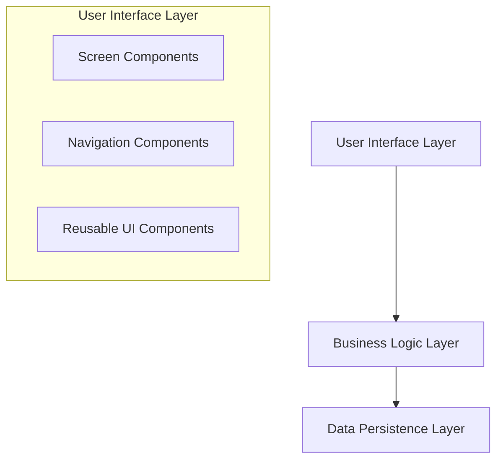
```mermaid
graph TD
    A[User Interface Layer] --> B[Business Logic Layer]
    B --> C[Data Persistence Layer]

    subgraph "User Interface Layer"
        A1[Screen Components]
        A2[Navigation Components]
        A3[Reusable UI Components]
    end

```

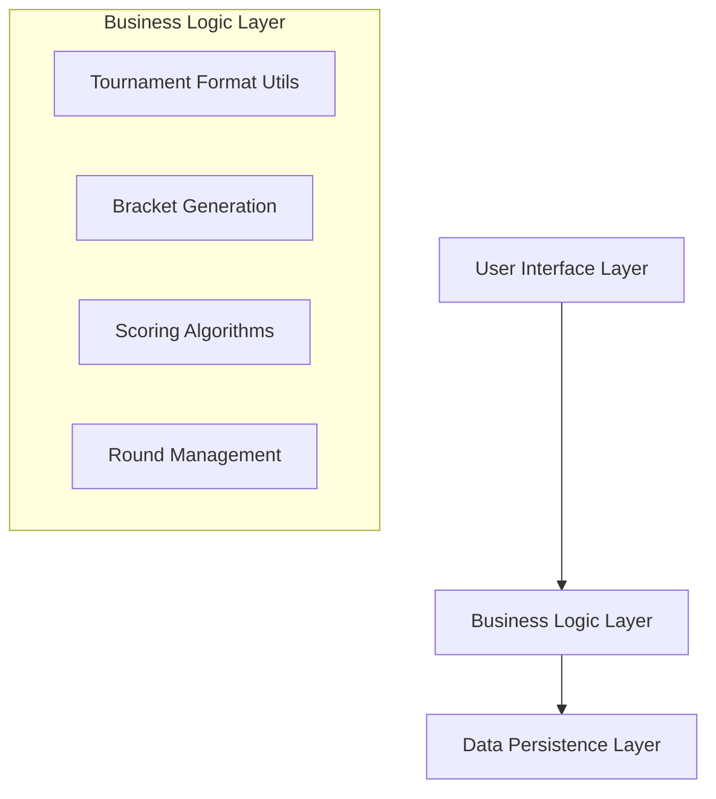
```mermaid
graph TD
    A[User Interface Layer] --> B[Business Logic Layer]
    B --> C[Data Persistence Layer]

    subgraph "Business Logic Layer"
        B1[Tournament Format Utils]
        B2[Bracket Generation]
        B3[Scoring Algorithms]
        B4[Round Management]
    end

```

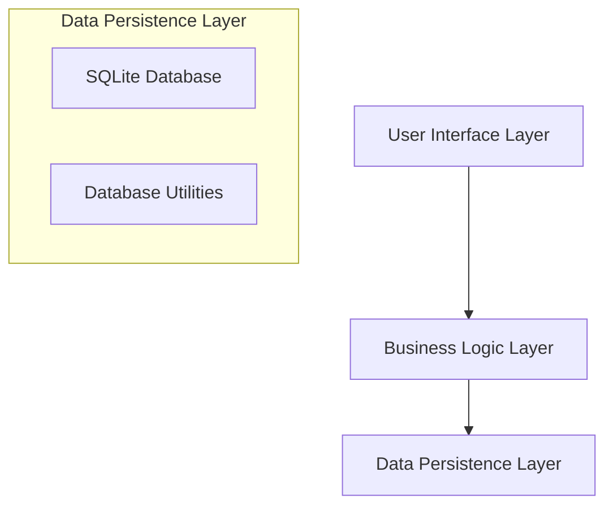
```mermaid
graph TD
    A[User Interface Layer] --> B[Business Logic Layer]
    B --> C[Data Persistence Layer]

    subgraph "Data Persistence Layer"
        C1[SQLite Database]
        C2[Database Utilities]
    end
```

The application employs several design principles and patterns:

1. **Component-Based Architecture**: UI is composed of reusable React components
2. **Container/Presenter Pattern**: Separation of data management from presentation
3. **Single Responsibility Principle**: Each component has a focused responsibility
4. **Repository Pattern**: Database access is abstracted through Drizzle ORM utilities
5. **Hooks Pattern**: Functional components with state and effects
6. **Query/Mutation Pattern**: TanStack Query for server state management
7. **Context Pattern**: React Context for global state (RBAC, BLE connections, i18n)
8. **Event-Driven Architecture**: EventEmitter for network communication
9. **Service Pattern**: Abstracted services for BLE scoring boxes and network clients

### 3.3 Sequence Diagrams

The system's key interactions are illustrated in the sequence diagrams presented in section 4.1, which show the dynamic behavior of the system during critical operations such as tournament creation, event configuration, and bout scoring.

## 4. Detailed Architecture

### 4.1 Key Components and Interactions

This section describes the key interactions between components during system operations, illustrating the dynamic behavior of the application.

#### 4.1.1 Application Initialization

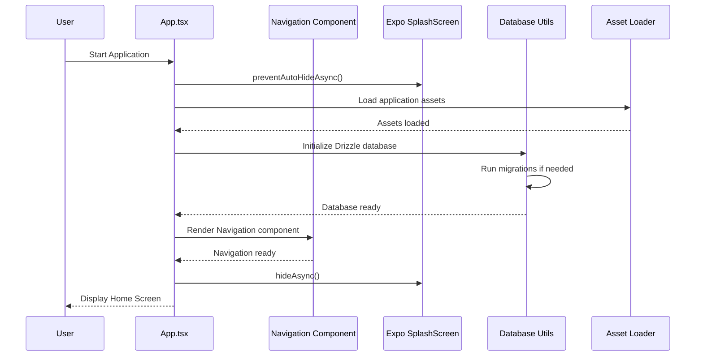
```mermaid
sequenceDiagram
    participant User
    participant App as App.tsx
    participant Navigation as Navigation Component
    participant SplashScreen as Expo SplashScreen
    participant DB as Database Utils
    participant Assets as Asset Loader

    User->>App: Start Application
    App->>SplashScreen: preventAutoHideAsync()
    App->>Assets: Load application assets
    Assets-->>App: Assets loaded
    App->>DB: Initialize Drizzle database
    DB->>DB: Run migrations if needed
    DB-->>App: Database ready
    App->>Navigation: Render Navigation component
    Navigation-->>App: Navigation ready
    App->>SplashScreen: hideAsync()
    App-->>User: Display Home Screen
```

The application initialization process begins when the user starts the application. The App component first prevents the splash screen from auto-hiding, then loads assets and initializes the database in parallel. Once both assets are loaded and the database is initialized, the Navigation component is rendered. Finally, the splash screen is hidden, and the Home Screen is displayed to the user.

#### 4.1.2 Tournament Creation Flow

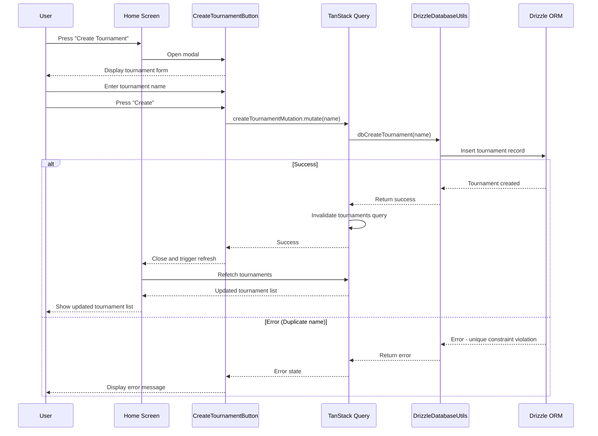
```mermaid
sequenceDiagram
    participant User
    participant Home as Home Screen
    participant Modal as CreateTournamentButton
    participant Query as TanStack Query
    participant DB as DrizzleDatabaseUtils
    participant Drizzle as Drizzle ORM

    User->>Home: Press "Create Tournament"
    Home->>Modal: Open modal
    Modal-->>User: Display tournament form
    User->>Modal: Enter tournament name
    User->>Modal: Press "Create"
    Modal->>Query: createTournamentMutation.mutate(name)
    Query->>DB: dbCreateTournament(name)
    DB->>Drizzle: Insert tournament record
    alt Success
        Drizzle-->>DB: Tournament created
        DB-->>Query: Return success
        Query->>Query: Invalidate tournaments query
        Query-->>Modal: Success
        Modal-->>Home: Close and trigger refresh
        Home->>Query: Refetch tournaments
        Query-->>Home: Updated tournament list
        Home-->>User: Show updated tournament list
    else Error (Duplicate name)
        Drizzle-->>DB: Error - unique constraint violation
        DB-->>Query: Return error
        Query-->>Modal: Error state
        Modal-->>User: Display error message
    end
```

The tournament creation flow begins when the user presses the "Create Tournament" button on the Home screen. This opens a modal dialog where the user can enter a tournament name. When the user submits the form, the application calls the database utility to create a new tournament. If successful, the modal closes and the tournament list is refreshed to include the new tournament. If there's an error (such as a duplicate name), an error message is displayed to the user.

#### 4.1.3 Event Management

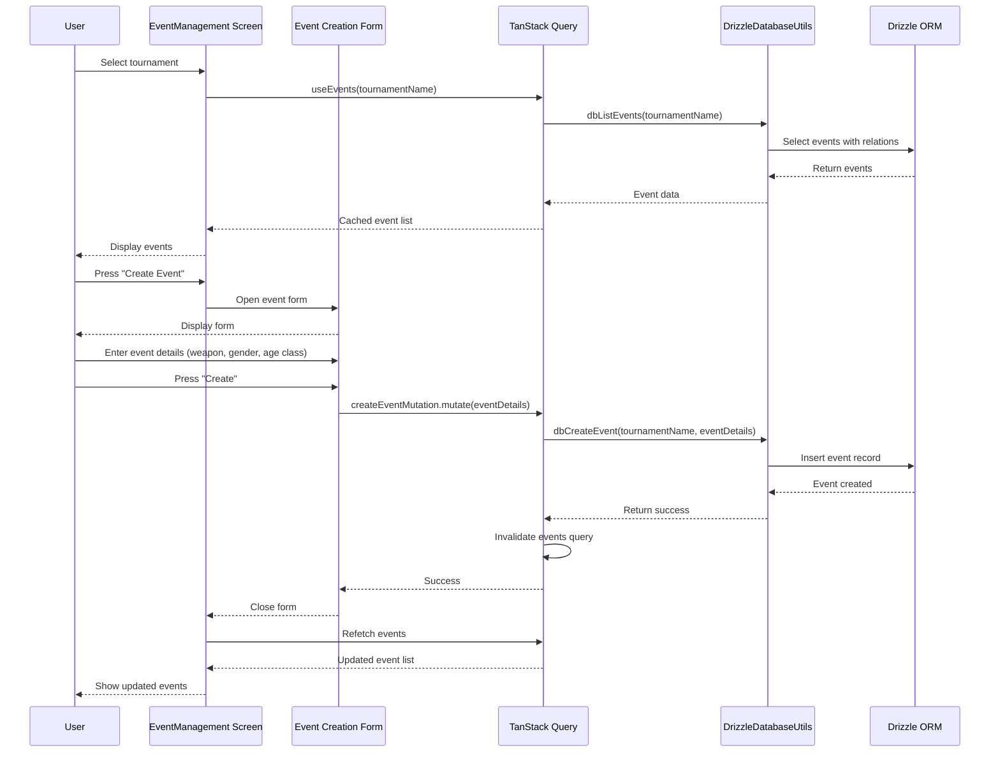
```mermaid
sequenceDiagram
    participant User
    participant EventMgmt as EventManagement Screen
    participant EventForm as Event Creation Form
    participant Query as TanStack Query
    participant DB as DrizzleDatabaseUtils
    participant Drizzle as Drizzle ORM

    User->>EventMgmt: Select tournament
    EventMgmt->>Query: useEvents(tournamentName)
    Query->>DB: dbListEvents(tournamentName)
    DB->>Drizzle: Select events with relations
    Drizzle-->>DB: Return events
    DB-->>Query: Event data
    Query-->>EventMgmt: Cached event list
    EventMgmt-->>User: Display events

    User->>EventMgmt: Press "Create Event"
    EventMgmt->>EventForm: Open event form
    EventForm-->>User: Display form
    User->>EventForm: Enter event details (weapon, gender, age class)
    User->>EventForm: Press "Create"
    EventForm->>Query: createEventMutation.mutate(eventDetails)
    Query->>DB: dbCreateEvent(tournamentName, eventDetails)
    DB->>Drizzle: Insert event record
    Drizzle-->>DB: Event created
    DB-->>Query: Return success
    Query->>Query: Invalidate events query
    Query-->>EventForm: Success
    EventForm-->>EventMgmt: Close form
    EventMgmt->>Query: Refetch events
    Query-->>EventMgmt: Updated event list
    EventMgmt-->>User: Show updated events
```

The event management flow begins when a user selects a tournament from the Home screen, which navigates to the Event Management screen. The application loads and displays the events for the selected tournament. The user can create a new event by pressing the "Create Event" button, which opens a form to enter event details such as weapon type, gender, and age class. Upon submission, the application creates the event in the database and refreshes the event list to show the newly created event.

#### 4.1.4 Event Settings Configuration

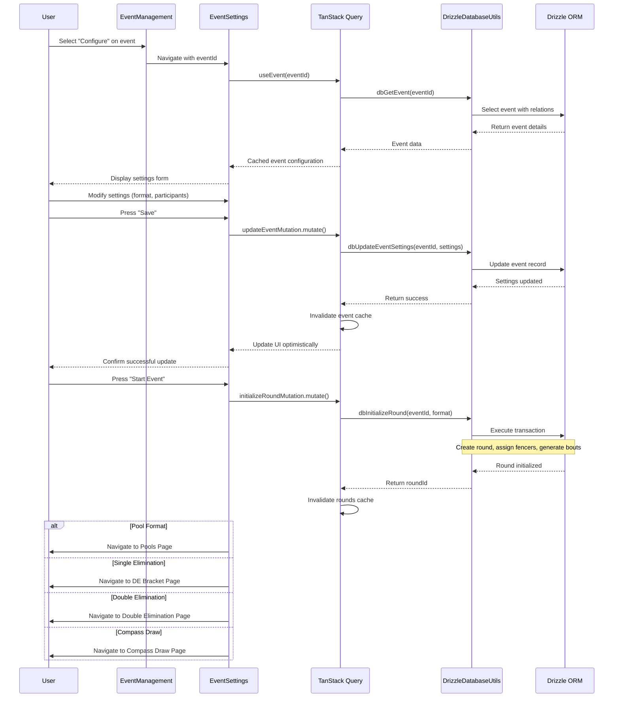
```mermaid
sequenceDiagram
    participant User
    participant Events as EventManagement
    participant Settings as EventSettings
    participant Query as TanStack Query
    participant DB as DrizzleDatabaseUtils
    participant Drizzle as Drizzle ORM

    User->>Events: Select "Configure" on event
    Events->>Settings: Navigate with eventId
    Settings->>Query: useEvent(eventId)
    Query->>DB: dbGetEvent(eventId)
    DB->>Drizzle: Select event with relations
    Drizzle-->>DB: Return event details
    DB-->>Query: Event data
    Query-->>Settings: Cached event configuration
    Settings-->>User: Display settings form

    User->>Settings: Modify settings (format, participants)
    User->>Settings: Press "Save"
    Settings->>Query: updateEventMutation.mutate()
    Query->>DB: dbUpdateEventSettings(eventId, settings)
    DB->>Drizzle: Update event record
    Drizzle-->>DB: Settings updated
    DB-->>Query: Return success
    Query->>Query: Invalidate event cache
    Query-->>Settings: Update UI optimistically
    Settings-->>User: Confirm successful update

    User->>Settings: Press "Start Event"
    Settings->>Query: initializeRoundMutation.mutate()
    Query->>DB: dbInitializeRound(eventId, format)
    DB->>Drizzle: Execute transaction
    Note over DB,Drizzle: Create round, assign fencers, generate bouts
    Drizzle-->>DB: Round initialized
    DB-->>Query: Return roundId
    Query->>Query: Invalidate rounds cache

    alt Pool Format
        Settings->>User: Navigate to Pools Page
    else Single Elimination
        Settings->>User: Navigate to DE Bracket Page
    else Double Elimination
        Settings->>User: Navigate to Double Elimination Page
    else Compass Draw
        Settings->>User: Navigate to Compass Draw Page
    end
```

The event settings configuration begins when the user selects "Configure" on an event in the Event Management screen. The application navigates to the Event Settings screen, loading the event details. The user can modify settings such as tournament format and participants, then save these changes. When the user is ready to start the event, pressing the "Start Event" button initializes the round in the database, creating the necessary structures based on the selected format. The application then navigates to the appropriate screen based on the tournament format.

#### 4.1.5 Pool Management

The pool management process is divided into three key phases: initial setup and display, bout management, and pool completion.

##### 4.1.5.1 Pool Setup and Display

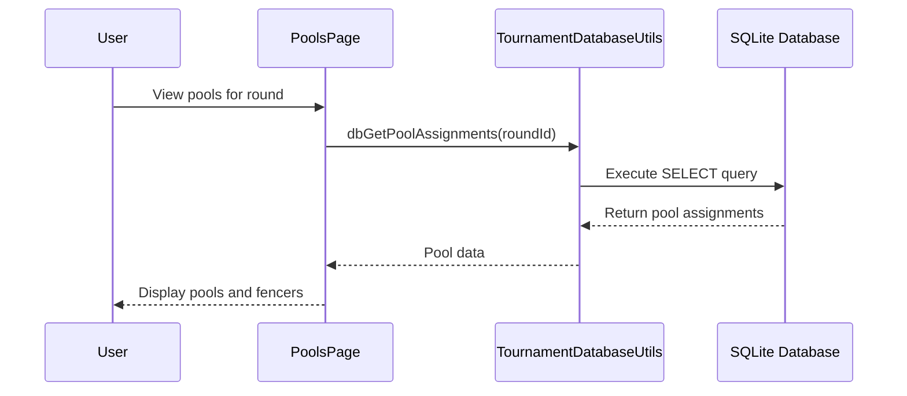
```mermaid
sequenceDiagram
    participant User
    participant Pools as PoolsPage
    participant DB as TournamentDatabaseUtils
    participant SQLite as SQLite Database

    User->>Pools: View pools for round
    Pools->>DB: dbGetPoolAssignments(roundId)
    DB->>SQLite: Execute SELECT query
    SQLite-->>DB: Return pool assignments
    DB-->>Pools: Pool data
    Pools-->>User: Display pools and fencers
```

The pool setup begins when the user navigates to the Pools Page after starting an event with a pool format. The application loads the pool assignments from the database and displays the pools with their assigned fencers to the user.

##### 4.1.5.2 Bout Selection and Scoring

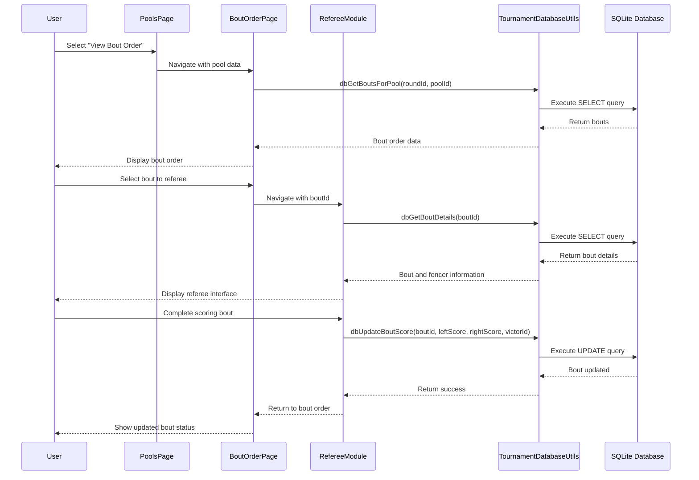
```mermaid
sequenceDiagram
    participant User
    participant Pools as PoolsPage
    participant BoutOrder as BoutOrderPage
    participant Referee as RefereeModule
    participant DB as TournamentDatabaseUtils
    participant SQLite as SQLite Database

    User->>Pools: Select "View Bout Order"
    Pools->>BoutOrder: Navigate with pool data
    BoutOrder->>DB: dbGetBoutsForPool(roundId, poolId)
    DB->>SQLite: Execute SELECT query
    SQLite-->>DB: Return bouts
    DB-->>BoutOrder: Bout order data
    BoutOrder-->>User: Display bout order

    User->>BoutOrder: Select bout to referee
    BoutOrder->>Referee: Navigate with boutId
    Referee->>DB: dbGetBoutDetails(boutId)
    DB->>SQLite: Execute SELECT query
    SQLite-->>DB: Return bout details
    DB-->>Referee: Bout and fencer information
    Referee-->>User: Display referee interface

    User->>Referee: Complete scoring bout
    Referee->>DB: dbUpdateBoutScore(boutId, leftScore, rightScore, victorId)
    DB->>SQLite: Execute UPDATE query
    SQLite-->>DB: Bout updated
    DB-->>Referee: Return success
    Referee-->>BoutOrder: Return to bout order
    BoutOrder-->>User: Show updated bout status
```

Once pools are displayed, the user can select "View Bout Order" to see the sequence of bouts for a pool. The application loads the bouts for the selected pool and displays them in the recommended order. The user can select a bout to referee, which opens the Referee Module with the details of the selected bout. After scoring the bout, the results are saved to the database, and the user returns to the bout order view with updated status.

##### 4.1.5.3 Pool Completion and Results

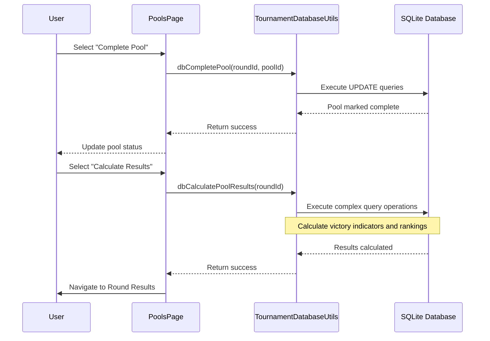
```mermaid
sequenceDiagram
    participant User
    participant Pools as PoolsPage
    participant DB as TournamentDatabaseUtils
    participant SQLite as SQLite Database

    User->>Pools: Select "Complete Pool"
    Pools->>DB: dbCompletePool(roundId, poolId)
    DB->>SQLite: Execute UPDATE queries
    SQLite-->>DB: Pool marked complete
    DB-->>Pools: Return success
    Pools-->>User: Update pool status

    User->>Pools: Select "Calculate Results"
    Pools->>DB: dbCalculatePoolResults(roundId)
    DB->>SQLite: Execute complex query operations
    Note over DB,SQLite: Calculate victory indicators and rankings
    SQLite-->>DB: Results calculated
    DB-->>Pools: Return success
    Pools->>User: Navigate to Round Results
```

After all bouts in a pool have been scored, the user can mark the pool as complete. When all pools in the round are complete, the user can calculate the round results. This triggers complex database operations to calculate victory indicators, rankings, and other statistics. The application then navigates to the Round Results screen to display the final standings and prepare for the next stage of the tournament.

#### 4.1.6 Direct Elimination Management

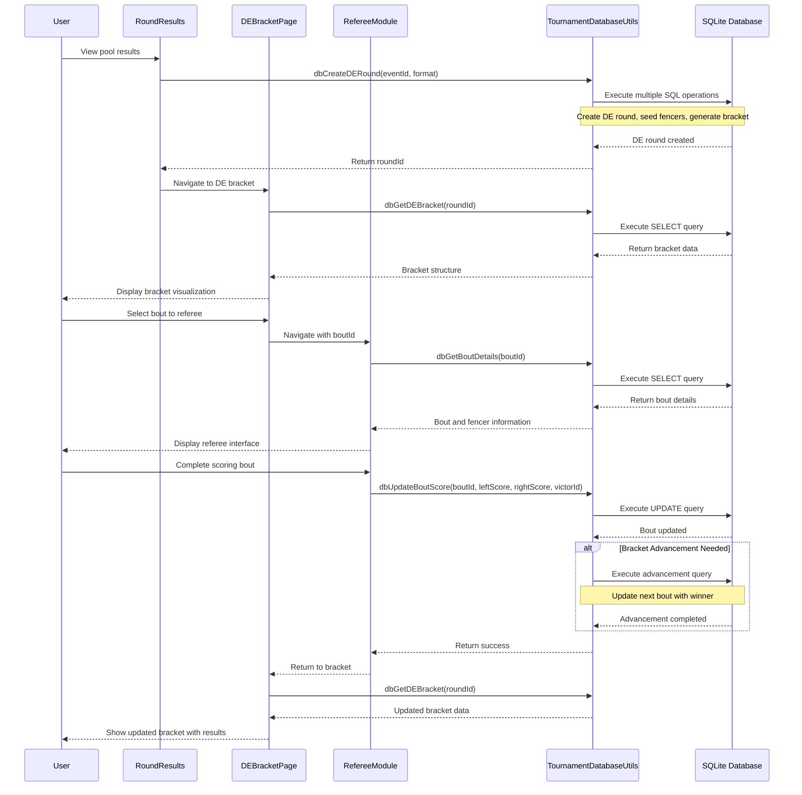
```mermaid
sequenceDiagram
    participant User
    participant Results as RoundResults
    participant DEPage as DEBracketPage
    participant Referee as RefereeModule
    participant DB as TournamentDatabaseUtils
    participant SQLite as SQLite Database

    User->>Results: View pool results
    Results->>DB: dbCreateDERound(eventId, format)
    DB->>SQLite: Execute multiple SQL operations
    Note over DB,SQLite: Create DE round, seed fencers, generate bracket
    SQLite-->>DB: DE round created
    DB-->>Results: Return roundId
    Results->>DEPage: Navigate to DE bracket

    DEPage->>DB: dbGetDEBracket(roundId)
    DB->>SQLite: Execute SELECT query
    SQLite-->>DB: Return bracket data
    DB-->>DEPage: Bracket structure
    DEPage-->>User: Display bracket visualization

    User->>DEPage: Select bout to referee
    DEPage->>Referee: Navigate with boutId
    Referee->>DB: dbGetBoutDetails(boutId)
    DB->>SQLite: Execute SELECT query
    SQLite-->>DB: Return bout details
    DB-->>Referee: Bout and fencer information
    Referee-->>User: Display referee interface

    User->>Referee: Complete scoring bout
    Referee->>DB: dbUpdateBoutScore(boutId, leftScore, rightScore, victorId)
    DB->>SQLite: Execute UPDATE query
    SQLite-->>DB: Bout updated

    alt Bracket Advancement Needed
        DB->>SQLite: Execute advancement query
        Note over DB,SQLite: Update next bout with winner
        SQLite-->>DB: Advancement completed
    end

    DB-->>Referee: Return success
    Referee-->>DEPage: Return to bracket
    DEPage->>DB: dbGetDEBracket(roundId)
    DB-->>DEPage: Updated bracket data
    DEPage-->>User: Show updated bracket with results
```

The direct elimination management begins when pool results are finalized and a DE round is created. The application seeds fencers based on pool results and generates the bracket structure. The user can view the bracket visualization, which shows all scheduled bouts. When selecting a bout to referee, the application opens the Referee Module with the bout details. After scoring the bout, the result is saved, and the winner is automatically advanced to the next round in the bracket. The bracket visualization is then updated to reflect the new state.

#### 4.1.7 Double Elimination Flow

The double elimination process is divided into three phases: bracket structure generation, bout management, and advancement logic.

##### 4.1.7.1 Double Elimination Structure Generation

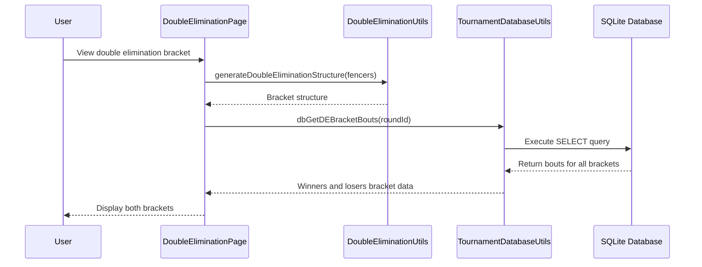
```mermaid
sequenceDiagram
    participant User
    participant DEPage as DoubleEliminationPage
    participant Utils as DoubleEliminationUtils
    participant DB as TournamentDatabaseUtils
    participant SQLite as SQLite Database

    User->>DEPage: View double elimination bracket
    DEPage->>Utils: generateDoubleEliminationStructure(fencers)
    Utils-->>DEPage: Bracket structure
    DEPage->>DB: dbGetDEBracketBouts(roundId)
    DB->>SQLite: Execute SELECT query
    SQLite-->>DB: Return bouts for all brackets
    DB-->>DEPage: Winners and losers bracket data
    DEPage-->>User: Display both brackets
```

The double elimination structure generation begins when a round with double elimination format is initialized. The application uses specialized utilities to generate the structure for both winners and losers brackets. The bouts for both brackets are created in the database, and when the user navigates to the Double Elimination Page, they can view both brackets simultaneously.

##### 4.1.7.2 Bout Management in Double Elimination

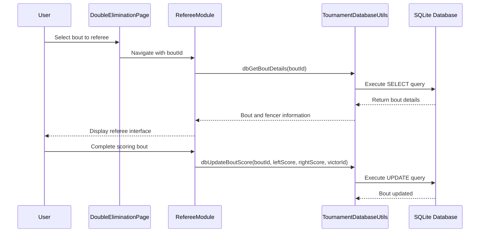
```mermaid
sequenceDiagram
    participant User
    participant DEPage as DoubleEliminationPage
    participant Referee as RefereeModule
    participant DB as TournamentDatabaseUtils
    participant SQLite as SQLite Database

    User->>DEPage: Select bout to referee
    DEPage->>Referee: Navigate with boutId
    Referee->>DB: dbGetBoutDetails(boutId)
    DB->>SQLite: Execute SELECT query
    SQLite-->>DB: Return bout details
    DB-->>Referee: Bout and fencer information
    Referee-->>User: Display referee interface

    User->>Referee: Complete scoring bout
    Referee->>DB: dbUpdateBoutScore(boutId, leftScore, rightScore, victorId)
    DB->>SQLite: Execute UPDATE query
    SQLite-->>DB: Bout updated
```

The bout management process in double elimination is similar to single elimination, where the user selects a bout to referee from either bracket. The application loads the bout details and presents the referee interface. After scoring, the result is saved to the database.

##### 4.1.7.3 Double Elimination Advancement Logic

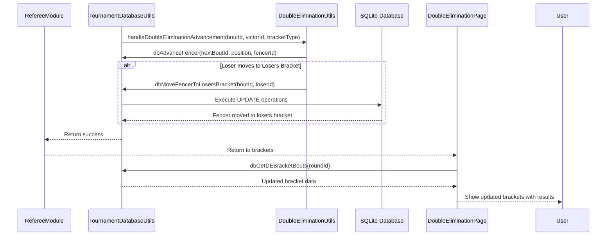
```mermaid
sequenceDiagram
    participant Referee as RefereeModule
    participant DB as TournamentDatabaseUtils
    participant Utils as DoubleEliminationUtils
    participant SQLite as SQLite Database
    participant DEPage as DoubleEliminationPage
    participant User

    DB->>Utils: handleDoubleEliminationAdvancement(boutId, victorId, bracketType)
    Utils->>DB: dbAdvanceFencer(nextBoutId, position, fencerId)

    alt Loser moves to Losers Bracket
        Utils->>DB: dbMoveFencerToLosersBracket(boutId, loserId)
        DB->>SQLite: Execute UPDATE operations
        SQLite-->>DB: Fencer moved to losers bracket
    end

    DB-->>Referee: Return success
    Referee-->>DEPage: Return to brackets
    DEPage->>DB: dbGetDEBracketBouts(roundId)
    DB-->>DEPage: Updated bracket data
    DEPage-->>User: Show updated brackets with results
```

The advancement logic for double elimination is more complex than single elimination. After a bout is scored, the winner advances within the current bracket, and if the bout was in the winners bracket, the loser moves to the corresponding position in the losers bracket. This logic is handled by specialized utilities that determine the correct advancement paths based on the bout's position and bracket type.

#### 4.1.8 Compass Draw Flow

The compass draw process is divided into three phases: initialization and structure generation, bout management, and cross-direction advancement logic.

##### 4.1.8.1 Compass Draw Initialization

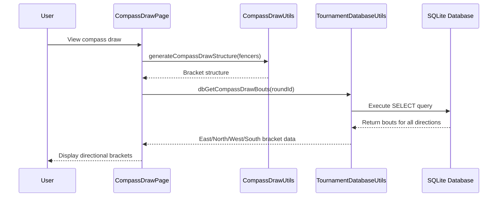
```mermaid
sequenceDiagram
    participant User
    participant CDPage as CompassDrawPage
    participant Utils as CompassDrawUtils
    participant DB as TournamentDatabaseUtils
    participant SQLite as SQLite Database

    User->>CDPage: View compass draw
    CDPage->>Utils: generateCompassDrawStructure(fencers)
    Utils-->>CDPage: Bracket structure
    CDPage->>DB: dbGetCompassDrawBouts(roundId)
    DB->>SQLite: Execute SELECT query
    SQLite-->>DB: Return bouts for all directions
    DB-->>CDPage: East/North/West/South bracket data
    CDPage-->>User: Display directional brackets
```

The compass draw initialization creates a complex structure with multiple directional brackets (East, North, West, South). When the user views the compass draw, the application loads all the directional brackets and displays them in an organized layout.

##### 4.1.8.2 Directional Bracket Management

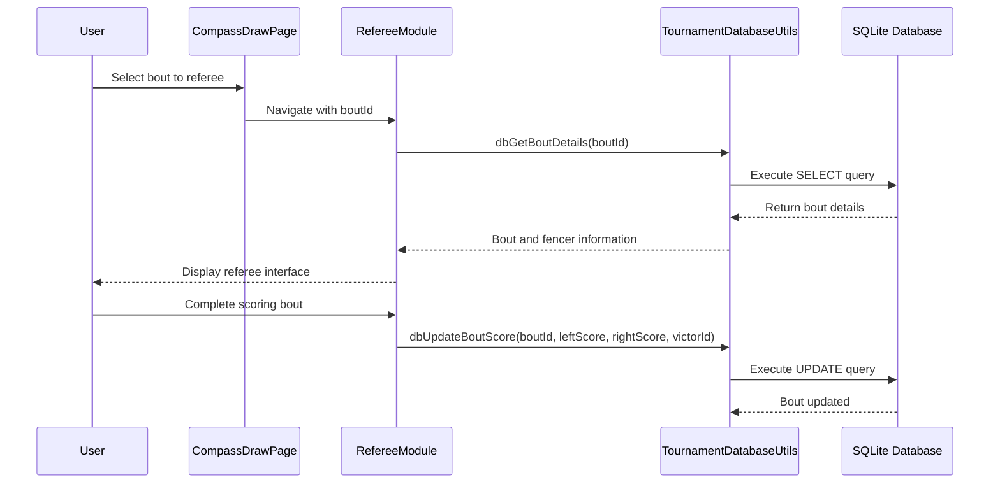
```mermaid
sequenceDiagram
    participant User
    participant CDPage as CompassDrawPage
    participant Referee as RefereeModule
    participant DB as TournamentDatabaseUtils
    participant SQLite as SQLite Database

    User->>CDPage: Select bout to referee
    CDPage->>Referee: Navigate with boutId
    Referee->>DB: dbGetBoutDetails(boutId)
    DB->>SQLite: Execute SELECT query
    SQLite-->>DB: Return bout details
    DB-->>Referee: Bout and fencer information
    Referee-->>User: Display referee interface

    User->>Referee: Complete scoring bout
    Referee->>DB: dbUpdateBoutScore(boutId, leftScore, rightScore, victorId)
    DB->>SQLite: Execute UPDATE query
    SQLite-->>DB: Bout updated
```

Bout management in the compass draw is similar to other bracket formats, where the user selects a bout from any direction to referee. The application loads the bout details and presents the referee interface for scoring.

##### 4.1.8.3 Cross-Direction Advancement

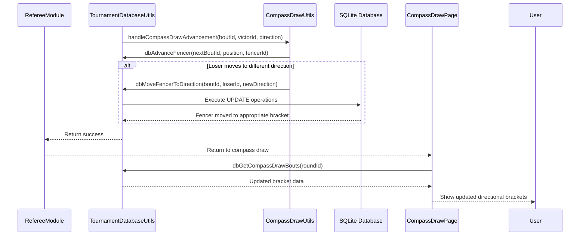
```mermaid
sequenceDiagram
    participant Referee as RefereeModule
    participant DB as TournamentDatabaseUtils
    participant Utils as CompassDrawUtils
    participant SQLite as SQLite Database
    participant CDPage as CompassDrawPage
    participant User

    DB->>Utils: handleCompassDrawAdvancement(boutId, victorId, direction)
    Utils->>DB: dbAdvanceFencer(nextBoutId, position, fencerId)

    alt Loser moves to different direction
        Utils->>DB: dbMoveFencerToDirection(boutId, loserId, newDirection)
        DB->>SQLite: Execute UPDATE operations
        SQLite-->>DB: Fencer moved to appropriate bracket
    end

    DB-->>Referee: Return success
    Referee-->>CDPage: Return to compass draw
    CDPage->>DB: dbGetCompassDrawBouts(roundId)
    DB-->>CDPage: Updated bracket data
    CDPage-->>User: Show updated directional brackets
```

The cross-direction advancement in a compass draw is the most complex of all bracket formats. Winners typically continue in the same direction, while losers move to a different direction based on where and when they lost. Specialized utilities handle these complex advancement rules to ensure fencers progress correctly through the tournament structure.

#### 4.1.9 Referee Module Flow

The referee module process is divided into three key phases: session initialization, scoring and timing control, and bout completion.

##### 4.1.9.1 Referee Session Initialization

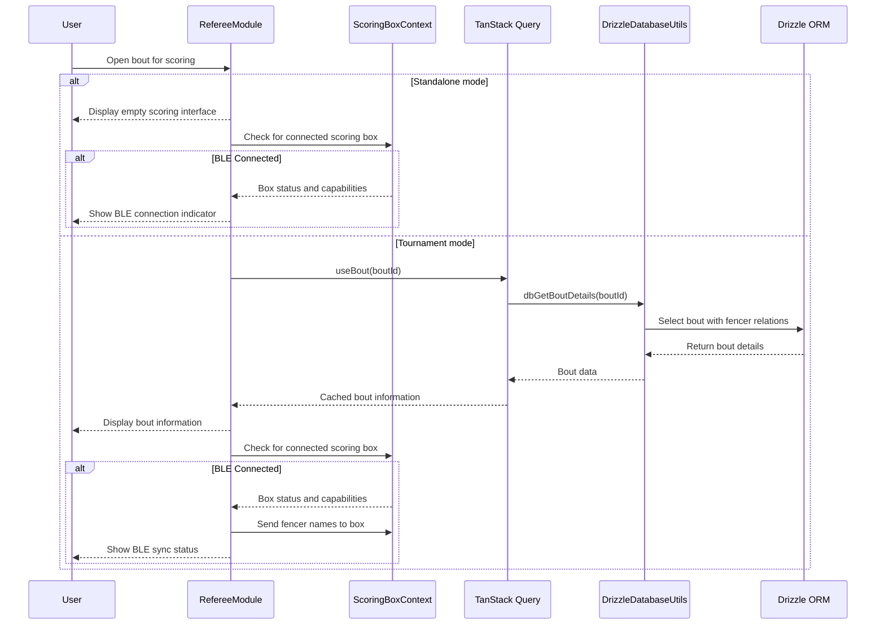
```mermaid
sequenceDiagram
    participant User
    participant Referee as RefereeModule
    participant BLE as ScoringBoxContext
    participant Query as TanStack Query
    participant DB as DrizzleDatabaseUtils
    participant Drizzle as Drizzle ORM

    User->>Referee: Open bout for scoring
    alt Standalone mode
        Referee-->>User: Display empty scoring interface
        Referee->>BLE: Check for connected scoring box
        alt BLE Connected
            BLE-->>Referee: Box status and capabilities
            Referee-->>User: Show BLE connection indicator
        end
    else Tournament mode
        Referee->>Query: useBout(boutId)
        Query->>DB: dbGetBoutDetails(boutId)
        DB->>Drizzle: Select bout with fencer relations
        Drizzle-->>DB: Return bout details
        DB-->>Query: Bout data
        Query-->>Referee: Cached bout information
        Referee-->>User: Display bout information
        Referee->>BLE: Check for connected scoring box
        alt BLE Connected
            BLE-->>Referee: Box status and capabilities
            Referee->>BLE: Send fencer names to box
            Referee-->>User: Show BLE sync status
        end
    end
```

The Referee Module can be initialized in two modes: standalone for practice or informal bouts, or tournament mode for official bouts. In tournament mode, the application loads the bout details including fencer information from the database.

##### 4.1.9.2 Timer and Scoring Controls

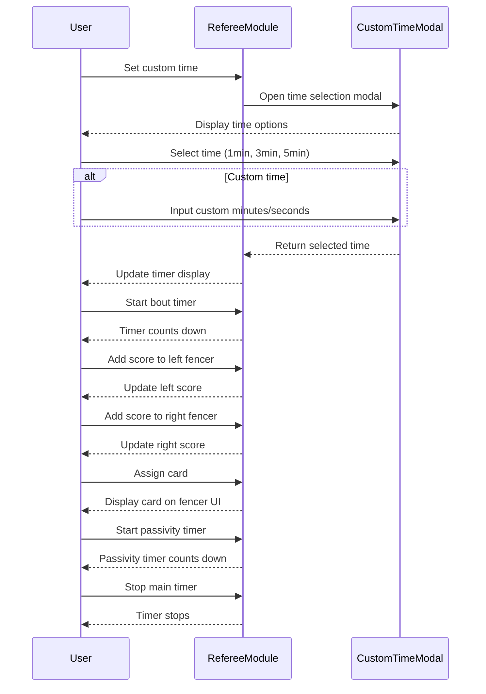
```mermaid
sequenceDiagram
    participant User
    participant Referee as RefereeModule
    participant TimeModal as CustomTimeModal

    User->>Referee: Set custom time
    Referee->>TimeModal: Open time selection modal
    TimeModal-->>User: Display time options
    User->>TimeModal: Select time (1min, 3min, 5min)
    alt Custom time
        User->>TimeModal: Input custom minutes/seconds
    end
    TimeModal-->>Referee: Return selected time
    Referee-->>User: Update timer display

    User->>Referee: Start bout timer
    Referee-->>User: Timer counts down

    User->>Referee: Add score to left fencer
    Referee-->>User: Update left score

    User->>Referee: Add score to right fencer
    Referee-->>User: Update right score

    User->>Referee: Assign card
    Referee-->>User: Display card on fencer UI

    User->>Referee: Start passivity timer
    Referee-->>User: Passivity timer counts down

    User->>Referee: Stop main timer
    Referee-->>User: Timer stops
```

The Referee Module provides comprehensive controls for managing a bout, including timer functions, scoring, and card assignments. The user can set custom time periods, start and stop timers, increment scores for each fencer, and assign cards as penalties.

##### 4.1.9.3 Bout Completion and Results

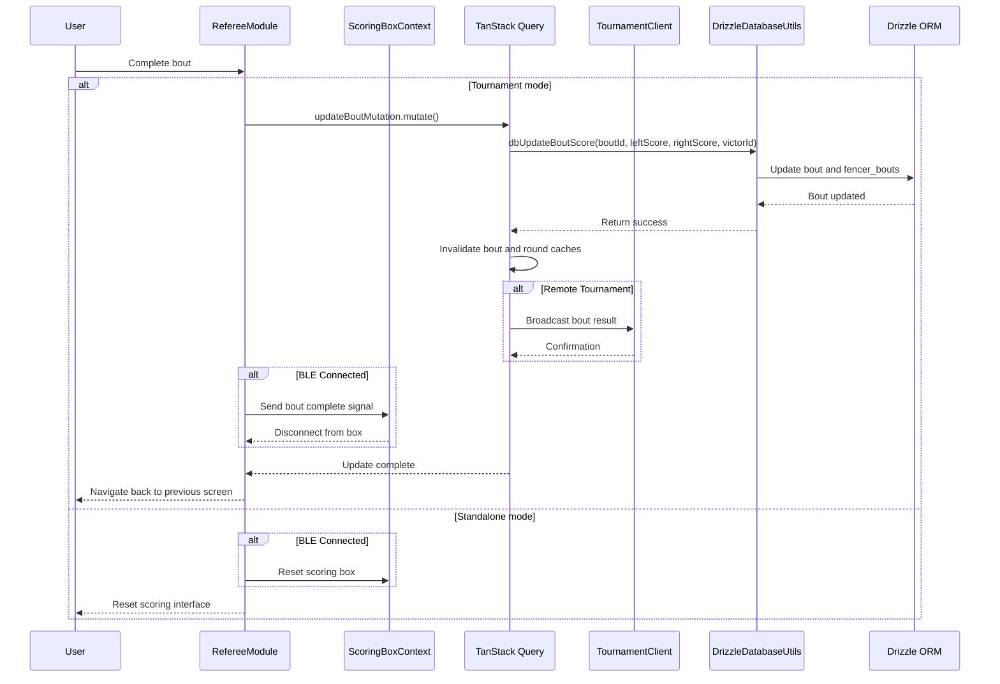
```mermaid
sequenceDiagram
    participant User
    participant Referee as RefereeModule
    participant BLE as ScoringBoxContext
    participant Query as TanStack Query
    participant Client as TournamentClient
    participant DB as DrizzleDatabaseUtils
    participant Drizzle as Drizzle ORM

    User->>Referee: Complete bout

    alt Tournament mode
        Referee->>Query: updateBoutMutation.mutate()
        Query->>DB: dbUpdateBoutScore(boutId, leftScore, rightScore, victorId)
        DB->>Drizzle: Update bout and fencer_bouts
        Drizzle-->>DB: Bout updated
        DB-->>Query: Return success
        Query->>Query: Invalidate bout and round caches

        alt Remote Tournament
            Query->>Client: Broadcast bout result
            Client-->>Query: Confirmation
        end

        alt BLE Connected
            Referee->>BLE: Send bout complete signal
            BLE-->>Referee: Disconnect from box
        end

        Query-->>Referee: Update complete
        Referee-->>User: Navigate back to previous screen
    else Standalone mode
        alt BLE Connected
            Referee->>BLE: Reset scoring box
        end
        Referee-->>User: Reset scoring interface
    end
```

When a bout is completed, the Referee Module saves the results to the database in tournament mode and returns to the previous screen. In standalone mode, the interface is reset for a new bout. The saved results trigger the appropriate advancement logic based on the tournament format.

### 4.2 Component Architecture

This section describes the static architecture of the application's major components, detailing their structure, properties, methods, and relationships.

#### 4.2.1 Home Screen

```mermaid
classDiagram
    class Home {
        -joinModalVisible: boolean
        -connectedTournament: string|null
        -deviceId: string
        +useOngoingTournaments(): QueryResult
        +useCompletedTournaments(): QueryResult
        +handleJoinSuccess(tournamentName: string): void
        +handleDisconnect(): void
        +refreshTournaments(): void
        +render(): JSX.Element
    }

    class AbilityContext {
        -ability: Ability
        -setTournamentContext(ctx: any): void
        +can(action: string, subject: any): boolean
        +provide(): JSX.Element
    }

    class QueryClient {
        -queryCache: QueryCache
        -mutationCache: MutationCache
        +invalidateQueries(key: any): void
        +prefetchQuery(key: any, fn: any): void
    }

    class CreateTournamentButton {
        -modalVisible: boolean
        -tournamentName: string
        -onTournamentCreated: Function
        +handleSubmit(): void
        +render(): JSX.Element
    }

    class JoinTournamentModal {
        -serverAddress: string
        -port: number
        -tournamentName: string
        -onJoinSuccess: Function
        +handleConnect(): void
        +render(): JSX.Element
    }

    class TournamentList {
        -tournaments: Tournament[]
        -onTournamentDeleted: Function
        -isComplete: boolean
        +navigateToEvent(tournament: Tournament): void
        +render(): JSX.Element
    }

    class LanguageSwitcher {
        -languages: string[]
        +changeLanguage(lng: string): void
        +render(): JSX.Element
    }

    class TournamentClient {
        -socket: Socket
        -clientInfo: ClientInfo
        +connect(host: string, port: number): Promise
        +disconnect(): Promise
        +loadClientInfo(): Promise
        +getClientInfo(): ClientInfo
    }

    Home --> CreateTournamentButton: renders
    Home --> JoinTournamentModal: opens
    Home --> TournamentList: displays tournaments
    Home --> LanguageSwitcher: renders
    Home --> QueryClient: uses for data
    Home --> AbilityContext: uses for permissions
    Home --> TournamentClient: manages connection
```

The Home screen is the entry point of the application, providing access to tournament management features. The current implementation uses TanStack Query hooks (`useOngoingTournaments` and `useCompletedTournaments`) for data management instead of direct database calls. It also incorporates role-based access control through the AbilityContext and internationalization for multilingual support.

The screen manages tournament connectivity through the TournamentClient service, allowing users to join remote tournaments. The UI is divided into sections for ongoing tournaments and completed tournaments, with each rendered through the TournamentList component. The LanguageSwitcher component enables users to change the application language.

###### 4.2.1.1.1 Attributes

| Name                | Access  | Type           | Description                                      |
| ------------------- | ------- | -------------- | ------------------------------------------------ |
| joinModalVisible    | private | boolean        | Controls visibility of the join tournament modal |
| connectedTournament | private | string \| null | Name of currently connected remote tournament    |
| deviceId            | private | string         | Unique device identifier for permissions         |

###### 4.2.1.1.2 Methods

| Name:            | useOngoingTournaments                                                                  |
| ---------------- | -------------------------------------------------------------------------------------- |
| **Input:**       | None                                                                                   |
| **Output:**      | QueryResult<Tournament[]>                                                              |
| **Description:** | TanStack Query hook that fetches and caches ongoing tournaments with real-time updates |

| Name:            | useCompletedTournaments                                           |
| ---------------- | ----------------------------------------------------------------- |
| **Input:**       | None                                                              |
| **Output:**      | QueryResult<Tournament[]>                                         |
| **Description:** | TanStack Query hook that fetches and caches completed tournaments |

| Name:            | handleJoinSuccess                                                                            |
| ---------------- | -------------------------------------------------------------------------------------------- |
| **Input:**       | string tournamentName : Name of the tournament joined                                        |
| **Output:**      | void                                                                                         |
| **Description:** | Handles successful connection to a remote tournament, updates UI and sets permission context |

| Name:            | handleDisconnect                                                 |
| ---------------- | ---------------------------------------------------------------- |
| **Input:**       | None                                                             |
| **Output:**      | void                                                             |
| **Description:** | Disconnects from remote tournament and resets permission context |

| Name:            | refreshTournaments                                            |
| ---------------- | ------------------------------------------------------------- |
| **Input:**       | None                                                          |
| **Output:**      | void                                                          |
| **Description:** | Invalidates tournament queries to force refresh from database |

| Name:            | render                                                                                  |
| ---------------- | --------------------------------------------------------------------------------------- |
| **Input:**       | None                                                                                    |
| **Output:**      | JSX.Element                                                                             |
| **Description:** | Renders the home screen UI with tournament lists, action buttons, and connection status |

##### 4.2.1.2 CreateTournamentButton (replaces CreateTournamentModal)

```mermaid
classDiagram
    class CreateTournamentButton {
        -modalVisible: boolean
        -tournamentName: string
        -creating: boolean
        -onTournamentCreated: Function
        +useCreateTournament(): MutationResult
        +handleSubmit(): void
        +render(): JSX.Element
    }
```

###### 4.2.1.2.1 Attributes

| Name                | Access  | Type     | Description                                      |
| ------------------- | ------- | -------- | ------------------------------------------------ |
| modalVisible        | private | boolean  | Controls modal visibility                        |
| tournamentName      | private | string   | Name input for the new tournament                |
| creating            | private | boolean  | Indicates if creation is in progress             |
| onTournamentCreated | private | Function | Callback when tournament is successfully created |

###### 4.2.1.2.2 Methods

| Name:            | useCreateTournament                                                           |
| ---------------- | ----------------------------------------------------------------------------- |
| **Input:**       | None                                                                          |
| **Output:**      | MutationResult<Tournament, Error>                                             |
| **Description:** | TanStack Query mutation hook for creating tournaments with optimistic updates |

| Name:            | handleSubmit                                              |
| ---------------- | --------------------------------------------------------- |
| **Input:**       | None                                                      |
| **Output:**      | void                                                      |
| **Description:** | Validates input and triggers tournament creation mutation |

| Name:            | render                                                           |
| ---------------- | ---------------------------------------------------------------- |
| **Input:**       | None                                                             |
| **Output:**      | JSX.Element                                                      |
| **Description:** | Renders the create button and modal dialog with name input field |

##### 4.2.1.3 TournamentList (updated from TournamentListComponent)

```mermaid
classDiagram
    class TournamentList {
        -tournaments: Tournament[]
        -onTournamentDeleted: Function
        -isComplete: boolean
        +useDeleteTournament(): MutationResult
        +navigateToEvent(tournament: Tournament): void
        +handleDelete(tournamentName: string): void
        +render(): JSX.Element
    }
```

###### 4.2.1.3.1 Attributes

| Name                | Access  | Type         | Description                                      |
| ------------------- | ------- | ------------ | ------------------------------------------------ |
| tournaments         | private | Tournament[] | List of tournaments to display                   |
| onTournamentDeleted | private | Function     | Callback when a tournament is deleted            |
| isComplete          | private | boolean      | Whether showing completed or ongoing tournaments |

###### 4.2.1.3.2 Methods

| Name:            | useDeleteTournament                                                           |
| ---------------- | ----------------------------------------------------------------------------- |
| **Input:**       | None                                                                          |
| **Output:**      | MutationResult<void, Error>                                                   |
| **Description:** | TanStack Query mutation hook for deleting tournaments with cache invalidation |

| Name:            | navigateToEvent                                                  |
| ---------------- | ---------------------------------------------------------------- |
| **Input:**       | Tournament tournament : The tournament to navigate to            |
| **Output:**      | void                                                             |
| **Description:** | Navigates to event management screen for the selected tournament |

| Name:            | handleDelete                                                  |
| ---------------- | ------------------------------------------------------------- |
| **Input:**       | string tournamentName : Name of tournament to delete          |
| **Output:**      | void                                                          |
| **Description:** | Shows confirmation dialog and deletes tournament if confirmed |

| Name:            | render                                                                    |
| ---------------- | ------------------------------------------------------------------------- |
| **Input:**       | None                                                                      |
| **Output:**      | JSX.Element                                                               |
| **Description:** | Renders the tournament list with delete buttons and navigation capability |

#### 4.2.2 Event Management

```mermaid
classDiagram
    class EventManagement {
        -tournamentName: string
        -isRemote: boolean
        -serverEnabled: boolean
        -isNetworkConnected: boolean
        +useEvents(tournamentName): QueryResult
        +useEventStatuses(events): QueryResult
        +createEventMutation: MutationResult
        +checkServerStatus(): Promise<boolean>
        +checkNetworkConnectivity(): Promise<boolean>
        +handleStartServer(): void
        +handleStopServer(): void
        +render(): JSX.Element
    }

    class QueryClient {
        -queryCache: QueryCache
        -mutationCache: MutationCache
        +invalidateQueries(key: any): void
        +prefetchQuery(key: any, fn: any): void
    }

    class TournamentServer {
        -server: Server
        -serverInfo: ServerInfo
        +startServer(port: number): Promise
        +stopServer(): Promise
        +isServerRunning(): boolean
        +getServerInfo(): ServerInfo
        +setQueryClient(client: QueryClient): void
    }

    class AbilityContext {
        -ability: Ability
        +can(action: string, subject: any): boolean
    }

    class ConnectionStatusBar {
        -isConnected: boolean
        -serverInfo: ServerInfo
        -isNetworkConnected: boolean
        +render(): JSX.Element
    }

    class EventCard {
        -event: Event
        -isStarted: boolean
        -onConfigure(event: Event): void
        -onDelete(eventId: number): void
        -onNavigateToEvent(event: Event): void
        +render(): JSX.Element
    }

    class Can {
        -I: string
        -a: string
        -this: any
        -do: string
        -on: any
        -children: ReactNode
        +render(): JSX.Element|null
    }

    EventManagement --> QueryClient: uses for data
    EventManagement --> TournamentServer: manages server
    EventManagement --> AbilityContext: checks permissions
    EventManagement --> ConnectionStatusBar: displays network status
    EventManagement --> EventCard: displays events
    EventManagement --> Can: controls access
```

The Event Management screen displays and manages events within a selected tournament. The current implementation supports both local and remote tournament management, with the ability to host a tournament server or connect to a remote one. It uses TanStack Query for data management and RBAC for permission control.

##### 4.2.2.1 EventManagement

```mermaid
classDiagram
    class EventManagement {
        -tournamentName: string
        -isRemote: boolean
        -serverEnabled: boolean
        -isNetworkConnected: boolean
        -serverInfo: ServerInfo
        -localIpAddress: string
        -serverOperationPending: boolean
        -selectedGender: string
        -selectedWeapon: string
        -selectedAge: string
        +useEvents(tournamentName): QueryResult
        +useEventStatuses(events): QueryResult
        +createEventMutation: MutationResult
        +handleCreateEvent(): void
        +render(): JSX.Element
    }
```

###### 4.2.2.1.1 Attributes

| Name                   | Access  | Type       | Description                                    |
| ---------------------- | ------- | ---------- | ---------------------------------------------- |
| tournamentName         | private | string     | Name of the selected tournament                |
| isRemote               | private | boolean    | Indicates if this is a remote connection       |
| serverEnabled          | private | boolean    | Indicates if server hosting is active          |
| isNetworkConnected     | private | boolean    | Indicates if device has network connectivity   |
| serverInfo             | private | ServerInfo | Information about the hosted server            |
| localIpAddress         | private | string     | Device's local IP address for server hosting   |
| serverOperationPending | private | boolean    | Indicates if server operations are in progress |
| selectedGender         | private | string     | Gender selection for new events                |
| selectedWeapon         | private | string     | Weapon selection for new events                |
| selectedAge            | private | string     | Age class selection for new events             |

###### 4.2.2.1.2 Methods

| Name:            | useEvents                                                                       |
| ---------------- | ------------------------------------------------------------------------------- |
| **Input:**       | string tournamentName : Name of the tournament to fetch events for              |
| **Output:**      | QueryResult<Event[]>                                                            |
| **Description:** | TanStack Query hook that fetches and caches events for the specified tournament |

| Name:            | useEventStatuses                                                              |
| ---------------- | ----------------------------------------------------------------------------- |
| **Input:**       | Event[] events : Array of events to fetch statuses for                        |
| **Output:**      | QueryResult<{[eventId: number]: boolean}>                                     |
| **Description:** | TanStack Query hook that fetches and caches status information for each event |

| Name:            | checkServerStatus                                               |
| ---------------- | --------------------------------------------------------------- |
| **Input:**       | None                                                            |
| **Output:**      | Promise<boolean>                                                |
| **Description:** | Checks if the tournament server is running and updates UI state |

| Name:            | checkNetworkConnectivity                                                     |
| ---------------- | ---------------------------------------------------------------------------- |
| **Input:**       | None                                                                         |
| **Output:**      | Promise<boolean>                                                             |
| **Description:** | Checks if the device has network connectivity and updates the UI accordingly |

| Name:            | handleStartServer                                                                 |
| ---------------- | --------------------------------------------------------------------------------- |
| **Input:**       | None                                                                              |
| **Output:**      | void                                                                              |
| **Description:** | Starts the tournament server for hosting, allowing other devices to connect to it |

| Name:            | handleCreateEvent                                                                                                                      |
| ---------------- | -------------------------------------------------------------------------------------------------------------------------------------- |
| **Input:**       | None                                                                                                                                   |
| **Output:**      | void                                                                                                                                   |
| **Description:** | Creates an event with the selected weapon, gender, and age class parameters using the createEventMutation function from TanStack Query |

| Name:            | render                                                                        |
| ---------------- | ----------------------------------------------------------------------------- |
| **Input:**       | None                                                                          |
| **Output:**      | JSX.Element                                                                   |
| **Description:** | Renders the event management UI with event list, server controls, and actions |

#### 4.2.3 Event Settings

```mermaid
classDiagram
    class EventSettings {
        -event: Event
        -isRemote: boolean
        -selectedPoolConfig: PoolConfiguration
        -importedCsvData: Fencer[]
        +useRounds(eventId): QueryResult
        +useFencers(event): QueryResult
        +useAddFencer(): MutationResult
        +useRemoveFencer(): MutationResult
        +useCreateFencer(): MutationResult
        +useAddRound(): MutationResult
        +useInitializeRound(): MutationResult
        +calculatePoolConfigurations(totalFencers): PoolConfiguration[]
        +handleImportCSV(): void
        +handleAddFencer(fencer: Fencer): void
        +handleRemoveFencer(fencer: Fencer): void
        +handleStartEvent(): void
        +render(): JSX.Element
    }

    class QueryClient {
        -queryCache: QueryCache
        -mutationCache: MutationCache
        +invalidateQueries(key: any): void
        +prefetchQuery(key: any, fn: any): void
    }

    class ClubAutocomplete {
        -query: string
        -selectedClub: Club|null
        -clubs: Club[]
        +useSearchClubs(query): QueryResult
        +useCreateClub(): MutationResult
        +handleSelectClub(club: Club): void
        +handleCreateClub(name: string): void
        +render(): JSX.Element
    }

    class CustomPicker {
        -options: Option[]
        -selectedValue: string
        -onValueChange: Function
        +render(): JSX.Element
    }

    class DocumentPicker {
        +getDocumentAsync(): Promise<DocumentResult>
    }

    class FileSystem {
        +readAsStringAsync(uri: string): Promise<string>
    }

    class i18n {
        +t(key: string): string
    }

    EventSettings --> QueryClient: uses for data
    EventSettings --> ClubAutocomplete: displays
    EventSettings --> CustomPicker: displays
    EventSettings --> DocumentPicker: uses for CSV import
    EventSettings --> FileSystem: uses for file reading
    EventSettings --> i18n: uses for translations
```

The Event Settings screen configures all aspects of an event before it begins, including format selection, participant management, and pool configuration. The current implementation uses TanStack Query for data management and provides advanced features like CSV import for fencers and intelligent pool configuration suggestions.

##### 4.2.3.1 EventSettings

```mermaid
classDiagram
    class EventSettings {
        -event: Event
        -isRemote: boolean
        -fencerSearch: string
        -selectedClub: Club|null
        -selectedPoolConfig: PoolConfiguration
        -formatOptions: string[]
        -importedCsvData: Fencer[]
        +useRounds(eventId): QueryResult
        +useFencers(event): QueryResult
        +useAddFencer(): MutationResult
        +useRemoveFencer(): MutationResult
        +handleImportCSV(): void
        +render(): JSX.Element
    }
```

###### 4.2.3.1.1 Attributes

| Name               | Access  | Type              | Description                                     |
| ------------------ | ------- | ----------------- | ----------------------------------------------- |
| event              | private | Event             | Event object containing configuration data      |
| isRemote           | private | boolean           | Flag indicating if this is a remote connection  |
| fencerSearch       | private | string            | Search query for fencer lookup                  |
| selectedClub       | private | Club \| null      | Currently selected club for fencer registration |
| selectedPoolConfig | private | PoolConfiguration | Selected pool distribution configuration        |
| formatOptions      | private | string[]          | Available tournament format options             |
| importedCsvData    | private | Fencer[]          | Data imported from CSV file                     |

###### 4.2.3.1.2 Methods

| Name:            | useRounds                                                                       |
| ---------------- | ------------------------------------------------------------------------------- |
| **Input:**       | number eventId : ID of the event to get rounds for                              |
| **Output:**      | QueryResult<Round[]>                                                            |
| **Description:** | TanStack Query hook that fetches and manages round data for the specified event |

| Name:            | useFencers                                                               |
| ---------------- | ------------------------------------------------------------------------ |
| **Input:**       | Event event : Event object to get fencers for                            |
| **Output:**      | QueryResult<Fencer[]>                                                    |
| **Description:** | TanStack Query hook that fetches and manages fencers for the given event |

| Name:            | useAddFencer                                                 |
| ---------------- | ------------------------------------------------------------ |
| **Input:**       | None                                                         |
| **Output:**      | MutationResult<{ fencer: Fencer, event: Event }, unknown>    |
| **Description:** | TanStack Query mutation hook for adding a fencer to an event |

| Name:            | useRemoveFencer                                                  |
| ---------------- | ---------------------------------------------------------------- |
| **Input:**       | None                                                             |
| **Output:**      | MutationResult<{ fencer: Fencer, event: Event }, unknown>        |
| **Description:** | TanStack Query mutation hook for removing a fencer from an event |

| Name:            | calculatePoolConfigurations                                                        |
| ---------------- | ---------------------------------------------------------------------------------- |
| **Input:**       | number totalFencers : Total number of fencers to distribute                        |
| **Output:**      | PoolConfiguration[]                                                                |
| **Description:** | Calculates optimal pool distributions based on the number of participating fencers |

| Name:            | handleImportCSV                                                              |
| ---------------- | ---------------------------------------------------------------------------- |
| **Input:**       | None                                                                         |
| **Output:**      | Promise<void>                                                                |
| **Description:** | Opens file picker, reads CSV, parses data, and converts it to fencer objects |

| Name:            | handleStartEvent                                                                                                      |
| ---------------- | --------------------------------------------------------------------------------------------------------------------- |
| **Input:**       | None                                                                                                                  |
| **Output:**      | Promise<void>                                                                                                         |
| **Description:** | Creates a round, initializes it with the selected format, and navigates to the appropriate screen based on the format |

| Name:            | render                                                                        |
| ---------------- | ----------------------------------------------------------------------------- |
| **Input:**       | None                                                                          |
| **Output:**      | JSX.Element                                                                   |
| **Description:** | Renders the event settings UI with fencer management and format configuration |

#### 4.2.4 Pools Page

```mermaid
classDiagram
    class PoolsPage {
        -eventId: number
        -roundId: number
        +usePools(roundId): QueryResult
        +usePoolStatuses(roundId): QueryResult
        +completePoolMutation: MutationResult
        +calculateResultsMutation: MutationResult
        +viewBoutOrder(poolId: number): void
        +completePool(poolId: number): void
        +calculateResults(): void
        +render(): JSX.Element
    }

    class PoolDisplay {
        -pool: Pool
        -fencers: PoolFencer[]
        -isComplete: boolean
        -onViewBoutOrder(): void
        -onComplete(): void
        +render(): JSX.Element
    }

    class PoolTable {
        -fencers: PoolFencer[]
        -boutResults: BoutResult[]
        +render(): JSX.Element
    }

    PoolsPage --> PoolDisplay: contains
    PoolDisplay --> PoolTable: contains
    PoolsPage --> TanStackQuery: uses
    PoolsPage --> RoundAlgorithms: uses
```

The Pools Page manages pool assignments, bout scheduling, and pool completion with real-time updates through TanStack Query.

##### 4.2.4.1 PoolsPage

```mermaid
classDiagram
    class PoolsPage {
        -eventId: number
        -roundId: number
        -pools: Pool[]
        -loading: boolean
        +loadPools(): void
        +viewBoutOrder(poolId: number): void
        +completePool(poolId: number): void
        +calculateResults(): void
        +render(): JSX.Element
    }
```

###### 4.2.4.1.1 Attributes

| Name    | Access  | Type    | Description                                  |
| ------- | ------- | ------- | -------------------------------------------- |
| eventId | private | number  | Identifier of the event containing the pools |
| roundId | private | number  | Identifier of the current round              |
| pools   | private | Pool[]  | List of pools in the current round           |
| loading | private | boolean | Indicates if data is being loaded            |

###### 4.2.4.1.2 Methods

| Name:            | loadPools                                                   |
| ---------------- | ----------------------------------------------------------- |
| **Input:**       | None                                                        |
| **Output:**      | void                                                        |
| **Description:** | Fetches pool assignments and fencer data from the database. |

| Name:            | viewBoutOrder                                           |
| ---------------- | ------------------------------------------------------- |
| **Input:**       | number poolId : The identifier of the pool to view      |
| **Output:**      | void                                                    |
| **Description:** | Navigates to the Bout Order page for the selected pool. |

| Name:            | completePool                                                           |
| ---------------- | ---------------------------------------------------------------------- |
| **Input:**       | number poolId : The identifier of the pool to mark as complete         |
| **Output:**      | void                                                                   |
| **Description:** | Marks a pool as complete in the database after all bouts are finished. |

| Name:            | calculateResults                                                                               |
| ---------------- | ---------------------------------------------------------------------------------------------- |
| **Input:**       | None                                                                                           |
| **Output:**      | void                                                                                           |
| **Description:** | Calculates rankings, victory indicators, and seeding for the next round based on pool results. |

| Name:            | render                                                             |
| ---------------- | ------------------------------------------------------------------ |
| **Input:**       | None                                                               |
| **Output:**      | JSX.Element                                                        |
| **Description:** | Renders the pools page with all pool displays and control buttons. |

##### 4.2.4.2 PoolDisplay

```mermaid
classDiagram
    class PoolDisplay {
        -pool: Pool
        -fencers: PoolFencer[]
        -isComplete: boolean
        -onViewBoutOrder(): void
        -onComplete(): void
        +render(): JSX.Element
    }
```

###### 4.2.4.2.1 Attributes

| Name            | Access  | Type         | Description                                       |
| --------------- | ------- | ------------ | ------------------------------------------------- |
| pool            | private | Pool         | The pool data to display                          |
| fencers         | private | PoolFencer[] | List of fencers assigned to this pool             |
| isComplete      | private | boolean      | Indicates if the pool has been marked as complete |
| onViewBoutOrder | private | function     | Callback when user views bout order               |
| onComplete      | private | function     | Callback when user marks pool as complete         |

###### 4.2.4.2.2 Methods

| Name:            | render                                                                  |
| ---------------- | ----------------------------------------------------------------------- |
| **Input:**       | None                                                                    |
| **Output:**      | JSX.Element                                                             |
| **Description:** | Renders a single pool component with header, table, and action buttons. |

##### 4.2.4.3 PoolTable

```mermaid
classDiagram
    class PoolTable {
        -fencers: PoolFencer[]
        -boutResults: BoutResult[]
        +render(): JSX.Element
    }
```

###### 4.2.4.3.1 Attributes

| Name        | Access  | Type         | Description                               |
| ----------- | ------- | ------------ | ----------------------------------------- |
| fencers     | private | PoolFencer[] | List of fencers in the pool               |
| boutResults | private | BoutResult[] | Results of bouts that have been completed |

###### 4.2.4.3.2 Methods

| Name:            | render                                                                |
| ---------------- | --------------------------------------------------------------------- |
| **Input:**       | None                                                                  |
| **Output:**      | JSX.Element                                                           |
| **Description:** | Renders the pool table grid showing fencer matchups and bout results. |

#### 4.2.5 Bout Order Page

```mermaid
classDiagram
    class BoutOrderPage {
        -roundId: number
        -poolId: number
        +useBouts(roundId, poolId): QueryResult
        +selectBout(boutId: number): void
        +render(): JSX.Element
    }

    class BoutItem {
        -bout: Bout
        -leftFencer: Fencer
        -rightFencer: Fencer
        -status: string
        -onSelect(): void
        +render(): JSX.Element
    }

    BoutOrderPage --> BoutItem: displays
    BoutOrderPage --> TanStackQuery: uses
```

The Bout Order Page displays the sequence of bouts in a pool with real-time status updates.

#### 4.2.6 Referee Module

```mermaid
classDiagram
    class RefereeModule {
        -boutId: number|null
        -boutTime: number
        -leftScore: number
        -rightScore: number
        -leftFencer: Fencer|null
        -rightFencer: Fencer|null
        -passivityTime: number
        -isTimerActive: boolean
        -isPassivityActive: boolean
        -cards: Card[]
        -loading: boolean
        -weapon: string
        -doubleTouch: boolean
        +useBout(boutId): QueryResult
        +updateBoutMutation: MutationResult
        +useScoringBox(): ScoringBoxHook
        +startTimer(): void
        +stopTimer(): void
        +updateScore(fencer: 'left'|'right', change: number): void
        +addCard(fencer: 'left'|'right', type: CardType): void
        +saveBoutResult(): void
        +render(): JSX.Element
    }

    class CustomTimeModal {
        -isVisible: boolean
        -minutes: number
        -seconds: number
        -presets: TimePreset[]
        +render(): JSX.Element
    }

    class ConnectionStatusIndicator {
        -isConnected: boolean
        -boxType: string
        +render(): JSX.Element
    }

    class DataSourceDialog {
        -selectedSource: 'local'|'scoring_box'
        -onSourceSelected: Function
        +render(): JSX.Element
    }

    RefereeModule --> CustomTimeModal: opens
    RefereeModule --> ConnectionStatusIndicator: displays
    RefereeModule --> DataSourceDialog: shows
    RefereeModule --> ScoringBoxContext: uses
    RefereeModule --> TanStackQuery: uses
```

The Referee Module provides comprehensive bout management with Bluetooth scoring box integration and real-time synchronization.

#### 4.2.7 Network Connectivity

```mermaid
classDiagram
    class TournamentClient {
        -socket: Socket
        -clientInfo: ClientInfo
        -eventEmitter: EventEmitter
        -reconnectTimer: Timer
        -messageQueue: Message[]
        +connect(host: string, port: number): Promise
        +disconnect(): Promise
        +sendMessage(type: string, data: any): Promise
        +on(event: string, handler: Function): void
        +getClientInfo(): ClientInfo
    }

    class TournamentServer {
        -server: Server
        -serverInfo: ServerInfo
        -clients: Map<string, ClientSocket>
        -queryClient: QueryClient
        +startServer(port: number): Promise
        +stopServer(): Promise
        +broadcast(message: Message): void
        +isServerRunning(): boolean
        +getServerInfo(): ServerInfo
    }

    class ConnectionStatusBar {
        -isConnected: boolean
        -serverInfo: ServerInfo
        -isNetworkConnected: boolean
        +render(): JSX.Element
    }

    class ConnectionLostModal {
        -visible: boolean
        -onReconnect: Function
        -onDismiss: Function
        +render(): JSX.Element
    }

    TournamentClient --> EventEmitter: uses
    TournamentServer --> TanStackQuery: updates
    ConnectionStatusBar --> NetInfo: monitors
```

The networking components enable distributed tournament management with automatic reconnection and real-time data synchronization.

#### 4.2.8 Bluetooth LE Integration

```mermaid
classDiagram
    class ScoringBoxContext {
        -bleManager: BLEManager
        -currentService: ScoringBoxService|null
        -connectionState: ConnectionState
        +connect(deviceId: string): Promise
        +disconnect(): void
        +getState(): ScoringBoxState
        +provide(): JSX.Element
    }

    class BLEManager {
        -manager: BleManager
        -subscription: Subscription|null
        +scanForDevices(callback: Function): void
        +connectToDevice(deviceId: string): Promise
        +disconnectFromDevice(): Promise
    }

    class ScoringBoxService {
        <<interface>>
        +connect(device: Device): Promise
        +disconnect(): void
        +subscribeToScores(callback: Function): void
        +sendFencerNames(left: string, right: string): void
        +resetScores(): void
    }

    class TournaFenceBoxService {
        +connect(device: Device): Promise
        +disconnect(): void
        +subscribeToScores(callback: Function): void
        +sendFencerNames(left: string, right: string): void
        +resetScores(): void
    }

    class EnPointeBoxService {
        +connect(device: Device): Promise
        +disconnect(): void
        +subscribeToScores(callback: Function): void
        +sendFencerNames(left: string, right: string): void
        +resetScores(): void
    }

    class SkeweredBoxService {
        +connect(device: Device): Promise
        +disconnect(): void
        +subscribeToScores(callback: Function): void
        +sendFencerNames(left: string, right: string): void
        +resetScores(): void
    }

    ScoringBoxContext --> BLEManager: manages
    ScoringBoxContext --> ScoringBoxService: uses
    TournaFenceBoxService ..|> ScoringBoxService: implements
    EnPointeBoxService ..|> ScoringBoxService: implements
    SkeweredBoxService ..|> ScoringBoxService: implements
```

The BLE integration provides seamless connectivity with multiple scoring box types for automatic score synchronization.

#### 4.2.9 Role-Based Access Control

```mermaid
classDiagram
    class AbilityContext {
        -ability: Ability
        -tournamentContext: TournamentContext
        +setTournamentContext(ctx: any): void
        +can(action: string, subject: any): boolean
        +provide(): JSX.Element
    }

    class ability {
        +defineAbilityFor(ctx: TournamentContext): Ability
        +ACTIONS: ActionEnum
        +SUBJECTS: SubjectEnum
    }

    class Can {
        -I: string
        -a: string
        -this: any
        -do: string
        -on: any
        -children: ReactNode
        +render(): JSX.Element|null
    }

    class PermissionsDisplay {
        -permissions: Permission[]
        +render(): JSX.Element
    }

    AbilityContext --> ability: uses
    Can --> AbilityContext: consumes
    PermissionsDisplay --> AbilityContext: displays
```

The RBAC system provides fine-grained permission control for tournament management operations.

#### 4.2.10 Internationalization

```mermaid
classDiagram
    class i18n {
        -instance: i18n
        -resources: Resources
        +init(): void
        +changeLanguage(lng: string): Promise
        +t(key: string): string
    }

    class LanguageSwitcher {
        -languages: Language[]
        +changeLanguage(lng: string): void
        +render(): JSX.Element
    }

    class translations {
        +en: TranslationResource
        +es: TranslationResource
        +fr: TranslationResource
        +zh: TranslationResource
    }

    i18n --> translations: loads
    LanguageSwitcher --> i18n: uses
```

The internationalization system provides multilingual support for the entire application.

## 5. Data Model

### 5.1 Database Schema

The application uses Drizzle ORM with SQLite for data persistence. The schema is defined using TypeScript-first approach with full type safety.

```mermaid
erDiagram
    Clubs ||--o{ Fencers : has
    Tournaments ||--o{ Events : contains
    Events ||--o{ Rounds : contains
    Events ||--o{ FencerEvents : has
    Events ||--o{ OfficialEvents : has
    Events ||--o{ RefereeEvents : has
    Fencers ||--o{ FencerEvents : participates
    Officials ||--o{ OfficialEvents : manages
    Referees ||--o{ RefereeEvents : officiates
    Rounds ||--o{ FencerPoolAssignment : assigns
    Rounds ||--o{ Bouts : contains
    Rounds ||--o{ DEBracketBouts : contains
    Rounds ||--o{ DETable : has
    Fencers ||--o{ FencerPoolAssignment : assigned
    Fencers ||--o{ FencerBouts : participates
    Bouts ||--o{ FencerBouts : has
    Bouts ||--|| DEBracketBouts : details
    Rounds ||--o{ SeedingFromRoundResults : produces
    Fencers ||--o{ SeedingFromRoundResults : receives
    Referees ||--o{ Bouts : officiates

    Clubs {
        integer id PK
        string name UK
        string abbreviation
    }

    Tournaments {
        string name PK
        boolean iscomplete
    }

    Fencers {
        integer id PK
        string fname
        string lname
        string nickname
        string gender
        string club
        integer clubid FK
        string erating
        integer eyear
        string frating
        integer fyear
        string srating
        integer syear
    }

    Officials {
        integer id PK
        string fname
        string lname
        string nickname
        string device_id
    }

    Referees {
        integer id PK
        string fname
        string lname
        string nickname
        string device_id
    }

    Events {
        integer id PK
        string tname FK
        string weapon
        string gender
        string age
        string class
        string seeding
    }

    FencerEvents {
        integer fencerid PK
        integer eventid PK
    }

    OfficialEvents {
        integer officialid PK
        integer eventid PK
    }

    RefereeEvents {
        integer refereeid PK
        integer eventid PK
    }

    Rounds {
        integer id PK
        integer eventid FK
        string type
        integer rorder
        integer poolcount
        integer poolsize
        string poolsoption
        integer promotionpercent
        integer targetbracket
        boolean usetargetbracket
        string deformat
        integer detablesize
        boolean isstarted
        boolean iscomplete
    }

    FencerPoolAssignment {
        integer roundid PK
        integer poolid PK
        integer fencerid PK
        integer fenceridinpool
    }

    Bouts {
        integer id PK
        integer lfencer FK
        integer rfencer FK
        integer victor FK
        integer referee FK
        integer eventid FK
        integer roundid FK
        integer tableof
    }

    DEBracketBouts {
        integer id PK
        integer roundid FK
        integer bout_id FK
        string bracket_type
        integer bracket_round
        integer bout_order
        integer next_bout_id FK
        integer loser_next_bout_id FK
    }

    DETable {
        integer id PK
        integer roundid FK
        integer tableof
    }

    FencerBouts {
        integer boutid PK
        integer fencerid PK
        integer score
    }

    SeedingFromRoundResults {
        integer id PK
        integer fencerid FK
        integer eventid FK
        integer roundid FK
        integer seed
    }
```

#### Database Table Descriptions

| Table                       | Description                                                                          |
| --------------------------- | ------------------------------------------------------------------------------------ |
| **Clubs**                   | Stores fencing club information with unique name constraint                          |
| **Tournaments**             | Stores tournament information with name as primary key and completion status         |
| **Fencers**                 | Contains fencer personal data, club affiliation, and weapon-specific ratings         |
| **Officials**               | Stores tournament official information with device ID for permissions                |
| **Referees**                | Stores referee information with device ID for authentication                         |
| **Events**                  | Records events within tournaments with weapon, gender, age, and class specifications |
| **FencerEvents**            | Junction table linking fencers to events they participate in                         |
| **OfficialEvents**          | Junction table linking officials to events they manage                               |
| **RefereeEvents**           | Junction table linking referees to events they officiate                             |
| **Rounds**                  | Stores round configuration including type, pool settings, and DE format              |
| **FencerPoolAssignment**    | Maps fencers to specific pools within a round with position tracking                 |
| **Bouts**                   | Records all bout information including fencers, referee, and victor                  |
| **DEBracketBouts**          | Maps bouts to bracket positions with advancement paths for various formats           |
| **DETable**                 | Stores direct elimination table structure information                                |
| **FencerBouts**             | Records fencer-specific bout outcomes including scores                               |
| **SeedingFromRoundResults** | Stores seeding information from completed rounds for subsequent rounds               |

## 6. Traceability Matrix

| Req ID                                      | Implementing Component                                            |
| ------------------------------------------- | ----------------------------------------------------------------- |
| **Tournament Management**                   |                                                                   |
| 3.1 - Tournament Creation                   | CreateTournamentButton.tsx, DrizzleDatabaseUtils.ts               |
| 3.1.1 - Tournament Name Input               | CreateTournamentButton.tsx                                        |
| 3.1.2 - Require At Least One Event          | EventManagement.tsx, DrizzleDatabaseUtils.ts                      |
| 3.1.3 - Create Events Within Tournaments    | EventManagement.tsx                                               |
| 3.2 - Tournament Management                 | Home.tsx, TournamentList.tsx                                      |
| 3.2.1 - Complete All Events Before Ending   | DrizzleDatabaseUtils.ts                                           |
| 3.2.2 - Delete Tournament                   | TournamentList.tsx, DrizzleDatabaseUtils.ts                       |
| 3.2.3 - View Tournaments in Progress        | Home.tsx, TournamentList.tsx                                      |
| 3.2.4 - Invite Referees                     | JoinTournamentModal.tsx, TournamentClient.ts                      |
| 3.2.5 - Tournament History                  | Home.tsx, TournamentList.tsx                                      |
| 3.2.6 - Enable Embedded Server              | EventManagement.tsx, TournamentServer.ts                          |
| 3.2.7 - Export Tournament Data              | DrizzleDatabaseUtils.ts                                           |
| **Event Management**                        |                                                                   |
| 3.3 - Event Management                      | EventManagement.tsx, EventSettings.tsx                            |
| 3.3.1 - View Created Events                 | EventManagement.tsx                                               |
| 3.3.2 - Generate Event Name                 | EventManagement.tsx                                               |
| 3.3.3 - Add at Least One Round              | EventSettings.tsx                                                 |
| 3.3.4 - Add Arbitrary Number of Fencers     | EventSettings.tsx, ClubAutocomplete.tsx                           |
| 3.3.5 - Create DE Table                     | DEBracketPage.tsx, RoundAlgorithms.tsx                            |
| 3.3.6 - Enter/Select Fencers                | EventSettings.tsx, ClubAutocomplete.tsx                           |
| 3.3.7 - Support Additional Formats          | BracketFormats.ts, CompassDrawUtils.ts, DoubleEliminationUtils.ts |
| 3.3.8 - Delete Events                       | EventManagement.tsx                                               |
| 3.3.9 - Import Fencers from CSV             | EventSettings.tsx                                                 |
| **Pools/DE Management**                     |                                                                   |
| 3.4 - Pools Management                      | PoolsPage.tsx                                                     |
| 3.4.1 - Create Bout Order                   | BoutOrderPage.tsx, BoutOrderUtils.ts                              |
| 3.4.2 - Allow Referees to Select Bouts      | BoutOrderPage.tsx, RefereeModule.tsx                              |
| 3.4.3 - End Pools Button                    | PoolsPage.tsx                                                     |
| 3.4.4 - Create DE After Pools               | RoundResults.tsx, DEBracketPage.tsx                               |
| 3.4.5 - Generate Results Page After Pools   | PoolsPage.tsx, RoundResults.tsx                                   |
| 3.5 - DE Table Creation                     | DEBracketPage.tsx, RoundAlgorithms.tsx                            |
| 3.5.1 - Use Prior Round Results for Seeding | RoundResults.tsx, DrizzleDatabaseUtils.ts                         |
| 3.5.2 - Use Specified Seeding Method        | EventSettings.tsx, RoundAlgorithms.tsx                            |
| 3.5.3 - Grant Byes to Fencers               | DEBracketPage.tsx, RoundAlgorithms.tsx                            |
| 3.6 - Fencer Following                      | TournamentResultsPage.tsx                                         |
| 3.7 - Results Generation                    | RoundResults.tsx, TournamentResultsPage.tsx                       |
| **Scoring and Refereeing**                  |                                                                   |
| 3.8 - Scoring Module                        | RefereeModule.tsx                                                 |
| 3.8.1 - Increment/Decrement Score           | RefereeModule.tsx                                                 |
| 3.8.2 - Start/Stop Clock                    | RefereeModule.tsx                                                 |
| 3.8.3 - Passivity Timer                     | RefereeModule.tsx                                                 |
| 3.8.4 - Clock Presets                       | RefereeModule.tsx, CustomTimeModal.tsx                            |
| 3.8.5 - Assign Cards                        | RefereeModule.tsx                                                 |
| 3.8.6 - Assign Priority                     | RefereeModule.tsx (priority display)                              |
| 3.8.7 - Select Winner                       | RefereeModule.tsx                                                 |
| 3.8.8 - Connect to Scoring Box              | RefereeModule.tsx, ScoringBoxContext.tsx, BLEManager.ts           |
| 3.8.9 - Weapon Selection                    | RefereeModule.tsx                                                 |
| 3.8.10 - Hide Unused UI Elements            | RefereeModule.tsx                                                 |
| 3.9 - Referee Management                    | ManageOfficials.tsx, EventManagement.tsx                          |
| 3.9.1 - Link for Referees                   | TournamentClient.ts, JoinTournamentModal.tsx                      |
| 3.9.2 - Create Referee Whitelist            | ManageOfficials.tsx, ability.ts                                   |
| **Hardware**                                |                                                                   |
| 3.10 - Scoring Box                          | BLEManager.ts, ScoringBoxService interfaces                       |
| 3.10.1 - Conform to USA Fencing Rules       | ScoringBoxService implementations                                 |
| 3.10.2 - Audible Touch Indication           | External Hardware Component                                       |
| 3.10.3 - Customizable Light Colors          | External Hardware Component                                       |
| 3.10.4 - Bluetooth Pairing                  | BLEManager.ts, ScoringBoxContext.tsx                              |
| 3.10.5 - Modular Design                     | ScoringBoxService interfaces (TournaFence, EnPointe, Skewered)    |
| **Data Management**                         |                                                                   |
| 3.11 - Database Requirements                | DrizzleDatabaseUtils.ts, DrizzleClient.ts                         |
| 3.11.1 - Use Primary and Foreign Keys       | Drizzle Schema (schema/index.ts)                                  |
| 3.11.2 - Write-Ahead-Log                    | SQLite configuration in DrizzleClient.ts                          |
| 3.11.3 - Detect Database Changes            | TanStack Query, TournamentDataHooks.ts                            |
| 3.11.4 - Store Scoring Box Configurations   | ScoringBoxContext.tsx, usePersistentStateHook.ts                  |
| 3.11.5 - Rolling Backups                    | Not implemented                                                   |
| 3.11.6 - Audit Log                          | Not implemented                                                   |
| 3.11.7 - View Audit Log                     | Not implemented                                                   |
| 3.11.8 - Detect Data Mismatches             | TournamentClient.ts, TournamentServer.ts                          |
| 3.11.9 - Export Tournament Data             | Not implemented                                                   |
| **Non-Functional Requirements**             |                                                                   |
| 4.1 - Human Factors                         | i18n system, accessible UI components                             |
| 4.1.1 - Types of Users                      | RBAC system (ability.ts)                                          |
| 4.1.2 - Technical Proficiency               | Simplified UI, tooltips                                           |
| 4.2 - Hardware Support                      | React Native, Expo                                                |
| 4.2.1 - Client Hardware Requirements        | iOS 13+, Android 6+                                               |
| 4.2.2 - Scoring Box Hardware                | BLE support via react-native-ble-plx                              |
| 4.2.3 - Modular Hardware                    | Multiple scoring box services                                     |
| 4.3 - Software Compatibility                | React Native cross-platform                                       |
| 4.3.1 - SQLite Support                      | expo-sqlite with Drizzle ORM                                      |
| 4.3.2 - Operating System Support            | iOS, Android, Web (limited)                                       |
| 4.4 - Performance                           | TanStack Query caching, optimized re-renders                      |
| 4.4.1 - Page Load Time                      | Splash screen, lazy loading                                       |
| 4.4.2 - Database Query Performance          | Drizzle ORM optimizations, indexes                                |
| 4.5 - Error Handling                        | NetworkErrors.ts, error boundaries                                |
| 4.5.1 - Client Error Handling               | Try-catch blocks, user-friendly error messages                    |
